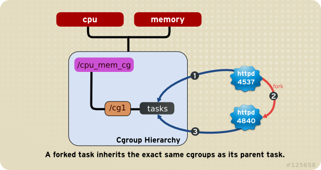
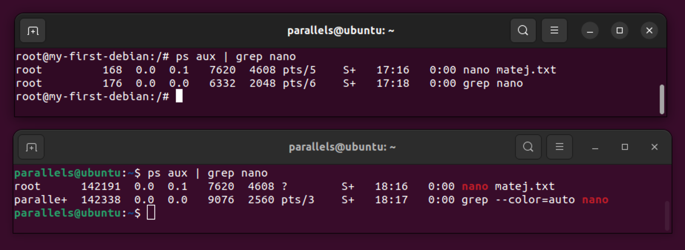
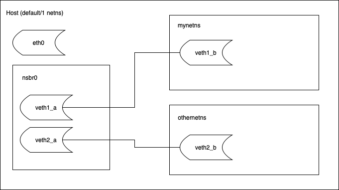

# Containers Under the Hood (and Their Security)

This module is the foundation that every later module rests on. By the end of it you should be able to look at a running Docker container and explain, in kernel terms, what isolation that container has and what isolation it does not have. The next two days of the course (image hardening, registries, exploitation, networking, observability) keep referring back to the primitives introduced here.

The single idea to take home is short:

> **A container is a normal (group of) Linux process that has been given a restricted view of the kernel (host).**

Three consequences follow from that one sentence, and the whole course follows from those three consequences:

1. The host kernel is shared (+ resource usage; - a kernel bug is a container escape, by definition).
2. Isolation is configured, not given (+ the defaults are convenient; - they are NOT safe).
3. Whatever the kernel can see, the host can see (container processes are directly visible to the host operator at all times).

## Learning Goals

This module describes the Linux containers fundamentals from the ground up. It also introduces the crucial security aspects and mechanisms of containers and references multiple userland tools and Docker commands along the way to prepare for the follow up course modules.

By the end of this hands-on, you should be able to:

- name the seven Linux namespaces Docker uses and what each one isolates
- read a container's cgroup v2 files and explain what limits the kernel is enforcing
- list a container's Linux capabilities and explain why the default set is what it is
- show that `--privileged` is equivalent to turning off all container security
- recognise the three "soft-targets" that come up in the rest of the course: the Docker socket, `--privileged`, and a container running as UID 0
- build a working container from scratch with `unshare`, `chroot`, and `cgroup` files — no Docker

## Kernel Primitives Behind Containers

Containers rely on features of the Linux kernel to form a contained or isolated environment for select processes within the host machine. This is similar to a virtual machine, but operates with the need for a hypervisor as no virtualization or emulation of hardware resources takes place. Instead the host's resources are shared with containers (processes) in a controlled manner.

The crucial kernel features enabling containerization are:

- **Control groups (cgroups)**
  - "resource management"
- **Namespaces (ns)**
  - "resource isolation"

A container also needs **something to run** — the binary itself, plus whatever libraries, configuration, and supporting files that binary expects to find on disk when it starts. This can be as little as a single statically-linked executable, or as much as a full distribution's userland (libc, a shell, an init system, system services). The same kernel primitives back both extremes; the difference is convention, giving rise to distinctions like _application containers vs OS containers_, _single-process vs multi-process_, and _with init vs without init_. Either way, an initial file or filesystem tree is required:

- **Filesystem (file / image / rootfs)**
  - "the userspace the contained process sees at `/` — from a single binary to a full distro rootfs — plus the host filesystem features that present it (bind mounts, overlay / CoW, permissions, ...)"

These features follow the core POSIX philosophy _that everything is either a process or a file_ (i.e. can be managed via filesystem, and utilizes features of filesystems) to enable **process containerization**.

Additionally, these core features are complemented by a variety of security mechanisms (called _kernel access controls_) enabling modern containerization, including:

- **Linux capabilities**
  - "subdividing root user privileges"
- **Secure computing policy**
  - "filtering individual syscalls"
- **Linux Security Modules / Mandatory Access Controls**
  - "e.g., additional fs-path-based policy (AppArmor)"

> Note: Containers can support nearly identical features as the fully fledged VMs, including enabling direct **hardware device access** from guest systems. This can be important for efficient operation of applications requiring low-level access to PCI devices, such as GPUs, NICs, and USB devices, despite operating in isolated environments.

### Control Groups (cgroups)

`cgroups`, short for control groups, is a feature of the Linux kernel that allows you to allocate, prioritize, deny, manage, and monitor system resources like CPU time, system memory, network bandwidth (using cgroup networking extensions), or combinations of these resources for a group of processes running on a system. It's a powerful tool for **resource management** and is widely used in various scenarios, especially in containerization.

> TLDR: **Cgroups** decide _how much of the box a process can have_.

You can group processes into cgroups based on various criteria. This grouping mechanism can "isolate" these processes from others, making it useful for system stability and security. In virtualization and containerization (like Docker and LXC), cgroups provide a way to **limit resources** used by containers (processes), ensuring that they don’t monopolize system resources. They help in managing and optimizing the performance of applications by controlling the allocation of resources.

> Brief implementation history:
>
> - Google presented a new generic method to solve the resource control problem with the cgroups project in 2007.
> - The mainline Linux kernel first included a cgroups implementation in 2008, and this paved the way for LXC, Docker, and later technologies.

#### Types of Resources Controlled by cgroups

- CPU: Limiting CPU usage, setting CPU priorities.
- Memory: Limiting memory usage, managing out-of-memory priorities.
- Block I/O: Limiting access to I/O devices, prioritizing I/O access.
- Network: Although traditionally not part of cgroups, there are extensions and tools that integrate network bandwidth management into the cgroups framework.

These features are enabled by **kernel resource controllers**. Cgroups v2 make use of the following controllers:

| Controller | File                  | Limits                                      |
| ---------- | --------------------- | ------------------------------------------- |
| `memory`   | `memory.max`          | Max RAM. Exceed → OOM-killed.               |
| `memory`   | `memory.swap.max`     | Max swap (or RAM+swap, depending on config) |
| `cpu`      | `cpu.max`             | Max CPU time per period                     |
| `cpu`      | `cpu.weight`          | Relative share under contention             |
| `cpuset`   | `cpuset.cpus`         | Pin to specific cores                       |
| `pids`     | `pids.max`            | Max number of processes/children            |
| `io`       | `io.max`, `io.weight` | Bandwidth and IOPS                          |

Additionally, more cgroups and their extension exist:

- `rdma` (set Remote DMA / InfiniBand resource limits)
- `perf_event` (performance monitoring and reporting)
- `...`

Note: Cgroups have significantly changed between v1 and v2.

- **cgroup v1** — separate hierarchies per controller (CPU, memory, blkio...). Default on RHEL 7/8.
- **cgroup v2** — single unified hierarchy. Default on every modern distro: Ubuntu 22+, Fedora 31+, RHEL 9 Debian 11+.

#### Operation Principles:

Cgroups provide a mechanism to aggregate sets of tasks or processes and their future children into hierarchical groups. These groups may be configured to have specialized behavior as desired. Under the hood cgroups make use of various kernel features to manage resources, e.g.:

- For CPU resources, cgroups integrate with the Linux scheduler to allocate CPU time among different groups according to configured limits and priorities.
- For memory, cgroups interact with the kernel's memory manager to track and limit the memory usage of processes in a group.

#### Cgroup Hierarchies and Relationships:

> Note that system processes are called tasks in cgroup terminology.

Cgroup hierarchies must follow a set of rules defining the relationships between cgroup subsystems. An overview of the fundamental rules is available at the [RedHat Customer Portal](https://access.redhat.com/documentation/en-us/red_hat_enterprise_linux/6/html/resource_management_guide/sec-relationships_between_subsystems_hierarchies_control_groups_and_tasks).

Any process (task) on the system which forks itself creates a child task. A child task automatically inherits the cgroup membership of its parent but can be moved to different cgroups as needed.



**Interacting with cgroups:**

As a part of the Linux kernel, cgroups require no additional software to work on a Linux system (interaction is possible using the filesystem interface, by manipulating files in `/sys/fs/cgroup/`), though userland tools are used to interact with them. For cgroups v2 the `cgroup-tools` (a.k.a `libcgroup` or `cgutils`) is one of the recommended packages.

The `cgroup-tools` package provides several management utilities, including:

- `cgcreate`: This tool is used to create a new control group using the desired subsystems.
- `cgset`: This tool is used to set resource limits on a control group.
- `cgclassify`: This tool is used to move running processes into a control group.
- `cgexec`: This tool is used to start a process directly in a specified control group.
- `cgget`: This tool displays the parameters and their values for a specified control group.
- `cgdelete`: This tool is used to remove a control group.

#### Example: creating a new cgroup, setting its resource limits and migrating a running process

**Prerequisites:**

```bash
# first check if cgroup subsystems are available
cat /proc/cgroups
# check if v2 is used
mount | grep cgroup2
# mount specific subsystems if required
# sudo mkdir /sys/fs/cgroup/blkio
# sudo mount -t cgroup -o blkio blkio /sys/fs/cgroup/blkio
```

**Manually interact with cgroups via filesystem:**

You may interact with cgroups directly on the filesystem. Following a key design philosophy in UNIX, where "everything is a file", cgroups are listed within the pseudo-filesystem subsystem in the directory `/sys/fs/cgroup`, which gives an overview of all the cgroup subsystems available or mounted in the currently running system:

```bash
ls -lh /sys/fs/cgroup
```

```bash
-r--r--r--  1 root root 0 Dec 12 16:38 cgroup.controllers
-rw-r--r--  1 root root 0 Dec 12 16:38 cgroup.max.depth
-rw-r--r--  1 root root 0 Dec 12 16:38 cgroup.max.descendants
-rw-r--r--  1 root root 0 Dec 12 16:38 cgroup.pressure
-rw-r--r--  1 root root 0 Dec 12 16:38 cgroup.procs
-r--r--r--  1 root root 0 Dec 12 16:38 cgroup.stat
-rw-r--r--  1 root root 0 Dec 12 16:38 cgroup.subtree_control
-rw-r--r--  1 root root 0 Dec 12 16:38 cgroup.threads
-rw-r--r--  1 root root 0 Dec 12 16:38 cpu.pressure
-r--r--r--  1 root root 0 Dec 12 16:38 cpuset.cpus.effective
-r--r--r--  1 root root 0 Dec 12 16:38 cpuset.mems.effective
-r--r--r--  1 root root 0 Dec 12 16:38 cpu.stat
drwxr-xr-x  2 root root 0 Dec 13 15:08 dev-hugepages.mount
drwxr-xr-x  2 root root 0 Dec 13 15:08 dev-mqueue.mount
drwxr-xr-x  2 root root 0 Dec 12 16:38 init.scope
-rw-r--r--  1 root root 0 Dec 12 16:38 io.cost.model
-rw-r--r--  1 root root 0 Dec 12 16:38 io.cost.qos
-rw-r--r--  1 root root 0 Dec 12 16:38 io.pressure
-rw-r--r--  1 root root 0 Dec 12 16:38 io.prio.class
-r--r--r--  1 root root 0 Dec 12 16:38 io.stat
-r--r--r--  1 root root 0 Dec 12 16:38 memory.numa_stat
-rw-r--r--  1 root root 0 Dec 12 16:38 memory.pressure
--w-------  1 root root 0 Dec 12 16:38 memory.reclaim
-r--r--r--  1 root root 0 Dec 12 16:38 memory.stat
-r--r--r--  1 root root 0 Dec 12 16:38 misc.capacity
drwxr-xr-x  2 root root 0 Dec 13 15:08 mygroup # note our new group here
drwxr-xr-x  2 root root 0 Dec 13 15:08 proc-sys-fs-binfmt_misc.mount
drwxr-xr-x  2 root root 0 Dec 13 15:08 sys-fs-fuse-connections.mount
drwxr-xr-x  2 root root 0 Dec 13 15:08 sys-kernel-config.mount
drwxr-xr-x  2 root root 0 Dec 13 15:08 sys-kernel-debug.mount
drwxr-xr-x  2 root root 0 Dec 13 15:08 sys-kernel-tracing.mount
drwxr-xr-x 57 root root 0 Dec 13 15:18 system.slice
drwxr-xr-x  3 root root 0 Dec 13 15:08 user.slice
```

The control groups are organized hierarchically, meaning that each cgroup inherits properties from its parent, and resources can be managed at different levels.

> Note: you output may differ depending on cgroup configuration. Moreover, cgroup v1 uses a different directory structure than cgroup v2. You can check for cgroup version using the `mount | grep cgroup` command. If cgroup sys is not mounted, but is supported by your kernel you may mount the fs using `mount -t cgroup2 none /sys/fs/cgroup`.

We can now view or modify maximum allowed cgroup memory using standard file operations:

```bash
# get max memory
cat /sys/fs/cgroup/mygroup/memory.max # result in bytes or "max"
# set max memory
echo 100000 > /sys/fs/cgroup/mygroup/memory.max
# note that result will be rounded down to nearest page size:
cat /sys/fs/cgroup/mygroup/memory.max # 98304
# add PID 1234 to group
echo 1234 >> /sys/fs/cgroup/mygroup/cgroup.procs
```

> Note that these changes are not persistent! For persistent configuration, you would typically use a boot-time script or a daemon like systemd. The default `libcgroup` configuration file is `/etc/cgconfig.conf`, however that may vary by distribution. Some cgroup features may require kernel boot arguments.

> Aside: Linux monitors changes in the cgroup filesystem through the `inotify` Linux kernel subsystem that provides a means to monitor filesystem events.

**Using the `cgroup-tools`:**

```bash
sudo cgcreate -g cpu,memory:/mygroup # subsystems and name
sudo cgset -r memory.max=500M mygroup # memory limit
sudo cgclassify -g cpu,memory:/mygroup 1234 # PID
# or spawn new task (process) using cgexec
sudo cgexec -g cpu,memory:/mygroup nano
```

**How Docker uses cgroups:**

```bash
# Start a container with limits
docker run -d --name web --memory 128m --cpus 0.5 --pids-limit 50 nginx:1.27

# Find its cgroup path
CID=$(docker inspect -f '{{.Id}}' web)
CG=/sys/fs/cgroup/system.slice/docker-${CID}.scope

# Confirm the limits the kernel is enforcing
cat $CG/memory.max
# 134217728           <- 128 MiB exactly

cat $CG/cpu.max
# 50000 100000        <- 50 ms per 100 ms = half a CPU

cat $CG/pids.max
# 50

# Which processes are in it?
cat $CG/cgroup.procs
# 17234
# 17299

# Current memory usage
cat $CG/memory.current
# 6422528             <- ~6 MiB used out of 128 MiB
```

The container _is_ the cgroup. Add a process to `cgroup.procs` and it's now part of the container's resource accounting. Hit `memory.max` and the kernel OOM-kills processes in that cgroup — typically your application's PID 1.

Additional Docker flags for cgroups:

| Docker flag          | cgroup v2 file    | Effect                           |
| -------------------- | ----------------- | -------------------------------- |
| `--memory 512m`      | `memory.max`      | Hard cap; OOM kill on exceed     |
| `--memory-swap 1g`   | `memory.swap.max` | Cap on RAM + swap combined       |
| `--cpus 1.5`         | `cpu.max`         | 1.5 CPU cores worth of time      |
| `--cpu-shares 512`   | `cpu.weight`      | Relative weight under contention |
| `--cpuset-cpus 0,1`  | `cpuset.cpus`     | Pin to physical cores 0 and 1    |
| `--pids-limit 100`   | `pids.max`        | Fork bomb containment            |
| `--blkio-weight 200` | `io.weight`       | Relative I/O share               |

> **Common misconception:** cgroups are **not** a security boundary. They are an accounting and throttling mechanism. A container without `--memory` can still call every kernel syscall. A container without `--pids-limit` can fork until the host runs out of PIDs — denial of service, not a privilege escalation, but still ugly. Security comes from combining multiple kernel features and security mechanisms: namespaces + capabilities + seccomp + LSMs, not from cgroups only.

### Namespaces

Linux namespaces are a feature of the Linux kernel that provide **resource and process isolation**. They allow for the partitioning of various aspects of the operating system, so that each set of processes sees its own isolated instance of the global resource. This is one of the key technologies that enable containerization in Linux.

Namespaces provide an abstraction of global system resources that will appear to the processes within the defined namespaces as their own isolated instances of a specific global resources. They enable a form of "lightweight process virtualization", ensuring that processes in different namespaces cannot see or affect each other. This is fundamental for the security and stability of Linux containers; they provide the required isolation between a container and the host system, as well as between containers themselves.

> Brief implementation history:
>
> - At the Ottawa Linux Symposium held in 2006, Eric W. Bierderman presented his paper “Multiple Instances of the Global Linux Namespaces”
> - This paper proposed the addition of ten namespaces to the Linux kernel. His inspiration for these additional namespaces was the existing filesystem namespace for mounts, which was introduced in 2002.

**Namespace Types**

There are seven namespaces in active use today, and a running Docker container is attached to all seven:

| Namespace       | `clone()` flag    | What it isolates                                        |
| --------------- | ----------------- | ------------------------------------------------------- |
| Mount (`mnt`)   | `CLONE_NEWNS`     | Mount table — what filesystems are mounted where        |
| PID             | `CLONE_NEWPID`    | Process IDs — container PID 1 is host PID 17234         |
| Network (`net`) | `CLONE_NEWNET`    | Interfaces, IPs, routes, sockets, iptables tables       |
| UTS             | `CLONE_NEWUTS`    | Hostname and NIS domain (UTS = "UNIX Time-Sharing")     |
| IPC             | `CLONE_NEWIPC`    | SysV semaphores, message queues, POSIX shared memory    |
| User            | `CLONE_NEWUSER`   | UID/GID mapping — container root _can_ be host non-root |
| Cgroup          | `CLONE_NEWCGROUP` | View of the cgroup tree (a container sees only its own) |

Time and cgroup-v1 namespaces also exist; Docker does not currently use the time namespace by default.

> Note: each running task in the kernel has a `nsproxy` structure (`include/linux/nsproxy.h`) that points to its current namespaces. Creating a new namespace is, in kernel terms, just allocating a new struct and pointing the task at it. There is no virtualisation involved.

Practical example: The image below demonstrates the effect of **PID namespace** by comparing process IDs of the same process as seen from the container (top) and from the host system (bottom). Because `nano` runs in the container, the container assigns it a PID in its own namespace (168). However, the host system keeps track of the sam process in a global namespace, assigning it a different PID (142191).



#### Interfacing with Namespaces: Unshare

Plain `unshare` from `util-linux` command-line utility can be used to simplify process launching in combination with creation of new namespaces. The point of _this_ demo is that the kernel boundary is one syscall (`unshare(2)`) and one command.

```bash
# UTS namespace — give the process its own hostname
sudo unshare --uts /bin/bash
# (now in the new namespace)
hostname my-tiny-container
hostname
# my-tiny-container

# In ANOTHER terminal on the host, check the real hostname:
hostname
# pop-os                       <- unchanged, the host doesn't see the rename

exit
```

Each flag creates one more namespace. Stack them to taste:

```bash
# PID + mount + UTS + net + IPC namespaces. --fork is required because
# the new PID namespace needs a new PID 1; --mount-proc re-mounts /proc
# so 'ps' reflects the new PID view.
sudo unshare --pid --mount --uts --net --ipc --fork --mount-proc /bin/bash

# Inside the new namespaces:
ps -ef
# UID    PID PPID  C STIME TTY   TIME     CMD
# root     1    0  0 09:14 pts/0 00:00:00 /bin/bash
# root     8    1  0 09:14 pts/0 00:00:00 ps -ef           mtu 65536 ...                          <- our own net stack

ls /
# /bin /etc /home /root ... (still the HOST's rootfs — we didn't chroot)
```

#### Interfacing with Namespaces: Full Networking Example

Creating a new namespace in Linux can be done using either command-line tools or system calls in a C program. Given is the example of creating a new **network namespace**.

We can use the `ip` command from the `iproute2` package to manage network namespaces. Here's how to create and use a new network namespace:

```bash
sudo ip netns add mynetns # add a network namespace
```

In order to connect the new isolated network namespace to the host (e.g, to enable internet connectivity) we have to create a **virtual ethernet (veth) interface pair (virtual cable)**. We can use the veth interface pair as a crossover ethernet cable to directly connect two "hosts" (two network namespaces).

```bash
sudo ip link add veth1_a type veth peer name veth1_b # create virtual cable
sudo ip link set veth1_b netns mynetns # plug one end into mynetns
sudo ip addr add 10.0.0.10/24 dev veth1_a # add ip to veth iface in default netns (host)
sudo ip netns exec mynetns ip addr add 10.0.0.11/24 dev veth1_b # add ip to iface in mynetns
sudo ip link set veth1_a up # bring one end up
sudo ip netns exec mynetns ip link set veth1_b up # bring the other one up
```

If we plan to establish connectivity between multiple network namespaces it makes sense to create a new bridge.

```bash
sudo ip link add nsbr0 type bridge # create new bridge
sudo ip link set nsbr0 up # bring it up
sudo ip addr add 10.0.0.1/24 dev nsbr0 # add ip (e.g., to use it as default gw)
sudo ip netns exec mynetns ip route add default via 10.0.0.1 # add default route in mynetns
ip link set veth1_a master nsbr0 # add veth1_a to nsbr0
```

Optional: Enable IP forwarding and set up NAT using masquerade rule to enable Internet connectivity:

```bash
sudo echo 1 | sudo tee /proc/sys/net/ipv4/ip_forward # enable ip forwarding
sudo iptables -t nat -A POSTROUTING -o eth0 -j MASQUERADE # masquerade (replace eth0 with your default gateway interface)
```

Test connectivity:

```bash
sudo ip netns exec mynetns bash
ping 1.1.1.1
```

Simplified diagram of the created environment:



> Interfacing using syscalls in C programs (for netns):
>
> - using `clone()` instead of `fork()` for spawning processes and setting `CLONE_NEWNET`
> - or using `setns()` inside the current process

#### Docker Networking using Namespaces

The same example from above: each container has its own network stack: its own loopback, its own interfaces, its own routing table, its own iptables rules. They connect to the rest of the world through a **veth pair**: a virtual cable with one end inside the container's namespace and one end on a host bridge (usually `docker0`).

```bash
docker run -d --name web --rm nginx:1.27

# What does the container see?
docker exec web ip -br addr
# lo    UNKNOWN  127.0.0.1/8
# eth0@ UP       172.17.0.2/16

# What does the host see?
ip -br addr | grep veth
# vethaf12c34@if4  UP   (no IP)
ip -br addr | grep docker0
# docker0  UP  172.17.0.1/16
```

`eth0` inside the container and `vethaf12c34` on the host are two ends of the same virtual cable. Pull the cable out of the bridge and the container loses the network. Move the container's end into a different netns and you can reroute its traffic without ever touching the container.

> **Warning:** `--network host` disables this entire mechanism. The container shares the host network stack directly. No isolation, no NAT, no firewall in between. Convenient. Dangerous.

#### Default Namespaces of Docker Containers

```bash
# Start a long-lived container we can poke at
docker run -d --name web --rm nginx:1.27

# Get its host PID
PID=$(docker inspect -f '{{.State.Pid}}' web)
echo "Container PID 1 on the host is $PID"

# List all the namespaces it lives in
lsns -p $PID
```

Expected output (your namespace IDs will differ):

```text
        NS TYPE   NPROCS   PID USER  COMMAND
4026531834 time      478     1 root  /sbin/init
4026531837 user      478     1 root  /sbin/init
4026532395 mnt         2 17234 root  nginx: master process nginx -g daemon off;
4026532396 uts         2 17234 root  nginx: master process nginx -g daemon off;
4026532397 ipc         2 17234 root  nginx: master process nginx -g daemon off;
4026532398 pid         2 17234 root  nginx: master process nginx -g daemon off;
4026532400 net         2 17234 root  nginx: master process nginx -g daemon off;
4026532471 cgroup      2 17234 root  nginx: master process nginx -g daemon off;
```

Note that `user` and `time` namespace IDs match the host's. By default Docker does _not_ create a separate user namespace — container root is host root.

#### PID Namespace, Two Numbers for the Same Process (Docker Example)

The same nginx process exists in two namespaces at once. Open two terminals.

In terminal 1 (host):

```bash
docker run -d --name web --rm nginx:1.27
docker inspect -f '{{.State.Pid}}' web
# 17234

ps -ef | grep nginx
# root     17234 17211  0 09:14 ?        00:00:00 nginx: master process nginx -g daemon off;
# 101      17299 17234  0 09:14 ?        00:00:00 nginx: worker process
```

In terminal 2 (container):

```bash
docker exec web ps -ef
# UID  PID  PPID  C STIME TTY  TIME     CMD
# root   1     0  0 09:14 ?    00:00:00 nginx: master process nginx -g daemon off;
# nginx  29    1  0 09:14 ?    00:00:00 nginx: worker process
```

Same process. PID 17234 on the host. PID 1 inside the container. The kernel is keeping two PID mappings.

This is why container PID 1 is interesting in two ways. First, by default it's a normal host process owned by host UID 0 — there's no extra membrane between a compromised container process and the host kernel. Second, PID 1 has special kernel semantics: it ignores signals it hasn't explicitly handled, and it's responsible for reaping orphaned zombies. Most applications don't do either of those things, which is why docker stop on a naive container takes ten seconds and SIGKILLs your app (as SIGTERM is ignored if you don't write a handler for it), and why long-running containers occasionally exhaust their PID table with zombies. The fix is a tiny init shim like tini (or docker run --init) that sits at PID 1 and handles both jobs properly.

#### User Namespace (The Most Useful and Least Used)

By default, container UID 0 is host UID 0. A container escape gets you root on the host. This was the original sin of containerisation, and it is still the default!

The user namespace lets the kernel map container UIDs to host UIDs:

```bash
# Default Docker container — UID 0 in container == UID 0 on host
docker run --rm alpine cat /proc/self/uid_map
#          0          0 4294967295

# With user namespace remapping (configure in /etc/docker/daemon.json):
# { "userns-remap": "default" }
# After daemon restart:
docker run --rm alpine cat /proc/self/uid_map
#          0     100000      65536
```

The second form says: "container UIDs 0..65535 map to host UIDs 100000..165535". If an attacker escapes the container, they are host UID 100000 — an unprivileged user who cannot read `/etc/shadow` or load kernel modules.

Why isn't this on by default?

- Bind-mounts get awkward (`-v /home/data:/data` — whose data?)
- Docker volumes get awkward
- Each container needs its own per-UID image copy if you use namespace-per-container
- Some workloads (the ones that genuinely need `--privileged`) cannot use it

Rootless Podman uses this by default. Most production Docker installations do not, and security tools work around the gap with other primitives.

### Filesystem (rootfs)

After namespaces and cgroups, the third core ingredient is a **root filesystem** — the view of `/` the container's processes will see. Namespaces decide _what kernel resources_ a process can see; the rootfs decides _what files_ a process can see.

The kernel is shared with the host. The rootfs is everything _above_ the kernel that the workload needs: libraries, binaries, configuration. No kernel, no bootloader, no initramfs — those are the host's job. This is why container images are dramatically smaller than VM disks.

**A rootfs is just a directory tree.** You can `tar` it, `ls` it, `cp -a` it. What makes it "a container's filesystem" is that a process `chroot`s (or `pivot_root`s) into it and lives there.

#### How Big? It Depends on What You're Modelling

|                | App container                    | OS container                       |
| -------------- | -------------------------------- | ---------------------------------- |
| Contents       | One binary + its libs            | Full userland with init + services |
| Size           | 5 MB – 200 MB                    | 200 MB – 2 GB                      |
| PID 1          | Your app, or a small init shim   | A real init (`systemd`, `openrc`)  |
| Lifecycle      | Immutable; rebuild to update     | Mutable; `apt upgrade` inside      |
| Canonical tool | Docker, Podman, Kubernetes       | LXC/LXD, systemd-nspawn, Proxmox   |
| Mental model   | "Process with a restricted view" | "Tiny VM without a kernel"         |

The kernel mechanisms underneath are identical. The difference is convention and what gets packed into the rootfs.

- **Minimum:** one statically-linked binary. Docker's `FROM scratch` produces images whose entire content is the binary plus a few hundred bytes of OCI metadata. Nothing to pivot through after a breach because there's nothing inside.
- **Middle (where most app containers live):** a minimal base like `python:3.12-slim` or `node:22-alpine` — language runtime plus a tiny shell — and your code on top.
- **Maximum:** a full distro rootfs (Ubuntu, Debian, Alma) with `systemd`, `cron`, `sshd`. Behaves like a server.

**Rule of thumb:** put in the rootfs only what your process needs at runtime. Every extra binary (`curl`, `bash`, `apt`) is a tool you also hand the attacker after RCE. "Distroless" images take this to its conclusion — no shell at all.

#### PID 1 and Init

Inside the container, _something_ has to be PID 1. The choice has consequences:

**Init-less (Docker default).** Your app binary is PID 1. Clean, minimal, fits the "one container, one job" pattern. But PID 1 has special kernel semantics: it ignores signals it hasn't explicitly handled, and it's responsible for reaping orphan zombies. Most apps do neither — so `docker stop` waits 10 seconds and SIGKILLs you, and long-running containers leak zombies. Fix with a tiny init shim: `tini`, `dumb-init`, or `docker run --init`.

**Init-ful (LXC default).** A real init system (`systemd`, `openrc`) brings the rootfs up the way it would on a normal Linux boot: mount filesystems, start services, manage logging, supervise children. You `systemctl restart nginx`. Familiar ops story; much bigger attack surface.

Pick by what you're modelling. A stateless HTTP service → app container with an init shim. A legacy app that expects `cron` + `syslog` + multiple users → OS container with a real init.

#### Distribution and Storage

- **OCI images (Docker/Podman/containerd).** Rootfs ships as content-addressed **layers**; runtimes use overlayfs so containers share read-only lower layers and only differ in their writable upper layer.
- **LXC/LXD.** Single compressed rootfs tarballs plus metadata templates. Copy-on-write comes from the storage backend (ZFS, Btrfs, LVM thin), not the image format.
- **Hand-rolled.** `debootstrap`, `apk add --root`, or a `tar xz` of an existing image. Sometimes the right answer.

The runtime's job is to unpack the rootfs (or assemble its layers) into a directory and present it as `/` to processes inside the new namespaces. The storage backend choice (overlayfs, ZFS, Btrfs, LVM) is performance and operations — not security.

> TLDR: a rootfs is whatever userspace your workload needs, packed in a directory and presented at `/` to a process in its own namespaces. One static binary or a full distro — the kernel doesn't care, and the choice is about what you're modelling, not what containers require.

#### Example: Alpine RootFS Container using Unshare and Chroot

```bash
# get rootfs
mkdir alpine-rootfs && cd alpine-rootfs
wget -qO- https://dl-cdn.alpinelinux.org/alpine/v3.20/releases/x86_64/alpine-minirootfs-3.20.0-x86_64.tar.gz | sudo tar xz
cd ..

# launch sh in seperate ns
sudo unshare --pid --mount --uts --net --fork --mount-proc chroot alpine-rootfs /bin/sh
```

## Kernel Access Controls

Namespaces and cgroups give a process a smaller _view_ of the system and a smaller _share_ of its resources, but they say nothing about **what that process is still allowed to do** inside its smaller world. A container with no access controls is still root, can still call every one of the kernel's 350+ syscalls, and can still touch any file its UID is permitted to. Most container escapes of the last decade exploited exactly that gap — the container was isolated, but the process inside it was unrestricted.

The kernel ships three further mechanisms that close it. Each narrows a different slice of "what root can do":

- **Linux capabilities**
  - "subdividing root user privileges"
- **Secure computing policy**
  - "filtering individual syscalls"
- **Linux Security Modules / Mandatory Access Controls**
  - "e.g., additional fs-path-based policy (AppArmor)"

  Together with namespaces and cgroups, these form the **defense-in-depth** stack a real container runtime composes on every `docker run`. None of them is sufficient alone; layered, they're what stops a single CVE or misconfiguration from becoming a full host compromise.

### Linux Capabilities

> TLDR: Root Split into 41 Pieces

Traditional UNIX had two privilege levels: UID 0 and "everything else". UID 0 could do anything; UID 1+ couldn't change the time, load a kernel module, bind to port 80, raw-socket the network, or trace another user's processes.

On a normal host, the workarounds for "this user needs to do _one_ privileged thing" are a tangle of unrelated mechanisms:

- **Filesystem permissions** — the classic owner/group/other read-write-execute bits. Coarse, but most of what userland needs.
- **POSIX ACLs** — finer-grained per-user/per-group permissions when the three-bucket model is too crude.
- **The setuid / setgid bit** — a file marked setuid root runs _as root_ regardless of who invoked it. This is how `passwd`, `sudo`, and historically `ping` worked. Powerful, dangerous, and the source of decades of privilege-escalation bugs because the invoked program now has _all_ of root's powers, not just the one it needed.
- **File capabilities** — the same capability idea applied to individual binaries via `setcap`. Modern `ping` is the canonical example: `setcap cap_net_raw+ep /bin/ping` lets it open raw sockets without being setuid root. One capability granted to one binary, instead of full root via the setuid bit.
- **Sudoers rules** — userland policy on top of all of the above, deciding which users can run which commands as whom.

These work, but they were designed for multi-user time-shared systems and they're hard to compose. "Let this _process_ do exactly one privileged thing for its whole lifetime" isn't a question they answer cleanly.

Linux **capabilities** (added in kernel 2.2 in 1999) chop root into 41 individually grantable powers, attachable per-process and per-thread. A few that matter:

| Capability             | What it grants                                                          |
| ---------------------- | ----------------------------------------------------------------------- |
| `CAP_NET_BIND_SERVICE` | Bind a socket to ports < 1024                                           |
| `CAP_CHOWN`            | Change ownership of files                                               |
| `CAP_NET_ADMIN`        | Configure interfaces, routes, firewall                                  |
| `CAP_SYS_PTRACE`       | Attach to and inspect any process                                       |
| `CAP_SYS_MODULE`       | Load and unload kernel modules                                          |
| **`CAP_SYS_ADMIN`**    | The "new root" — mount, pivot_root, set hostnames, BPF, namespaces, ... |
| `CAP_DAC_OVERRIDE`     | Bypass file-read / file-write / execute permission checks               |
| `CAP_SYS_READ_SEARCH`  | Bypass file-read and directory-search permission checks                 |
| `CAP_AUDIT_WRITE`      | Write to the kernel auditing log                                        |

`CAP_SYS_ADMIN` is so broad that it is sometimes referred to as the new root: if you can grant only one capability, you grant `CAP_SYS_ADMIN` and you have given away the kernel.

#### What Docker Gives a Container by Default

Docker drops most capabilities and keeps a curated set of 14:

```text
CAP_CHOWN              CAP_SETUID
CAP_DAC_OVERRIDE       CAP_SETGID
CAP_FSETID             CAP_SETPCAP
CAP_FOWNER             CAP_NET_BIND_SERVICE
CAP_MKNOD              CAP_SYS_CHROOT
CAP_NET_RAW            CAP_KILL
CAP_SETFCAP            CAP_AUDIT_WRITE
```

This is too much for most workloads. The right baseline for application containers is:

```bash
docker run --cap-drop=ALL --cap-add=NET_BIND_SERVICE my-app
```

…and then add the one or two you actually need (commonly nothing at all if you bind to a port > 1024).

#### Example: Container with Limited Capablities using Unshare and Chroot

```bash
# grab a tiny rootfs (alpine minirootfs, ~3 MB)
mkdir alpine-rootfs && cd alpine-rootfs
wget -qO- https://dl-cdn.alpinelinux.org/alpine/v3.20/releases/x86_64/alpine-minirootfs-3.20.0-x86_64.tar.gz | sudo tar xz
cd ..
```

The `setpriv` from `util-linux` enables capability specification from host:

```bash
# Apply at the unshare boundary instead of inside the container
sudo unshare --pid --mount --uts --net --fork --mount-proc \
    setpriv --bounding-set=-all,+cap_net_bind_service --no-new-privs \
    chroot alpine-rootfs /bin/sh
```

Alternatively, shell-level tool `capsh` from `libcap` can also be used.

> Note: A fresh unshare shell inherits whatever capabilities your starting shell has. If you started from `sudo`, that's all 41. We want to keep one or two.

#### Example: Inspect CAPs in a Container

```bash
# Default capabilities
docker run --rm -it alpine sh
/ # apk add libcap 2>/dev/null
/ # capsh --print | head -3
# Current: cap_chown,cap_dac_override,cap_fowner,cap_fsetid,cap_kill,
#   cap_setgid,cap_setuid,cap_setpcap,cap_net_bind_service,cap_net_raw,
#   cap_sys_chroot,cap_mknod,cap_audit_write,cap_setfcap=ep

# Same image, dropped to nothing
docker run --rm -it --cap-drop=ALL alpine sh
/ # capsh --print | head -2
# Current: =
# Bounding set =
```

#### Example: One Capability Granted, the Rest Denied

A container can be root inside (UID 0) and still be unable to do most root things. We start nginx — which wants to bind port 80 — with `--cap-drop=ALL`, then watch it fail, then add back the single capability it needs.

```bash
# Step 1 — Drop everything. nginx is UID 0 inside, but powerless.
docker run --rm --name web --cap-drop=ALL nginx:1.27
# 2026/01/15 09:14:01 [emerg] 1#1: bind() to 0.0.0.0:80 failed
#   (13: Permission denied)
# nginx: [emerg] bind() to 0.0.0.0:80 failed (13: Permission denied)

# Confirm: we ARE root, but we have no capabilities
docker run --rm -it --cap-drop=ALL alpine sh
/ # id
# uid=0(root) gid=0(root) groups=0(root)               <- still root
/ # apk add libcap >/dev/null 2>&1
/ # capsh --print | head -2
# Current: =
# Bounding set =                                       <- empty, root or not

# Try a privileged thing: change a file's owner
/ # touch /tmp/f && chown nobody /tmp/f
# chown: /tmp/f: Operation not permitted               <- needs CAP_CHOWN

# Try to bind a low port the hard way
/ # nc -lp 80
# nc: bind: Permission denied                          <- needs CAP_NET_BIND_SERVICE

exit

# Step 2 — Give back ONLY the one capability nginx needs.
docker run --rm --name web \
    --cap-drop=ALL \
    --cap-add=NET_BIND_SERVICE \
    -p 8080:80 \
    nginx:1.27
# 2026/01/15 09:15:33 [notice] 1#1: start worker processes              <- starts cleanly

# In another terminal:
curl -sI http://localhost:8080/ | head -1
# HTTP/1.1 200 OK

# Confirm what's actually inside the container:
docker exec web sh -c 'apk add libcap >/dev/null 2>&1; capsh --print | head -2'
# Current: cap_net_bind_service=ep
# Bounding set =cap_net_bind_service
```

**What this shows:** UID 0 is no longer the question. The kernel checks capabilities, not UID, for almost every privileged operation. A "root" process with an empty capability set cannot bind low ports, cannot change ownership, cannot load modules, cannot ptrace, cannot raw-socket — it can do less than your unprivileged shell account on the host.

The production baseline for application containers is exactly this shape: `--cap-drop=ALL`, then `--cap-add` the one or two you actually need. Most apps need _none_ if they bind to a port ≥ 1024 (configure nginx to listen on 8080 inside the container, then publish however you like, and you can drop `NET_BIND_SERVICE` too — the smallest cap set is no caps at all).

### Syscall Filtering (seccomp)

Namespaces and capabilities cut down _which kernel features_ a container can call. **seccomp** further restricts _which syscalls_ it can touch.

A Linux kernel has 350+ syscalls. Most workloads use 40–60. **seccomp-bpf** lets you write a small BPF program (think of it as a kernelspace hook code) that decides "allow / deny" per syscall.

- Docker ships a default seccomp profile that blocks ~50 dangerous syscalls (`kexec_load`, `init_module`, `mount`, `reboot`, etc.).
- The default profile is reasonable but not minimal — several CVEs of the last 5 years were syscalls Docker still permits.
- You can write a custom profile and apply it with `--security-opt seccomp=profile.json`. Most people don't, because profile-writing is tedious. Tools exist: `oci-seccomp-bpf-hook`, `k8s-seccomp-recorder` — they record syscalls in audit mode and produce a profile for you.

#### Example: Check Seccomp Mode in Container

```bash
# Check what mode a container is in
docker run --rm alpine grep Seccomp /proc/1/status
# Seccomp:        2          <- 0=disabled, 1=strict, 2=filter
```

> **Don't do this:** `--security-opt seccomp=unconfined`. Many tutorials and StackOverflow answers suggest it to make some app work. It removes the syscall filter entirely.

#### Example: Manual Seccomp Policy

> Note: Seccomp has no friendly standalne userspace tooling. Docker uses `libseccomp`, which exposes a C API. The user-friendly Docker version is `--security-opt seccomp=profile.json`; the kernel-level version is a BPF program loaded via `prctl(PR_SET_SECCOMP, SECCOMP_MODE_FILTER, &prog)`. There is no unshare-style coreutil for this.

The smallest honest demo is a ~20-line C wrapper. Save as seccomp_exec.c:

```c
#include <seccomp.h>
#include <unistd.h>
#include <stdio.h>

int main(int argc, char **argv) {
    if (argc < 2) { fprintf(stderr, "usage: %s <program> [args...]\n", argv[0]); return 2; }

    // Default action: KILL. Then allowlist what a basic shell needs.
    scmp_filter_ctx ctx = seccomp_init(SCMP_ACT_KILL);

    int allow[] = {
        SCMP_SYS(read), SCMP_SYS(write), SCMP_SYS(open), SCMP_SYS(openat),
        SCMP_SYS(close), SCMP_SYS(stat), SCMP_SYS(fstat), SCMP_SYS(lstat),
        SCMP_SYS(execve), SCMP_SYS(exit), SCMP_SYS(exit_group),
        SCMP_SYS(brk), SCMP_SYS(mmap), SCMP_SYS(mprotect), SCMP_SYS(munmap),
        SCMP_SYS(rt_sigaction), SCMP_SYS(rt_sigprocmask), SCMP_SYS(rt_sigreturn),
        SCMP_SYS(ioctl), SCMP_SYS(fcntl), SCMP_SYS(getpid), SCMP_SYS(getuid),
        SCMP_SYS(getgid), SCMP_SYS(geteuid), SCMP_SYS(getegid),
        SCMP_SYS(arch_prctl), SCMP_SYS(set_tid_address), SCMP_SYS(access),
        SCMP_SYS(getdents64), SCMP_SYS(readlink), SCMP_SYS(uname),
        SCMP_SYS(wait4), SCMP_SYS(clone), SCMP_SYS(vfork),
    };
    for (size_t i = 0; i < sizeof(allow)/sizeof(allow[0]); i++)
        seccomp_rule_add(ctx, SCMP_ACT_ALLOW, allow[i], 0);

    // Explicitly KILL the syscalls we want to highlight
    seccomp_rule_add(ctx, SCMP_ACT_KILL, SCMP_SYS(mount), 0);
    seccomp_rule_add(ctx, SCMP_ACT_KILL, SCMP_SYS(init_module), 0);
    seccomp_rule_add(ctx, SCMP_ACT_KILL, SCMP_SYS(kexec_load), 0);
    seccomp_rule_add(ctx, SCMP_ACT_KILL, SCMP_SYS(reboot), 0);

    seccomp_load(ctx);
    execvp(argv[1], &argv[1]);
    perror("execvp");
    return 1;
}
```

Build it:

```bash
sudo apt-get install -y libseccomp-dev
gcc -o seccomp_exec seccomp_exec.c -lseccomp
```

Get sample rootfs and copy seccomp inside:

```bash
mkdir alpine-rootfs && cd alpine-rootfs
wget -qO- https://dl-cdn.alpinelinux.org/alpine/v3.20/releases/x86_64/alpine-minirootfs-3.20.0-x86_64.tar.gz | sudo tar xz
cd ..
cp seccomp_exec alpine-rootfs/seccomp_exec
```

Run the "container" with seccomp policy:

```bash
sudo unshare --pid --mount --uts --net --fork --mount-proc \
    chroot alpine-rootfs /seccomp_exec /bin/sh

# Inside
/ # grep Seccomp /proc/1/status
# Seccomp:        2          <- filter mode is on

/ # echo hello                       # read/write/execve are allowed
# hello

/ # mount -t tmpfs none /mnt         # we explicitly denied mount()
# Bad system call (core dumped)      <- the kernel SIGSYS-killed us
```

### AppArmor and SELinux — Mandatory Access Control

Namespaces and capabilities cut down _which kernel features_ a container can call. **LSMs** further restrict _which files_ it can touch.

Linux Security Modules (LSMs) add a second layer of "no, you can't do that" on top of file permissions and capabilities.

**AppArmor** is _path-based_: "this process may read `/etc/*` but not `/root/*`".

- Default on Debian, Ubuntu, SUSE.
- Docker ships a default profile (`docker-default`) for every container.
- Custom profiles applied with `--security-opt apparmor=profile-name`.

**SELinux** is _label-based_: every file and process has a context (`system_u:object_r:container_file_t:s0`).

- Default on RHEL, Fedora, CentOS Stream, Rocky, Alma.
- Docker uses the `container_t` type by default.
- Custom contexts applied with `--security-opt label=...`. Harder to author but more expressive.

Only one LSM is active at a time on a given host. You usually get whichever your distro chose.

#### Example: Check AppArmor Policy

```bash
# Is AppArmor active on this host? Which profiles are loaded?
sudo aa-status
# apparmor module is loaded.
# 47 profiles are loaded.
# 41 profiles are in enforce mode.
#    docker-default
#    /usr/bin/man
#    ...
# 6 profiles are in complain mode.
# 12 processes have profiles defined.
# 12 processes are in enforce mode.
#    docker-default (17234) nginx: master process nginx -g daemon off;
#    docker-default (17299) nginx: worker process

# What profile is a given container running under?
docker run -d --name web --rm nginx:1.27
PID=$(docker inspect -f '{{.State.Pid}}' web)
cat /proc/$PID/attr/current
# docker-default (enforce)

# Same thing from inside the container
docker exec web cat /proc/1/attr/current
# docker-default (enforce)

# On a SELinux host (RHEL/Fedora) the equivalents are:
sudo sestatus
ps -eZ | grep container
```

`enforce` mode actually blocks. `complain` mode only logs to `dmesg` / `/var/log/audit/audit.log`. If you're writing a new profile, start in `complain`, watch the logs for a day, fix what breaks, then flip to enforce.

You will need the `apparmor-utils` package for `aa-status`, `aa-exec`, `aa-genprof`, and `aa-logprof`. The kernel module is in every modern Ubuntu/Debian/SUSE kernel; the userland tools are separate.

#### Example: Write our own AppArmor Policy

Write a tiny profile that denies access to `/etc/shadow` and most of `/proc`. Save as `/etc/apparmor.d/tiny-container`:

```c
#include <tunables/global>

profile tiny-container flags=(attach_disconnected) {
    #include <abstractions/base>

    # Allow basic shell behaviour
    /bin/** ixr,
    /usr/bin/** ixr,
    /sbin/** ixr,
    /lib/** mr,
    /usr/lib/** mr,
    /etc/** r,
    /tmp/** rwk,

    # ... but explicitly deny the obvious targets
    deny /etc/shadow rwklx,
    deny /etc/sudoers rwklx,
    deny /root/** rwklx,

    # Kernel surfaces that show up in escape chains
    deny /proc/sys/kernel/** w,
    deny /proc/*/attr/** w,
    deny /sys/fs/cgroup/** w,
    deny capability sys_admin,
    deny capability sys_module,
    deny capability sys_ptrace,
}
```

Load it and check:

```bash
sudo apparmor_parser -r /etc/apparmor.d/tiny-container
sudo aa-status | grep tiny-container
# tiny-container
```

Launch a new "container" with `unshare` and `aa-exec` userland helper:

```bash
mkdir alpine-rootfs && cd alpine-rootfs
wget -qO- https://dl-cdn.alpinelinux.org/alpine/v3.20/releases/x86_64/alpine-minirootfs-3.20.0-x86_64.tar.gz | sudo tar xz
cd ..
sudo unshare --pid --mount --uts --net --fork --mount-proc \
    aa-exec -p tiny-container \
    chroot alpine-rootfs /bin/sh

# Inside
/ # cat /proc/1/attr/current
# tiny-container (enforce)

/ # cat /etc/shadow
# cat: can't open '/etc/shadow': Permission denied        <- AppArmor said no

/ # cat /etc/hostname
# my-tiny-container                                       <- allowed
```

The denial appears in `dmesg` on the host: `audit: type=1400 ... apparmor="DENIED" operation="open" profile="tiny-container" name="/etc/shadow"`. If you're tuning a profile, that's where the log entries live; `aa-logprof` reads them and helps you turn them into rules.

### Example: Docker `--privileged` flag

`--privileged` is a single flag that:

- enables **all 41 capabilities** including `CAP_SYS_ADMIN`, `CAP_SYS_MODULE`, `CAP_SYS_RAWIO`
- removes the **default seccomp** filter
- removes the **default AppArmor / SELinux** confinement
- exposes **all host devices** (`/dev/*`) into the container

A privileged container can:

- mount any host filesystem (`mount /dev/sda1 /mnt` then read root)
- load and unload kernel modules
- change the host's kernel parameters via sysctl
- access every `/dev/` device, including raw disks and physical memory
- configure the host's firewall, network devices, time, hostname

There is almost never a good reason to run `--privileged` in production. If you think you need it, you almost always need one specific `--cap-add` or one specific device mount instead.

If you absolutely need to debug what a privileged-looking container actually wants, the standard workflow is:

```bash
# Start it with --privileged temporarily and capture the failed-syscall trace
docker run --rm --privileged --pid=host my-image strace -ff -e trace=%file,mount your-binary
# Look at what syscalls and mounts it actually used.
# Then re-run with just those --cap-add and --device flags.
```

## Creating and Starting Containers

We can now combine all the described mechanisms to start a Linux container.

1. Creating isolated namespaces.
   - e.g., isolating the filesystem similar to chroot, creating new netns with independent networking stack, etc.
2. Applying resource limits with cgroups.
   - e.g., setting cpu and memmory limits, throttling network interfaces, etc.
3. Implementing security measures with capabilities, seccomp, and LSM.
   - e.g., allow creating sockets, define container "privilege" level (more on that later)
4. Starting (init) process within the container.
   - process/init assumes PID 1 inside the container PID ns and starts userspace environment

To simplify these operations, enable user-friendly management and allow for persistent configuration, several virtualization and tools/environements have been developed:

- `systemd-nspawn` simple tool for running light-weight containers
- `lxc` project and userspace utilities
- `libvirt` software collection also supporting container types (`lxc`, `openvz`, etc.)
- `lxd` project for management of `lxc` containers
- `docker` based on `containerd` and follows the same principle of operation
- `proxmox` linux distribution for virtualization (uses `lxc` for containers)

### Example: Container From Scratch

This is the demo that ties everything together. We will build something that walks and quacks like a container, with no Docker involved, using only:

- a rootfs (tarball of Alpine)
- `unshare` to create namespaces
- `chroot` to swap the rootfs
- cgroup files to limit resources

> Note: we omit repeating apparmor, seccomp, and Linux capability examples here; refer to the code above.

```bash
# 1. Grab a tiny rootfs (Alpine minirootfs, ~3 MB)
mkdir alpine-rootfs && cd alpine-rootfs
wget -qO- https://dl-cdn.alpinelinux.org/alpine/v3.20/releases/x86_64/alpine-minirootfs-3.20.0-x86_64.tar.gz | sudo tar xz
cd ..

# 2. Create new PID + mount + UTS + net namespaces, then chroot in
sudo unshare --pid --mount --uts --net --fork --mount-proc \
    chroot $PWD/alpine-rootfs /bin/sh

# 3. We are "in the container"
/ # echo "I am $(hostname) and PID is $$"
# I am pop-os and PID is 1
/ # hostname my-tiny-container
/ # ps -ef
# PID   USER     COMMAND
#     1 root     /bin/sh
#     4 root     ps -ef
/ # ip addr
# 1: lo: <LOOPBACK> mtu 65536 ...
#    (no eth0 — separate network namespace, no veth set up)

# 4. From another host terminal: apply a memory limit via cgroup v2
sudo mkdir /sys/fs/cgroup/tiny
# Find the unshared PID from the host
ps -ef | grep unshare
# 17234 root unshare --pid --mount --uts --net --fork --mount-proc chroot ...
sudo echo 17234 | sudo tee /sys/fs/cgroup/tiny/cgroup.procs
sudo echo "128M" | sudo tee /sys/fs/cgroup/tiny/memory.max

# 5. Inside the "container", try to allocate 256M
/ # dd if=/dev/zero of=/dev/null bs=1M count=256
# Killed                              <- cgroup OOM-killed the process
```

No Docker. No containerd. No runc. Just six kernel features composed by hand: namespaces, chroot, cgroups, capabilities (we inherited them from the parent shell), seccomp (off), and PID 1.

This is the whole magic trick. Everything Docker, Podman, containerd, runc and Kubernetes do is a more polished version of this script.

### How Docker Does It

When you type `docker run -d --name web --rm nginx:1.27`, a surprising number of things happen. None of them are magic. All of them are normal Linux features.

```text
   you  -->  docker CLI  --HTTP-->  dockerd  --gRPC-->  containerd
                                                          |
                                                          v
                                                  containerd-shim
                                                          |
                                                          v
                                                        runc
                                                          |
                                                          v
                          unshare() + clone() + setns()  +  pivot_root()
                          + cgroup write  +  caps drop  +  seccomp  +  LSM
                                                          |
                                                          v
                                                  /bin/sh  (PID 1 in the new namespaces)
```

The runtime stack is layered. Each layer has one job:

- **`docker` (CLI)** is just an HTTP client. It talks to `dockerd` over `/var/run/docker.sock`.
- **`dockerd` (daemon)** is the high-level API server. It pulls images, manages networks, builds, handles volumes, talks to containerd.
- **`containerd`** is the container supervisor. It manages container lifecycles and image storage. It is also a perfectly good standalone runtime — `nerdctl`, Kubernetes (via the CRI), and BuildKit all talk to it directly.
- **`containerd-shim-runc-v2`** is a tiny per-container process that survives even if containerd restarts, so that containers do not die when the daemon does.
- **`runc`** is the low-level OCI runtime. It is the program that actually calls `clone()` and `unshare()` to create a new container. It exits as soon as the container is started.

Then the kernel does the work: new namespaces, new cgroup, capabilities are dropped, a seccomp profile is loaded, an LSM (AppArmor or SELinux) profile is attached, and finally the container's entrypoint becomes PID 1 inside its new world.

> **Important:** Once `runc` exits, there is no "container process" in the traditional sense. There is your nginx process, your Postgres process, your Python process — running directly on the host kernel — that simply has a restricted view of the world. This is why `ps -ef | grep nginx` on the host shows the nginx master process directly. There is no virtualisation, there is no hypervisor, there is no second kernel. Just a process with a small view.

#### Open Container Initiative

Everything above is standardised by the **Open Container Initiative (OCI)**, founded by Docker, CoreOS, Red Hat and others in 2015 to keep the ecosystem interoperable. Three specs matter:

| Spec                  | Defines                                                               | Reference impl                                                    |
| --------------------- | --------------------------------------------------------------------- | ----------------------------------------------------------------- |
| OCI Image Spec        | how an image is layered on disk and what its JSON manifest looks like | `containerd`                                                      |
| OCI Runtime Spec      | the JSON `config.json` describing namespaces, mounts, caps, etc.      | `runc` (default), `crun`, `youki`, `runsc`/gVisor, `kata-runtime` |
| OCI Distribution Spec | how registries serve images over HTTP                                 | `distribution/distribution` (a.k.a. `registry:2`)                 |

The practical consequence: a Docker image runs on Podman, on Kubernetes, on a hardened sandbox runtime like gVisor, on a microVM runtime like Kata — without changes. You can swap `runc` for `crun` (faster, written in C) or `youki` (written in Rust) by editing `daemon.json`. The image format is portable; the runtime is replaceable.

## Closing Security Remarks

No amount of container hardening will rescue a broken host. Three pitfalls on the host side undermine _everything_ the rest of this module taught you. They're worth memorising:

### 1. The Docker Socket Is Practical Root

`/var/run/docker.sock` is a UNIX socket. Anyone — any process, any user, any container — that can write to it can issue any Docker API call, including "run a privileged container that mounts `/`". The daemon on the other end is root and does as it's told.

```bash
# A container with the host's socket mounted in
docker run --rm -it -v /var/run/docker.sock:/var/run/docker.sock \
    docker:cli sh

# From inside, ask the daemon for host root via a privileged sibling
container$ docker run -it --rm --privileged -v /:/host alpine chroot /host
host-as-attacker# cat /etc/shadow | head -2
# root:$6$...
```

The rule: **never mount the Docker socket into a container that handles untrusted input.** Most "convenience" containers that do this (Portainer, Watchtower, docker-in-docker helpers, CI runners, many monitoring sidecars) are one application bug away from full host compromise.

### 2. The `docker` Group Is a Root-Equivalent Group

Adding your user to the `docker` group is widely advertised as "running Docker without root". It is not. It grants permission to _talk to_ the socket; the daemon on the other side still runs as root, and every container it launches is launched by root. Membership in the `docker` group is operationally identical to passwordless sudo:

```bash
# alice is in the docker group, no sudo needed
alice$ docker run -it --rm -v /:/host alpine chroot /host
host# id
# uid=0(root) gid=0(root) groups=0(root)
host# cat /etc/shadow
# (full contents)
```

This is why the Docker docs themselves note that **"the docker group grants root-level privileges to the user"**, and why CIS Docker Benchmark §1.2.4, NIST SP 800-190, and the UK NCSC container guidance all treat `docker`-group members as root-equivalent accounts that must be inventoried and rotated like root.

If you want actual non-root containers, the answer is **rootless Docker** (`dockerd-rootless-setuptool.sh install`) or **Podman**, where the daemon itself runs as your user and container UID 0 maps to your unprivileged host UID through a user namespace. That's a different mechanism with a different threat model — not the same thing as adding yourself to a group.

> Note: Rootless mode executes the Docker daemon and containers inside a user namespace. This is similar to userns-remap mode, except that with userns-remap mode, the daemon itself is running with root privileges, whereas in rootless mode, both the daemon and the container are running without root privileges.

> Note: Rootless isn't free. Ports below 1024 don't work out of the box. Networking goes through a userspace stack. Storage drivers are restricted. Some cgroup controllers need root. Privileged workloads can't run.

### 3. UFW (and iptables policy) Does Not Protect Published Container Ports

This one bites teams in production constantly. Docker, by default, manipulates `iptables` directly to publish container ports — and it inserts its rules into the `DOCKER` and `DOCKER-USER` chains, which are evaluated **before** the `filter` table's `INPUT` chain that UFW and most "host firewalls" manage. So:

```bash
# You think you're firewalled
sudo ufw status
# Status: active
# To       Action  From
# 22/tcp   ALLOW   Anywhere
# (nothing else allowed)

# You publish a database "internally"
docker run -d -p 5432:5432 postgres

# But the whole internet can reach it
attacker$ nc -zv your.host 5432
# Connection to your.host 5432 port [tcp/postgresql] succeeded!
```

UFW's deny-by-default rule never runs, because the packet was already routed by Docker's rules upstream of it. The `-p 5432:5432` shorthand binds to `0.0.0.0` and Docker happily punches the hole on your behalf.

The fixes, in order of preference:

- **Bind to localhost explicitly:** `-p 127.0.0.1:5432:5432`. The port is then reachable only from the host itself; UFW becomes irrelevant for this container.
- **Put rules in `DOCKER-USER`**, the chain Docker promises not to touch. UFW does not manage this chain; you write to it yourself with `iptables -I DOCKER-USER ...` (or via a small drop-in script).
- **Disable Docker's iptables manipulation entirely** (`"iptables": false` in `/etc/docker/daemon.json`) and manage all rules yourself. Powerful, fragile — only do this if you're confident with `nftables`/`iptables`.

The general principle is the same as the previous two pitfalls: **the convenient default exposes more than people expect**, and the host-level tool you assume is protecting you isn't even in the path.

### 4. Docker Runs Containers as Host Root by Default — LXD Doesn't

This is the single biggest security default difference between container runtimes, and almost nobody knows it.

On a default Docker install, container UID 0 _is_ host UID 0. An escape gives the attacker host root. The kernel feature that fixes this — **user namespaces with UID remapping** — has existed since 2013, Docker has supported it since 2016, and it's still off by default ten years later. By contrast, **LXD shipped unprivileged-by-default in 2015** (LXD 0.10) and Proxmox CT followed in **2016** (PVE 4.0+). When you `lxc launch ubuntu:22.04 web` on a default LXD install, container root maps to UID 100000+ on the host. No flag, no configuration. You'd have to set `security.privileged=true` to opt back into Docker's default.

The two ecosystems made opposite product calls from the same kernel primitive:

- **LXD / Proxmox:** "If we're calling this an OS container, root inside ≠ root outside, full stop. Bind-mount ownership translation, occasional workload breakage, per-UID image storage — we'll eat those costs to have a defensible default."
- **Docker:** "Most of our users want `docker run -v /home/me/code:/app node` to Just Work and bind ports without thinking. Making UID remapping default would break a billion existing Compose files and tutorials. We'll ship the kernel feature, but leave it opt-in."

So when someone says "containers", they're often describing two genuinely different security postures depending on which lineage they grew up in. LXC/LXD/Proxmox people are usually surprised that Docker containers are root-equivalent by default. Docker people are usually surprised that LXC containers aren't.

This is also why most older container hardening literature (the Liz Rice book, the early NCC and Trail of Bits papers from 2017–2019) leads with "use user namespaces!" — it was written when the LXD-style default was the more common reference point, and Docker's choice to leave the feature off looked like an obvious regression the community would surely fix. The community did not.

**The fix on Docker is two lines.** Edit `/etc/docker/daemon.json`:

```json
{
  "userns-remap": "default"
}
```

Then `systemctl restart docker`. From that moment on, every new container runs in a user namespace where container UID 0 maps to a high host UID (typically 100000). Existing images keep working; you'll get one extra copy per remapped UID on first run (a one-time disk cost). The operational changes are real but manageable:

- Bind-mounted host paths will show up inside the container as owned by some mapped UID — adjust ownership with `chown 100000:100000 /path/on/host` or use `--userns=host` per-container as an escape hatch.
- A few workloads that genuinely need real host root (some kernel-module-loading agents, some legacy CI runners) will need `--userns=host` to keep working.
- The published-port story is unchanged: `-p 80:80` still works, because the root daemon still does the host-side bind.

For most rootful Docker installs this is the **highest protection-per-effort change you can make**: two lines of config, one daemon restart, and the "container escape = host root" scenario stops being possible. The reason it's not more widely deployed is essentially that Docker doesn't advertise it and most teams don't know it exists.
