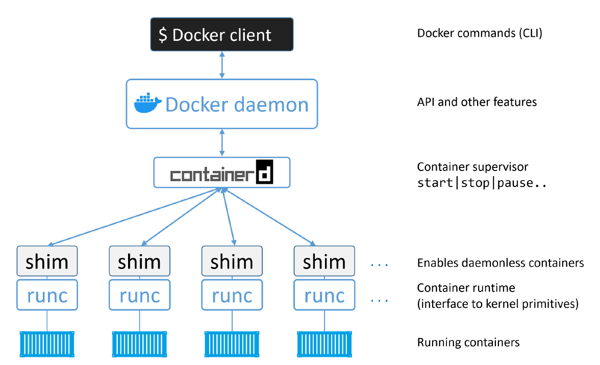

# Hands-on: Environment setup, project setup and Docker basics

## Containerized Environment Options

Before installing Docker, it is useful to understand that “containers” are not tied to one single tool. A container is a standardized way to package and run a process with its dependencies, but different tools can be used to build images, run containers, manage local development environments, or integrate with larger platforms such as Kubernetes.

| Tool             | Main role            | Notes               |
| ------------- | ------------------- | -------------------- |
| **Docker**                              | General-purpose container platform for building, running, and sharing containers | Very common in development, education, CI/CD, and cloud-native workflows. Includes a large ecosystem around Dockerfiles, images, Compose, registries, and developer tooling.        |
| **Podman**                              | Docker-compatible container engine with a daemonless architecture                | Often used as an alternative to Docker, especially on Linux systems and in security-conscious environments. It supports rootless containers and can run many Docker-style commands. |
| **containerd**                          | Core container runtime used by higher-level platforms                                                      | Docker uses containerd under the hood for container lifecycle operations such as creating, starting, and stopping containers. Kubernetes can also use containerd directly as its runtime, without Docker in between. Beginners usually interact with Docker rather than containerd directly.                       |
| **nerdctl**                             | Docker-compatible CLI for containerd                                             | Useful for working more directly with containerd while keeping a Docker-like command-line experience.                                                                               |

For this course, we will use Docker as the main hands-on platform. Docker is a good starting point because it gives us a complete and beginner-friendly workflow. Using Docker does not mean that other tools are less important. In fact, tools such as Podman, containerd, and Kubernetes are highly relevant in real-world environments. However, Docker provides the simplest entry point for learning the core ideas that apply across the container ecosystem:
- images and containers
- container registries
- filesystem layers
- networking and ports
- volumes and persistence
- environment variables and secrets
- container isolation and host interaction
- security risks such as privileged containers, unsafe images, and exposed Docker sockets

## About Docker platform

Docker is an open platform for developing, shipping, and running applications. You can download and install Docker on multiple platforms. There are multiple [Docker products](https://docs.docker.com/manuals/):
- **Application development**: Docker Desktop, Docker Offload, Docker Build Cloud, Testcontainers, Docker Build, Docker Engine, Docker Compose
- **Supply chain security**: Docker Hub, Docker Hardened Images, Docker Scout
- **AI and agents**: Docker Sandboxes, MCP Catalog and Toolkit, Docker Model Runner, Docker Agent, Gordon

**Docker Desktop** is a one-click-install application for your Mac, Linux, or Windows environment that lets you build, share, and run containerized applications and microservices. It provides a straightforward GUI (Graphical User Interface) that lets you manage your containers, applications, and images directly from your machine.

> Commercial use of Docker Desktop in larger enterprises (more than 250 employees OR more than $10 million USD in annual revenue) requires a paid subscription.

**Docker Engine** is an open source containerization technology for building and containerizing your applications. Docker Engine acts as a client-server application with:
- A server with a long-running daemon process **dockerd**.
- APIs which specify interfaces that programs can use to talk to and instruct the **Docker daemon**.
- A command line interface (CLI) **client docker**.

[Docker Desktop for Linux and Docker Engine](https://docs.docker.com/desktop/install/linux-install/#differences-between-docker-desktop-for-linux-and-docker-engine) can be installed side-by-side on the same machine. Docker Desktop for Linux stores containers and images in an isolated storage location within a VM and offers controls to restrict its resources. Using a dedicated storage location for Docker Desktop prevents it from interfering with a Docker Engine installation on the same machine.


## Docker Engine Architecture

Docker Engine is **written in the Go programming language** and takes advantage of several features of the Linux kernel to deliver its functionality. Docker uses a technology called **namespaces** to provide the isolated workspace called the container. When you run a container, Docker creates a set of namespaces for that container.

These namespaces provide a layer of isolation. Each aspect of a container runs in a separate namespace and its access is limited to that namespace.

Docker uses a **client-server architecture**. 

The Docker client talks to the Docker daemon, which does the heavy lifting of building, running, and distributing your Docker containers. 

The Docker client and daemon can run on the same system, or you can connect a Docker client to a remote Docker daemon. The Docker client and daemon communicate using a REST API, over UNIX sockets or a network interface.

In a default Linux installation, the client talks to the daemon via a local IPC/Unix socket at `/var/run/docker.sock`.

Another Docker client is Docker Compose, that lets you work with applications consisting of a set of containers.


Source: https://docs.docker.com/get-started/overview/

A Docker registry stores Docker images. Docker Hub is a public registry that anyone can use, and Docker looks for images on Docker Hub by default. You can even run your own private registry.

When you use the `docker pull` or `docker run` commands, Docker pulls the required images from your configured registry. When you use the `docker push` command, Docker pushes your image to your configured registry.

The Docker engine is modular in design and built from many small specialised tools. Where possible, these are based on open standards such as those maintained by the Open Container Initiative (OCI).

> As of Docker 1.11 (early 2016), the Docker engine implements the **OCI specifications** as closely as possible. For example, the Docker daemon no longer contains any container runtime code; all container runtime code is implemented in a separate OCI-compliant layer. By default, Docker uses runc for this. runc is the reference implementation of the OCI container-runtime-spec.

The major components that make up the Docker engine are; the **Docker daemon**, **containerd, runc**, and various plugins such as networking and storage. Together, these create and run containers.



Source: Docker Deep Dive, Nigel Poulton

- **`runc`** is the reference implementation of the OCI Runtime Specification. It is a low-level container runtime responsible for creating and starting containers according to the OCI standard. Docker, Inc. played an important role in both defining the OCI runtime specification and developing runc. Internally, runc is a lightweight CLI wrapper around libcontainer, the library that Docker introduced after moving away from LXC as its main interface to Linux kernel features such as namespaces and cgroups. Unlike Docker, runc is not a full container platform. It does not provide image management, networking, volumes, registries, Compose support, or a developer-friendly workflow. Its purpose is much narrower: given a prepared container filesystem and configuration, runc creates and runs the container. Because runc operates at this very low level, we often describe it as working at the OCI runtime layer. Higher-level tools such as Docker and containerd use components like runc underneath, while users usually interact with the more complete tooling above it.
-  **`containerd`** is a core container runtime that manages container lifecycle operations such as starting, stopping, pausing, and removing containers. It was originally extracted from the Docker daemon as part of the effort to make Docker more modular. In the Docker stack, containerd sits between the Docker daemon and low-level OCI runtimes such as runc Although containerd started as a lightweight lifecycle manager, it has grown to support additional features such as image pulling, storage, and networking. These features are modular, so platforms can use only the parts they need. Docker developed containerd and later donated it to the Cloud Native Computing Foundation (CNCF). It is now a graduated CNCF project and is widely used in production, including as a container runtime for Kubernetes.
- **`shim`** allows containers to keep running independently of the main containerd daemon. When containerd creates a container, it starts a new runc process. After runc creates the container, runc exits, and the containerd-shim becomes responsible for the running container process. The shim keeps the container’s standard input, output, and error streams open and reports the container’s exit status back to containerd. This design means containers can continue running even if containerd is restarted, and the system does not need to keep one runc process running for every container.
- The **`Docker daemon (dockerd)`** is the main background service of Docker Engine. It listens for requests from the Docker CLI or REST API and coordinates higher-level container operations. Although lower-level execution is delegated to components such as containerd and runc, the daemon still handles important functionality such as image management, image builds, API access, authentication, security features, networking, and orchestration-related behavior.

## Installing Docker Engine on Ubuntu

Docker Engine for Ubuntu is compatible with x86_64 (or amd64), armhf, arm64, s390x, and ppc64le (ppc64el) architectures. We are going to install Docker Engine from Docker's apt repository. 

1. Before you [install Docker Engine for the first time](https://docs.docker.com/engine/install/ubuntu/) on a new host machine, you need to set up the Docker apt repository. Afterward, you can install and update Docker from the repository.

```bash
# Add Docker's official GPG key:
sudo apt update
sudo apt install ca-certificates curl
sudo install -m 0755 -d /etc/apt/keyrings
sudo curl -fsSL https://download.docker.com/linux/ubuntu/gpg -o /etc/apt/keyrings/docker.asc
sudo chmod a+r /etc/apt/keyrings/docker.asc

# Add the repository to Apt sources:
sudo tee /etc/apt/sources.list.d/docker.sources <<EOF
Types: deb
URIs: https://download.docker.com/linux/ubuntu
Suites: $(. /etc/os-release && echo "${UBUNTU_CODENAME:-$VERSION_CODENAME}")
Components: stable
Architectures: $(dpkg --print-architecture)
Signed-By: /etc/apt/keyrings/docker.asc
EOF

sudo apt update
```

2. Install the Docker packages.
```bash
sudo apt install docker-ce docker-ce-cli containerd.io docker-buildx-plugin docker-compose-plugin
```

3. Verify that the installation is successful: 
```bash
sudo docker run hello-world
```

4. Configure Docker to start on boot with systemd:
```bash
sudo systemctl enable docker.service
sudo systemctl enable containerd.service
```

## Project Setup

We will build a small product catalog application with:
- a `frontend` container serving static HTML, CSS, and JavaScript
- a `backend` container exposing a simple FastAPI API
- a `postgres` database container storing products and demo users
- a `redis` container acting as a cache

At this stage the setup is intentionally minimal:
- broad images
- root inside the containers
- plain environment-variable secrets
- all service ports published to the host
- weak defaults that we will improve later

```text
example_app/
├── .env.example
├── .env
├── compose.yaml
├── backend/
│   ├── app.py
│   ├── Dockerfile
│   └── requirements.txt
├── frontend/
│   ├── Dockerfile
│   ├── index.html
│   ├── app.js
│   └── styles.css
└── db/
    └── init/
        └── 01-schema.sql
```

```
Browser
  |
  +--> frontend container  -> serves the UI on port 3000
  |
  +--> backend container   -> API on port 8000
          |
          +--> postgres     -> persistent data on port 5432
          |
          +--> redis        -> cache on port 6379
```

This first version does many things that are not acceptable in production:
- uses wide base images
- not updated dependencies
- copies more files than necessary into images
- runs services as root
- exposes PostgreSQL and Redis directly to the host
- stores secrets in plain text in environment variables
- includes an intentionally weak debug endpoint in the backend
- includes a search route that is simple enough to inspect and later harden

### Run the application
- **Build And Start The Stack**
    ```bash
    sudo docker compose up --build
    ```

- **Open The Application**
    - frontend: <http://localhost:3000>
    - backend health: <http://localhost:8000/api/health>
    - PostgreSQL: `localhost:5432`
    - Redis: `localhost:6379`

- **Observe The Containers**. In a second terminal:
    ```bash
    sudo docker compose ps
    sudo docker compose logs backend
    sudo docker compose logs db
    sudo docker compose logs redis
    ```

- **Explore The API**
    - Get the health state:
        ```bash
        curl http://localhost:8000/api/health
        ```
    - Fetch all products:
        ```bash
        curl http://localhost:8000/api/products
        ```
    - Run a search:
        ```bash
        curl "http://localhost:8000/api/products/search?q=red"
        ```
    - Clear the Redis cache:
        ```bash
        curl -X POST http://localhost:8000/api/cache/clear
        ```
    - Inspect the intentionally weak debug route:
        ```bash
        curl http://localhost:8000/api/admin/debug
        ```

- **Inspect The Running Environment**
    - Check the Compose-created network:
        ```bash
        docker network ls
        ```
    - Inspect the backend container:
        ```bash
        docker compose exec backend sh
        ```
    - Inside the container (the process runs as root, credentials are available as plain environment variables):
        ```sh
        id
        env | sort
        exit
        ```

- **Teardown**
    - Stop the stack:
        ```bash
        docker compose down -v
        ```
