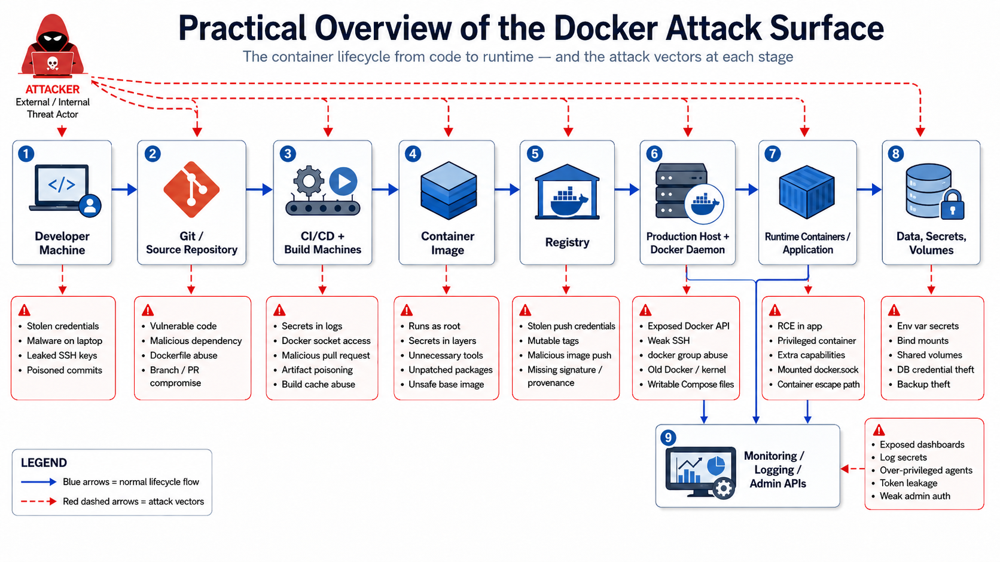

# Attack Surface In Containerized Environments

## Real-World Examples of Compromised Container Environments

### Tesla Kubernetes console cryptojacking incident

[Tesla’s cloud environment was compromised](https://www.wired.com/story/cryptojacking-tesla-amazon-cloud/) after attackers found a Kubernetes administrative console that was not password protected. From that console, they discovered credentials inside a Kubernetes pod that allowed access deeper into Tesla’s AWS environment. The attackers deployed cryptocurrency-mining scripts, using Tesla’s cloud compute resources for profit. Tesla said the issue was addressed within hours and that customer privacy and vehicle safety were not affected, but the incident still exposed sensitive internal data such as vehicle and mapping telemetry. 

**Main problem: an exposed, unauthenticated Kubernetes console and credentials stored inside a pod.**

### Malicious Docker Hub images by the docker123321 account

[In 2018, researchers found 17 malicious Docker images](https://threatpost.com/malicious-docker-containers-earn-crypto-miners-90000/132816/) on Docker Hub that contained cryptocurrency-mining malware. These images were downloaded roughly 5 million times before removal, and the attackers were estimated to have mined about $90,000 worth of Monero. Some images had mining software preinstalled, while others were intentionally misconfigured so the attacker could later access the running containers. The consequence was a container supply-chain compromise: users trusted public images and ran attacker-controlled code inside their environments. 

**Main problem: untrusted public container images and poor image-vetting practices.**

### Graboid Docker cryptojacking worm

[Graboid was reported by Palo Alto Networks Unit 42](https://unit42.paloaltonetworks.com/graboid-first-ever-cryptojacking-worm-found-in-images-on-docker-hub/) as the first known cryptojacking worm that spread through Docker Engine containers. It infected more than 2,000 unsecured Docker hosts by abusing exposed Docker daemons with no authentication. Once inside, it deployed Monero mining malware and periodically queried command-and-control infrastructure for new vulnerable Docker hosts to infect. Traditional endpoint tools often missed this activity because it happened inside containers. 

**Main problem: Docker daemons exposed to the internet without authentication or authorization.**

### Kinsing attacks against exposed Docker APIs

[The Kinsing malware campaign](https://www.aquasec.com/blog/threat-alert-kinsing-malware-container-vulnerability/) targeted container environments by exploiting misconfigured Docker API ports. Attackers used the exposed Docker API to start an Ubuntu container, download scripts, install persistence, kill competing miners, and run Kinsing plus a cryptominer. Aqua Security observed that the malware attempted to spread to other containers and hosts after initial compromise. The consequence was resource hijacking, persistence inside the container environment, and potential lateral movement beyond the original container. 

**Main problem: publicly exposed Docker API endpoints and weak runtime controls.**

### Hildegard TeamTNT Kubernetes campaign

[Hildegard was a TeamTNT-linked malware campaign](https://unit42.paloaltonetworks.com/hildegard-malware-teamtnt/) targeting Kubernetes clusters. The attackers gained initial access through a misconfigured kubelet that allowed anonymous access, then attempted to spread across as many containers as possible before launching cryptojacking. The malware used reverse shells, IRC command-and-control, process hiding, and payload encryption to remain stealthy. Unit 42 noted that hijacking a Kubernetes cluster is more profitable than compromising a single Docker host because a cluster can contain many nodes and containers. 

**Main problem: kubelet anonymous access and insufficient Kubernetes hardening.**

### Siloscape Windows container escape malware

[Siloscape was identified](https://unit42.paloaltonetworks.com/siloscape/) as the first known malware targeting Windows containers to compromise Kubernetes environments. It targeted Windows Server containers, attempted to escape the container, and then abused Kubernetes node credentials to spread inside poorly configured clusters. Unit 42 identified active victims and warned that full cluster compromise could expose usernames, passwords, internal files, databases, and even enable ransomware or software supply-chain attacks. The key danger was that a single compromised container could become a path to the entire Kubernetes cluster. 

**Main problem: treating Windows Server containers as a strong security boundary, combined with poor Kubernetes cluster configuration.**

### SCARLETEEL Kubernetes-to-AWS cloud data theft

[SCARLETEEL was a sophisticated cloud attack](https://www.sysdig.com/blog/cloud-breach-terraform-data-theft) discovered by Sysdig in a customer environment. The attacker first exploited a public-facing service in a self-managed Kubernetes cluster, gained access to a pod, and then pivoted into the victim’s AWS account. The attackers used cloud knowledge to escalate privileges, access AWS resources, steal proprietary software and credentials, and attempt further pivoting through Terraform state files. A cryptominer was also launched, possibly for profit or as a distraction, but the major consequence was data theft. 

**Main problem: a vulnerable Kubernetes workload combined with overly permissive cloud credentials and poor cloud workload isolation**

### LemonDuck botnet targeting Docker

[LemonDuck, originally known for broader botnet and cryptomining activity](https://www.crowdstrike.com/en-us/blog/lemonduck-botnet-targets-docker-for-cryptomining-operations/), expanded into Docker environments. CrowdStrike found that LemonDuck targeted exposed Docker APIs to run malicious containers that downloaded disguised scripts and eventually launched XMRig cryptocurrency mining. The malware also attempted to evade detection by disabling Alibaba Cloud monitoring services and killing competing miner processes. It searched for SSH keys, creating a path for lateral movement beyond the original container host. 

**Main problem: exposed Docker APIs, excessive container privileges, and weak host/container separation.**

### Kiss-a-Dog Docker and Kubernetes cryptojacking campaign

[Kiss-a-Dog was a CrowdStrike-observed cryptojacking campaign](https://www.crowdstrike.com/en-us/blog/new-kiss-a-dog-cryptojacking-campaign-targets-docker-and-kubernetes/) targeting vulnerable Docker and Kubernetes infrastructure. The campaign used multiple command-and-control servers, attempted container escape using host mounts, deployed rootkits, backdoored compromised containers, and tried to move laterally. The goal was cryptocurrency mining, but the tooling also supported persistence and stealth inside cloud-native environments. CrowdStrike highlighted misconfigured Docker or Kubernetes instances as a key detection point. 

**Main problem: exposed container attack surface, host path mounts, and misconfigured Docker/Kubernetes deployments.**


## Why Containers Change the Attack Surface

From a security perspective, many things remain the same in a containerized environment as in a traditional deployment. Attackers still want to steal data, modify how a system behaves, disrupt services, or abuse someone else’s compute resources for their own purposes, such as running cryptocurrency miners. **Moving an application into a container does not remove these motivations, and it does not automatically make the application secure.** A vulnerable web application is still vulnerable, weak credentials are still weak credentials, and exposed services are still exposed services.

What containers change is **how the application runs and what exists around it**. In a traditional deployment, an application usually runs directly on a server or virtual machine, alongside its configuration files, system packages, logs, local users, and network interfaces. In a containerized deployment, the application is packaged into an image, started by a container runtime, connected to container networks, given environment variables, mounted volumes, and controlled by a daemon such as Docker. This creates new places where mistakes can happen and new paths an attacker can follow after the first compromise.

For example, imagine a simple web application with a command injection vulnerability. 
- **In a traditional VM-based deployment**, an attacker who exploits that vulnerability may get command execution as the application user on the server. They might then look for local files, credentials, running processes, network access, or privilege escalation opportunities on that machine. 
- **In a containerized deployment**, the initial vulnerability may be exactly the same, but the attacker lands inside a container. At first, this may sound safer because the attacker is “only in the container.” However, the real question is: what does that container have access to?

The compromised container may contain environment variables with database credentials. 
- It may be connected to an internal Docker network where the database, cache, admin panel, or message queue are reachable by service name. 
- It may have a bind-mounted source code directory from the host. 
- It may run as root inside the container. 
- It may have extra Linux capabilities, access to host paths, or in the worst case, access to the Docker socket. In that situation, the container is not just a small isolated box; it becomes a stepping stone into other parts of the system.

Consider a Docker Compose application with a web service, a database, and an admin interface:

```yaml
services:
  web:
    image: example-web-app
    ports:
      - "8080:8080"
    environment:
      - DB_HOST=db
      - DB_USER=app
      - DB_PASSWORD=devpassword
    volumes:
      - ./app:/app

  db:
    image: postgres
    environment:
      - POSTGRES_PASSWORD=devpassword

  admin:
    image: adminer
    ports:
      - "9000:8080"
```

But from an attack surface perspective, several important questions appear:
- The web application is exposed on port 8080. 
- The admin interface is also exposed on port 9000. 
- The web container contains database credentials in environment variables. 
- The source code is mounted from the host into the container. 
- The web container can likely reach the database by using the hostname db.

Now imagine the web application is compromised. The attacker may be able to inspect the container environment, recover the database password, connect to the database over the internal Docker network, and access or modify application data. If the mounted `./app:/app` directory is writable, the attacker may also be able to modify application code on the host through the container. The original vulnerability was still just a web application bug, but container configuration changed the blast radius.

This is the main reason containers change the attack surface: they introduce additional layers, boundaries, and control points. We now have to think not only about the application, but also about the image, runtime configuration, Docker daemon, mounted volumes, container networks, secrets, host interaction, and build process. Each of these can either reduce risk or accidentally create a new path for an attacker.

## Container Threat Model

**Threat modeling** is the process of asking, in a structured way, what we are protecting, who might attack it, how they could reach it, and what could happen if one part of the system is compromised. In containerized environments, this becomes especially important because the application is no longer just “running on a server.” It is built into an image, stored in a registry, pulled by a host, started by a runtime, connected to container networks, given configuration and secrets, and often managed through automation. A good container threat model therefore has to follow the workload across its whole lifecycle: from source code, to image build, to registry, to runtime, to host interaction.

A useful way to think about this is that **containers create a chain of trust**. The developer writes source code, the build system turns it into an image, the registry stores that image, and the Docker host pulls and runs it as a container. This lifecycle is also used in container security research: [one survey on container threat modeling](https://arxiv.org/pdf/2111.11475) describes a data-flow model where application code and Dockerfiles move from a code repository, into an image build process, into a registry, and finally onto a Docker host where the image is deployed as a running container.

**The threat model should not only focus on dramatic container escape scenarios**. Those are important, but they are only one part of the picture. In practice, many container incidents start with something ordinary: a vulnerable web endpoint, a leaked password, an exposed admin panel, a bad image, a writable mount, or a CI job with too much access. The attacker may not need to “break Docker” if the deployment already gives them credentials, internal network access, or control over the Docker daemon.


### Threat Actors

The first step is to identify the actors that may interact with the system. In a traditional application, we often think mainly about external attackers and legitimate users. In containerized environments, we also need to consider developers, CI/CD systems, registries, administrators, automation containers, and even application processes themselves.

An **external attacker** is someone outside the environment. They may reach the system through a published port, a public web application, an exposed API, a misconfigured admin panel, or an exposed Docker API. Their starting position is usually limited, but if the first service they compromise contains secrets or internal network access, their reach can expand quickly.

An **internal attacker** already has access to some part of the deployment. This could be a compromised container, a stolen developer account, a foothold on the Docker host, or access to an internal network. Internal attackers are dangerous because many containerized environments trust internal traffic too much. For example, a database or cache service may not be exposed to the internet, but it may still be reachable from every container on the same Docker network.

A **malicious internal actor** is someone who legitimately has some access but abuses it. This could be a developer who can modify a Dockerfile, a user who can push images to a registry, an administrator who can access the Docker host, or a CI/CD maintainer who can change build scripts. In a containerized environment, these roles are powerful because modifying an image or deployment configuration can change what code eventually runs in production.

An **arbitrary internal actor** is not malicious but can still create risk. A developer may accidentally commit a `.env` file, copy a private key into an image, use latest tags in production, expose a database port during testing, or run an internet-sourced Compose file without checking its privileges. Many container security problems come from convenience decisions that were never meant to become production behavior.

Finally, we should also model application processes as actors. A process is not malicious by itself, but if it is compromised or behaves unexpectedly, its permissions matter. A web process that can read environment variables, write to mounted host directories, connect to internal services, or access the Docker socket becomes an important security actor once an attacker controls it.


### What Permissions Does Each Actor Have?

In a Docker-focused environment, permissions usually come from three places: 
- **Credentials** include application passwords, database users, API tokens, registry credentials, SSH keys, TLS private keys, CI/CD secrets, and cloud credentials. A developer with registry credentials may be able to push a new image. A compromised web container with database credentials may be able to read or modify data. A CI runner with deployment credentials may be able to change what runs in production.
- **System privileges** include access to the Docker host, membership in the docker group, access to the Docker socket, file permissions on mounted directories, and container runtime settings such as privileged: true, added Linux capabilities, host networking, or host PID mode. These permissions define how far an attacker can go after compromising a container.
- **Network access** determines what the actor can reach. A public user may only reach the web service, while a compromised web container may reach the database, Redis, an admin panel, metrics endpoints, internal APIs, or the Docker daemon if it has been exposed. This distinction is important: a service does not need to be public to be part of the attack path.

### Ways to Analyze the Threat Landscape

#### Asset-Based View: What Are We Trying to Protect?
The asset-based view starts with valuable things in the system. This is useful because it prevents us from focusing only on technical components and forgetting the actual business impact. In a containerized environment, assets include:
- Application source code
- Database data
- API tokens
- TLS certificates
- Docker host
- Docker socket
- Container images
- Registry credentials
- CI/CD secrets
- Mounted files
- Internal services
- Logs

For each asset:
- Where does this asset live?
- Who can access it?
- Which container can read it?
- Can it be copied into an image?
- Can it appear in logs?
- Can it be accessed through a mounted volume?
- What happens if it is modified or deleted?

For example, database data may live in a named Docker volume. The database container obviously needs access to it, but the threat model should ask whether any other container can access that same volume, whether the database port is published, whether credentials are stored in environment variables, and whether backup files are mounted into another service.

#### Entry-Point View: Where Can an Attacker Enter?
The entry-point view looks for places where input, access, or control enters the system.

Common Docker-oriented entry points include:
- Published ports
- Web endpoints
- Admin panels
- Debug endpoints
- Exposed metrics endpoints
- Uploaded files
- Container logs
- Mounted volumes
- Docker API
- Compromised image
- Malicious dependency
- Developer laptop
- CI runner

#### Trust-Boundary View: Where Does Control Cross Zones?
A trust boundary exists wherever data or control moves from one zone into another. Containers introduce many such boundaries. Important boundaries include:
- Internet → container
- container → container
- container → host
- container → Docker daemon
- developer → registry
- CI/CD → registry
- registry → production host
- container → mounted filesystem
- container → secret store

#### Attacker Path View: If One Part Is Compromised, What Becomes Reachable?

The attacker path view connects individual findings into realistic chains. A single issue may look minor in isolation, but serious when combined with others.
- Attack Path 1: Public App To Local Secrets
    1. Exploit a vulnerable API endpoint in a public-facing container.
    2. Get code execution in the container.
    3. Read mounted secrets, `.env` files, or application config.
    4. Reuse those credentials against Redis, PostgreSQL, a registry, or a cloud API.
    5. If the container can reach the runtime socket, start a more privileged container.
    6. Use the new access to move into data stores, host files, or other containers.
- Attack Path 2: Exposed Docker API To Host Compromise
    1. Find Docker Remote API exposed on TCP.
    2. Start a new privileged container or one with host filesystem mounts.
    3. Chroot into the host or steal host secrets.
    4. Persistence or data theft follows.
- Attack Path 3: CI Pipeline To Production Compromise
    1. Abuse a CI job, compromised runner, or malicious dependency.
    2. Insert a malicious image or implant build-time artifact.
    3. Push to the trusted registry path.
    4. Wait for deployment.
    5. Gain runtime access inside production under a trusted image name.
- Attack Path 4: Low-Privilege Container To Host
    1. Land in a container through application compromise.
    2. Discover the container has a sensitive bind mount, runtime socket, or elevated capabilities.
    3. Interact with the runtime or host filesystem.
    4. Escape to the host or gain host-level influence.
    5. From the host, scrape tokens, registry credentials, logs, or data from other containers.
- Attack Path 5: Monitoring Plane As A Shortcut
    1. Find an exposed dashboard or logging UI.
    2. Reuse weak credentials or exploit poor auth.
    3. Read logs containing secrets, tokens, or internal endpoints.
    4. Pivot into containers, databases, management APIs, or the runtime socket.

### Common Frameworks for Thinking About Container Threats

#### STRIDE for Containers

STRIDE is not container-specific, but it works very well for containerized environments when applied per [trust boundary](https://www.cavirin.com/blog/26-docker/77-docker-container-security-and-stride.html).

| STRIDE category        | Container example                                                    |
| ---------------------- | -------------------------------------------------------------------- |
| Spoofing               | Attacker uses stolen registry credentials to push an image           |
| Tampering              | Container modifies a mounted host directory                          |
| Repudiation            | Container creation or image push is not logged                       |
| Information disclosure | Secrets are visible in environment variables                         |
| Denial of service      | Container consumes excessive CPU, memory, or network                 |
| Elevation of privilege | Privileged container or Docker socket access enables broader control |


#### MITRE ATT&CK For Containers

[MITRE ATT&CK for Containers](https://attack.mitre.org/matrices/enterprise/containers/#) is useful because it describes adversary behavior using container-specific tactics and techniques. MITRE states that the Containers matrix represents tactics and techniques known to target container technologies and container orchestration systems.

| Finding                          | ATT&CK-style interpretation        |
| -------------------------------- | ---------------------------------- |
| Public vulnerable web app        | Initial Access                     |
| Shell inside container           | Execution                          |
| Secrets in environment variables | Credential Access                  |
| Listing containers and services  | Discovery                          |
| Web container reaches database   | Lateral Movement / Collection      |
| Docker socket mounted            | Privilege Escalation / Escape path |
| Crypto miner in container        | Resource Hijacking / Impact        |


Source: https://attack.mitre.org/matrices/enterprise/containers/#

#### NIST SP 800-190

[NIST SP 800-190](https://csrc.nist.gov/pubs/sp/800/190/final) is useful as a baseline reference because it organizes container security around core container components and risks. It describes containers as operating-system virtualization combined with application packaging, and it provides guidance on security concerns for containerized applications. NIST is useful because it reinforces the idea that container risk is not only a runtime problem. It includes images, registries, containers, host operating systems, and supporting processes.


## Practical Overview of the Docker Attack Surface

The easiest mistake in container security is to focus only on “the container.” In reality, the attack surface is much larger. A containerized workload passes through source code, dependencies, Dockerfiles, build systems, registries, hosts, runtimes, networks, volumes, secrets, logs, and operational tooling before it becomes a running application.

A practical threat model should therefore follow the container lifecycle:
```
Developer -> Source Code -> CI/CD -> Builder -> Image -> Registry -> Host -> Runtime -> Container -> App -> Data
                                                                  |
                                                                  +-> Logs / Monitoring / Admin APIs
```

An attacker does not need to break the strongest boundary. They only need to find the weakest link in this chain.

| Lifecycle stage                 | Main security question                                                                       |
| ------------------------------- | -------------------------------------------------------------------------------------------- |
| Source code and dependencies    | What vulnerabilities or malicious code enter before the image is built?                      |
| Dockerfile and image build      | What gets packaged into the image, including tools, users, secrets, and vulnerable packages? |
| CI/CD and builder               | Can the build process be abused to create or publish a malicious artifact?                   |
| Registry and image distribution | Can attackers push, replace, poison, or pull images they should not access?                  |
| Docker host and daemon          | Can attackers control the runtime or host through Docker management interfaces?              |
| Runtime configuration           | What privileges does the container receive when it starts?                                   |
| Network                         | What services become reachable from the internet, the host, or other containers?             |
| Storage and volumes             | What host files, persistent data, or shared volumes cross security boundaries?               |
| Secrets and configuration       | What sensitive values are visible to the container after compromise?                         |
| Observability and operations    | Can logs, dashboards, monitoring agents, or admin tools become attack paths?                 |




### Source Code and Dependency Attack Surface

The lifecycle begins before Docker is involved. Application bugs still matter in containers. SQL injection, command injection, SSRF, insecure deserialization, authentication bypasses, broken access control, and vulnerable third-party libraries do not disappear because the application is packaged as an image. The difference is what happens after exploitation.

In a traditional deployment, a command injection vulnerability may give the attacker command execution on a virtual machine. In a containerized deployment, the same vulnerability may give the attacker command execution inside a container. That may sound safer, but the important question is: what does that container have access to?

Attack vectors include:
- vulnerable web routes
- vulnerable APIs
- command injection
- SQL injection
- SSRF into internal services
- insecure file uploads
- insecure deserialization
- authentication bypasses
- vulnerable application dependencies
- malicious or typosquatted packages
- exposed debug endpoints
- over-permissive GraphQL or admin APIs

**The key lesson: containerization changes the landing zone, not the existence of application vulnerabilities.**

### Dockerfile and Image Attack Surface

The image is the artifact that will eventually run. If the image contains risky defaults, unnecessary tools, secrets, malware, vulnerable packages, or dangerous configuration, those risks travel with the image into every environment where it is deployed.

Image-level attack vectors include:
- using untrusted public base images
- using large full-OS images when a smaller image would be enough
- stale packages and vulnerable libraries
- unnecessary shells, package managers, compilers, curl, wget, or debugging tools
- SSH servers inside production containers
- images that run as root by default
- secrets copied into image layers
- sensitive files included through a broad build context
- missing or weak .dockerignore
- unverified downloads in the Dockerfile
- curl | sh installation patterns
- mutable tags such as latest
- missing image signing or provenance
- vulnerable application dependencies baked into the image


### CI/CD and Builder Attack Surface

The build pipeline is part of the attack surface because it decides what code becomes an image and what image is allowed to reach the registry. CI/CD systems are powerful because they often have access to source code, build secrets, registry credentials, signing keys, deployment tokens, and sometimes Docker itself. OWASP notes that CI/CD pipelines increase an organization’s attack surface and are attractive targets because pipeline steps are often executed with privileged identities.

Attack vectors include:
- malicious pull requests in insecure pipelines
- poisoned pipeline configuration
- CI jobs with access to production secrets
- CI runners with `/var/run/docker.sock` mounted
- shared runners with weak isolation
- leaked registry credentials
- leaked signing keys
- untrusted CI plugins or actions
- dependency confusion
- typosquatted packages
- compromised package maintainer accounts
- build cache poisoning
- artifact replacement
- weak branch protection
- missing review before production deployment
- secrets printed into build logs


### Registry and Image Distribution Attack Surface

The registry is where built images are stored and distributed. If attackers can push to the registry, replace an image, steal registry credentials, or trick systems into pulling the wrong image, they may compromise runtime environments without directly attacking the production host.

Attack vectors include:
- weak registry authentication
- leaked registry tokens
- over-permissive push access
- public images used without review
- malicious Docker Hub images
- typosquatted image names
- mutable tags such as latest
- missing signature verification
- missing provenance
- stale images left available
- image rollback to a vulnerable version
- compromised maintainer accounts
- internal image poisoning

The important point is that registry trust becomes runtime trust. If the deployment process trusts whatever is behind a tag, then control of the tag can become control of production.

### Docker Host and Docker Daemon Attack Surface

Containers run on hosts. The host contains the kernel, Docker Engine, container runtime, images, volumes, logs, network rules, and often local credentials or deployment scripts. A weak host can undermine every container running on it.

The Docker daemon is especially sensitive. Docker documentation warns that only trusted users should control the daemon, because Docker can start containers with host filesystem access. Docker also warns that exposing the daemon API over HTTP has serious security implications and should be secured with HTTPS certificates and limited to trusted networks or VPNs.

Host and daemon attack vectors include:
- exposed Docker API
- exposed Docker daemon over TCP
- weak SSH access to the Docker host
- too many users in the docker group
- vulnerable host kernel
- outdated Docker Engine
- writable Docker Compose files
- writable systemd unit files
- registry credentials stored on the host
- local management dashboards such as Portainer
- weak host filesystem permissions
- insufficient logging around docker exec, docker run, or image pulls
- backup scripts or deployment scripts with excessive privilege

### Runtime Configuration Attack Surface

The same image can be relatively safe or extremely dangerous depending on how it is run. Runtime configuration decides whether the container runs as root, whether it is privileged, which Linux capabilities it receives, which namespaces it shares, whether it can write to the filesystem, which devices it can access, and whether kernel hardening features apply.

Dangerous runtime settings include:
- `privileged: true`
- running as root
- `--cap-add=SYS_ADMIN`
- `--cap-add=NET_ADMIN`
- `--cap-add=SYS_PTRACE`
- host network mode
- host PID namespace
- host IPC namespace
- access to host devices
- disabled seccomp profile
- disabled AppArmor or SELinux confinement
- writable root filesystem
- broad bind mounts
- mounted Docker socket


### Network and Service Reachability Attack Surface

Container networking creates both useful connectivity and accidental reachability. A database may need to be reachable from the web application, but not from the internet. A metrics endpoint may need to be reachable from monitoring, but not from every container. An admin interface may be useful locally, but dangerous if published to all interfaces.

Network attack vectors include:
- published database ports
- exposed admin panels
- exposed metrics endpoints
- exposed debug endpoints
- reverse-proxy misconfiguration
- path rewrite mistakes
- weak TLS configuration
- internal services reachable from too many containers
- flat Docker networks
- unauthenticated Redis, Elasticsearch, PostgreSQL, or message queues
- weak east-west traffic controls
- internal DNS reconnaissance
- metadata service access
- host network mode
- accidental exposure through `-p` or Compose `ports`

### Storage, Volumes, and Host Filesystem Attack Surface

Storage is where container isolation often becomes messy. Containers may use named volumes, bind mounts, temporary filesystems, uploaded files, logs, caches, and backup directories. Some of these are harmless. Others create direct paths between the container and the host.

Storage attack vectors include:
- writable bind mounts
- host root mounted into a container
- source code mounted into production containers
- shared volumes reused across trust boundaries
- database volumes accessible from non-database containers
- secrets stored in mounted directories
- backups mounted into application containers
- writable upload directories
- logs containing credentials
- insecure file permissions on the host
- volume deletion or tampering

### Secrets and Configuration Attack Surface

Secrets are often the easiest way for an attacker to move from one stage to the next. A container does not need to escape to the host if its environment already contains database credentials, cloud tokens, registry credentials, API keys, or deployment secrets.

Secrets and configuration attack vectors include:
- secrets in environment variables
- secrets in `.env` files
- secrets copied into image layers
- secrets passed as build arguments
- secrets printed in CI logs
- secrets mounted into too many containers
- long-lived tokens
- broad cloud IAM permissions
- registry credentials inside containers
- TLS private keys in images or volumes
- application config files with database passwords
- debug logs containing tokens
- trace data containing authorization headers

### Runtime Exploits and Container Escape Attack Surface

Container escape is the case where code running inside a container crosses into the host or another stronger security boundary. This can happen through runtime vulnerabilities, kernel vulnerabilities, dangerous configuration, excessive privileges, mounted sockets, or host filesystem exposure.

MITRE ATT&CK describes Escape to Host as adversaries breaking out of a container or virtualized environment to gain access to the underlying host. MITRE also lists examples such as mounting the host filesystem, using privileged containers, abusing system calls, or exploiting a mounted container management socket such as `docker.sock`.

Escape-related attack vectors include:
- vulnerable host kernel
- vulnerable container runtime
- vulnerable runc or containerd components
- privileged containers
- host filesystem bind mounts
- Docker socket access
- host PID namespace
- host network mode
- dangerous Linux capabilities
- disabled seccomp
- weak AppArmor or SELinux confinement
- writable `/proc` or `/sys`
- device access from containers

### Observability and Operations Attack Surface

Monitoring, logging, tracing, and administration tools are defensive tools, but they can also become attack targets. Observability systems often have broad visibility across containers, hosts, logs, metrics, traces, and runtime metadata. Some agents run with elevated privileges. Some dashboards expose sensitive operational data. Some logs contain tokens, credentials, request headers, internal URLs, stack traces, or database connection strings.

Attack vectors include:
- exposed Grafana, Kibana, Prometheus, or logging dashboards
- weak dashboard credentials
- missing SSO or MFA
- monitoring agents with host-level privileges
- runtime sockets mounted into collectors
- logs containing secrets
- traces containing authorization headers
- alerting webhooks with embedded tokens
- over-permissive admin APIs
- weak audit trails
- attackers deleting logs or disabling monitoring

