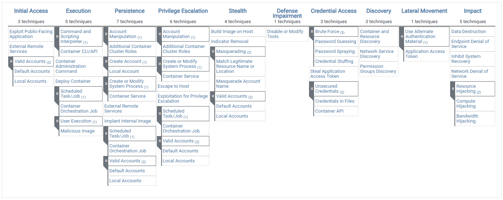

# Attack Surface In Containerized Environments


- copy fail exmaple


Containerized environments expand fast.

That is exactly why their attack surface expands fast too.

A traditional server might expose:

- one operating system
- one application
- one admin path

A containerized environment often exposes:

- public application endpoints
- published ports and reverse proxies
- container images and registries
- CI/CD and build workers
- container runtime sockets
- container daemon APIs
- application accounts and tokens
- host agents and scheduled jobs
- Docker Compose files, unit files, and run scripts
- secrets stores
- metrics, logs, dashboards, and operational tooling

This module is about learning to see all of that at once.

Many containerized applications are eventually deployed through orchestrators such as Kubernetes, but this module focuses on standalone or lightly managed container environments: Docker, Podman, containerd, Docker Compose, host networking, runtime sockets, volumes, registries, and the host operating system.

The goal is not just to memorize a list of bad things. The goal is to build a way of thinking about the entire container threat landscape so that later modules on images, networking, and hardening feel coherent.


## The Core Idea

The attack surface of a containerized environment is not one thing.

It is a chain of trust boundaries:

```text
Developer -> Source -> CI/CD -> Builder -> Registry -> Host -> Runtime -> Container -> App -> Data
                                               |
                                               +-> Monitoring / Logging / Admin APIs
```

An attacker does not need to break the hardest boundary.

They need to find the weakest one.

That might be:
- a public API route
- a poisoned image
- an exposed Docker API
- an over-permissive application token
- a management dashboard
- a dangerous bind mount
- a secret in logs
- a CI runner with the Docker socket mounted

That is why container security cannot be reduced to:
- "scan the image"
- "do not run as root"
- "put it in a container"

Those are useful controls, but they do not describe the whole system.

#### Three Common Attacker Outcomes

Most container attacks are easier to reason about if you ask what the attacker wants next:

- data theft
- compute theft
- denial of service

If a workload is exposed, attackers usually want one of those three outcomes first.

#### A Defensible Mental Model For The Audience

At the end of this lecture, participants should be able to look at a containerized environment and ask:

1. What can the internet reach?
2. What can one compromised container reach?
3. What can the host reach?
4. What can the runtime or management plane reach?
5. What can the builder or registry influence?
6. Which tokens or secrets unlock the next step?
7. Which admin or monitoring systems see everything?

That is the real container threat landscape.

Not "containers are risky" in the abstract.

But:

"this environment has seven trust boundaries and four of them are weak."

#### Good Discussion Prompts

- Which attack vectors are most likely in our environment: image poisoning, app compromise, daemon exposure, or identity abuse?
- If one container is compromised today, what is the most likely next step for the attacker?
- Which component in our environment has the highest ratio of privilege to monitoring?
- Which interfaces can bypass our normal audit path?
- Are we more worried about data theft, compute theft, or denial of service?


## Ways To Analyze The Threat Landscape

The same environment can be analyzed from several useful angles. Strong security teams switch between these lenses instead of using only one.

### 1. Analyze By Lifecycle

This is the easiest model for people new to container security.

Think in stages:

1. source and developer workstation
2. build system and CI/CD
3. image and registry
4. deployment configuration
5. runtime and host
6. post-compromise movement and impact

Useful question:

where can an attacker insert, modify, steal, or execute something at each stage?

### 2. Analyze By Layer

This is the most practical operational model.

Think in layers:

- application
- container image
- container runtime
- host OS
- host management layer
- network and service exposure
- identity and secrets
- observability and operations plane

Useful question:

what high-value interface exists at each layer, and who should be allowed to touch it?

### 3. Analyze By Attacker Path

This is the "kill chain" mindset.

Start from likely attacker goals:

- initial access
- execution
- credential access
- privilege escalation
- lateral movement
- impact

MITRE ATT&CK for Containers is excellent for this style of analysis.

### 4. Analyze By Trust Boundary

This is the most architectural approach.

Ask where trust changes:

- internet to ingress
- developer to CI
- CI to registry
- registry to host
- container to host
- host to runtime daemon
- workload to data store
- workload to secrets provider

Useful question:

what assumption are we making at this boundary, and what happens if that assumption is false?

## Common Frameworks

### MITRE ATT&CK For Containers



<!-- Source: https://attack.mitre.org/matrices/enterprise/containers/# -->

MITRE maintains a dedicated Containers matrix. As of the currently published matrix, it organizes attacker behavior across these tactics:

- Initial Access
- Execution
- Persistence
- Privilege Escalation
- Defense Evasion
- Credential Access
- Discovery
- Lateral Movement
- Impact

Examples in the matrix include:

- Exploit Public-Facing Application
- External Remote Services
- Container Administration Command
- Deploy Container
- Malicious Image
- Escape to Host
- Build Image on Host
- Unsecured Credentials
- Container API
- Container and Resource Discovery
- Resource Hijacking

Why it matters:

- it gives defenders a common language
- it helps link isolated incidents into repeatable attacker behavior
- it is more useful than a random list of "bad things" because it preserves attacker intent

### NIST SP 800-190

NIST SP 800-190 is still one of the best foundational references because it treats containers as a full stack of security concerns instead of just a runtime feature.

It is especially useful for:

- component-based analysis
- control mapping
- planning and architecture
- explaining container-specific concerns to non-specialists

Why it matters:

- it forces people to think beyond the container process itself
- it is a useful bridge between security engineering and governance

### STRIDE

STRIDE is not container-specific, but it works very well for containerized environments when applied per trust boundary.

Example:

- Spoofing: fake workload identity, stolen application token, registry impersonation
- Tampering: malicious image, modified manifest, poisoned build artifact
- Repudiation: weak audit trails around `docker exec`, runtime access, or registry changes
- Information Disclosure: secrets in env vars, mounted files, image layers, or logs
- Denial of Service: host resource exhaustion, daemon/API flooding, image-pull storms
- Elevation of Privilege: privileged containers, bind mounts, runtime socket, broad daemon access

Why it matters:

- it helps architects think systematically instead of tactically


## A practical overview of the attack surface

The easiest mistake in container security is to focus only on the container.

The actual attack surface is much larger.

## 1. Public Application Surface

This is where many attacks begin.

Attack vectors:

- vulnerable web applications
- vulnerable APIs
- weak authentication and session handling
- exposed admin panels
- SSRF into internal services
- file upload abuse
- command injection
- deserialization bugs
- debug endpoints
- GraphQL overexposure
- weak rate limits

Practical example:

a remote code execution flaw in a web application running inside a container does not stay "inside the app" for long if the container also has:

- mounted secrets or `.env` files
- metadata access
- internal network reachability
- access to Redis, PostgreSQL, or message queues

That one bug can become internal discovery, secret theft, and lateral movement.

## 2. Edge, Proxy, And Published-Port Surface

Teams often underestimate this layer because it feels like infrastructure plumbing.

Attack vectors:

- exposed reverse-proxy dashboards
- weak TLS configuration
- path confusion or rewrite mistakes
- default credentials on proxy dashboards or admin panels
- auth bypass in edge middleware
- request smuggling and header trust issues
- accidental exposure of internal routes
- mis-scoped wildcard hosts
- leaking backend services directly through published ports

Practical example:

the frontend might look fine, but the edge may still expose:

- `/metrics`
- `/debug`
- `/api/admin`
- a dashboard
- an internal health route

This is why networking and exposure decisions matter as much as code quality.

## 3. Image, Registry, And Supply Chain Surface

This is where attackers can compromise what will later run everywhere.

Attack vectors:

- malicious or typosquatted images
- compromised maintainer accounts
- poisoned base images
- mutable tags
- weak registry permissions
- leaked registry credentials
- missing signature verification
- missing provenance
- vulnerable dependencies and OS packages
- secrets baked into images
- broad build context including sensitive files
- compromised Compose files, unit files, or deployment scripts

Practical example:

an attacker who cannot touch production directly may still win by:

1. stealing registry credentials
2. pushing a malicious image under a trusted repository path
3. waiting for the next restart, pull, or deployment script

That turns supply chain trust into runtime compromise.

## 4. Build System And CI/CD Surface

The builder is one of the most powerful and most overlooked attack surfaces in modern platforms.

Attack vectors:

- CI runners with Docker socket access
- BuildKit misuse or unsafe entitlements
- untrusted BuildKit frontends
- malicious pull requests in insecure pipelines
- secret exposure in build logs
- artifact poisoning
- build cache abuse
- shared runners with weak tenant isolation
- leaked signing keys or deployment tokens
- compromised GitHub Actions or CI plugins

Practical example:

if a CI runner can reach `/var/run/docker.sock`, a malicious pipeline step may be able to:

- start privileged containers
- mount the host filesystem
- steal cached credentials
- inspect other build artifacts

That is not "just a build issue". It is an infrastructure compromise path.

## 5. Host Management And Runtime Control Surface

This is the management layer of a standalone container environment. If it is weak, everything running on the host becomes easier to abuse.

High-value targets include:

- Docker or Podman remote APIs
- `/var/run/docker.sock`
- containerd sockets
- SSH access to container hosts
- Docker Compose files
- systemd unit files that start containers
- registry credentials stored on the host
- local admin dashboards such as Portainer
- backup, patching, and deployment scripts

Attack vectors:

- exposed Docker daemon on TCP
- weakly protected management dashboards
- users in the `docker` group without strong controls
- CI jobs or helper containers with the runtime socket mounted
- writable Compose files or unit files
- scripts that pull mutable tags without verification
- broad host filesystem mounts
- unattended host agents with privileged access
- reused admin credentials across hosts
- weak audit trails around manual `docker exec` or `docker run`

Practical example:

a host may have no internet-facing application vulnerability, but a remote Docker API exposed on TCP can still let an attacker create a privileged container, mount `/`, and read or change host files.

This is a major lesson:

not every powerful action goes through the application. Runtime and host-management interfaces are control planes too.

## 6. Host And Runtime Surface

This is where "container" becomes "host risk."

Attack vectors:

- privileged containers
- host PID, IPC, or network namespace sharing
- bind mounts into sensitive host paths
- mounted Docker or container runtime sockets
- root inside the container
- extra Linux capabilities such as `SYS_ADMIN`
- missing seccomp / AppArmor / SELinux confinement
- weak user namespace settings
- runtime vulnerabilities in `runc`, containerd, or related components
- exposed device plugins
- writable procfs or sysfs abuse
- kernel attack surface shared with containers

Practical example:

these are all very different-looking settings:

- `--privileged`
- `-v /:/host`
- `-v /var/run/docker.sock:/var/run/docker.sock`
- `--pid=host`

But from the attacker's point of view they all say roughly the same thing:

"the host boundary is now negotiable."

## 7. Identity, Credentials, And Secrets Surface

This is one of the most common lateral movement paths.

Attack vectors:

- application token theft
- cloud metadata service abuse
- Docker credentials left on developer systems
- secrets in environment variables
- secrets in image layers
- secrets in CI logs
- secrets in Compose files or `.env` files
- long-lived tokens
- broad admin tokens mounted into containers
- registry creds mounted into containers
- leaked TLS private keys

Practical example:

a single compromised container may reveal:

- database credentials
- Redis passwords
- registry auth
- cloud IAM tokens
- host or deployment tokens
- internal API keys

The attacker does not need a breakout if the secrets already give them the next step.

## 8. Network And Service Discovery Surface

Flat networks make post-compromise work much easier.

Attack vectors:

- no host firewall or network segmentation
- backend and data services reachable from too many containers
- container-network service discovery abuse
- internal DNS reconnaissance
- direct container-to-container lateral movement
- exposed host ports
- insecure east-west traffic
- metadata service reachability
- unauthenticated internal HTTP services
- weak proxy, sidecar, or local DNS configuration

Practical example:

after landing in one container, attackers often do not need an exploit for the next step.

They just:

1. enumerate DNS names
2. probe common ports
3. find Redis, PostgreSQL, Elasticsearch, dashboards, or internal APIs
4. try default creds, weak creds, or stolen tokens

## 9. Data And Storage Surface

Persistence and storage layers are rich targets because they often hold the real business value.

Attack vectors:

- exposed databases
- insecure object storage
- writable shared volumes
- snapshot theft
- backup theft
- Docker volume or bind-mount abuse
- volumes reused across trust boundaries
- secrets copied into mounted storage
- weak database authentication inside the container network

Practical example:

teams often lock down the application more than the data path. Once an attacker reaches the data store, the container boundary stops mattering very much.

## 10. Observability And Operations Surface

This is the layer defenders love and attackers love too.

Attack vectors:

- exposed Grafana, Kibana, Prometheus, or dashboards
- over-permissive monitoring agents
- runtime socket mounted into collectors
- sensitive logs
- trace data containing credentials or tokens
- alerting webhooks with secrets
- admin UIs without SSO or MFA
- eBPF or host-monitoring agents with broad privilege

Practical example:

an observability agent may have:

- host-wide visibility
- Docker or containerd socket access
- access to logs from every container
- permissions to scrape host and runtime metrics

That makes it both a great defensive control and a great attack target.

## Common Attack Vectors

If you want the shortest practical list to remember, remember these.

## Very Common Initial Access Paths

- exploit a public-facing application
- steal valid credentials
- abuse exposed Docker API
- abuse exposed container-management dashboards
- abuse SSH or remote management on the container host
- pull a malicious image into the environment
- compromise CI/CD
- target dashboards, reverse proxies, and admin UIs

## Very Common Privilege Escalation Paths

- privileged container
- sensitive bind mount
- mounted runtime socket
- root container plus weak runtime restrictions
- broad access to the Docker or Podman daemon
- membership in the `docker` group
- application or deployment token with too much scope
- runtime or kernel vulnerability

## Very Common Lateral Movement Paths

- steal application, registry, or deployment tokens
- read secrets from environment or mounted files
- discover internal services on flat networks
- use host admin or dashboard credentials
- pivot via SSH or runtime socket
- poison internal images or jobs

## Very Common Impact Paths

- data theft
- cryptomining / compute hijacking
- destructive container, image, or volume deletion
- backup and snapshot theft
- denial of service through resource exhaustion
- log wiping or defense impairment

## Practical Attack Chains That Make This Real

Attackers usually chain weak points. That is what makes container security interesting and dangerous.

## Attack Chain 1: Public App To Local Secrets

1. Exploit a vulnerable API endpoint in a public-facing container.
2. Get code execution in the container.
3. Read mounted secrets, `.env` files, or application config.
4. Reuse those credentials against Redis, PostgreSQL, a registry, or a cloud API.
5. If the container can reach the runtime socket, start a more privileged container.
6. Use the new access to move into data stores, host files, or other containers.

Why it works:

- app exposure
- local secret exposure
- internal service reachability
- weak separation between application runtime and host management

## Attack Chain 2: Exposed Docker API To Host Compromise

1. Find Docker Remote API exposed on TCP.
2. Start a new privileged container or one with host filesystem mounts.
3. Chroot into the host or steal host secrets.
4. Persistence or data theft follows.

Why it works:

- the daemon is a control plane
- remote daemon access is effectively host access if poorly secured

This is one reason Microsoft observed TeamTNT targeting exposed Docker management surfaces.

## Attack Chain 3: CI Pipeline To Production Compromise

1. Abuse a CI job, compromised runner, or malicious dependency.
2. Insert a malicious image or implant build-time artifact.
3. Push to the trusted registry path.
4. Wait for deployment.
5. Gain runtime access inside production under a trusted image name.

Why it works:

- teams trust the pipeline more than they verify artifacts

## Attack Chain 4: Low-Privilege Container To Host

1. Land in a container through application compromise.
2. Discover the container has a sensitive bind mount, runtime socket, or elevated capabilities.
3. Interact with the runtime or host filesystem.
4. Escape to the host or gain host-level influence.
5. From the host, scrape tokens, registry credentials, logs, or data from other containers.

Why it works:

- host-level trust is far wider than container-level trust

## Attack Chain 5: Monitoring Plane As A Shortcut

1. Find an exposed dashboard or logging UI.
2. Reuse weak credentials or exploit poor auth.
3. Read logs containing secrets, tokens, or internal endpoints.
4. Pivot into containers, databases, management APIs, or the runtime socket.

Why it works:

- observability systems often see everything
- teams frequently protect them less than they should

## Practical Demo Examples

## Example 1: The "It Is Internal" Redis

An attacker compromises one container and starts checking service names:

- `redis`
- `postgres`
- `grafana`
- `prometheus`
- `elasticsearch`

If the container network is flat and internal services have weak auth, "internal only" becomes "reachable by the attacker."

Lesson:

internal reachability is not a defense after the first compromise.

## Example 2: The Helpful CI Runner

A team mounts `/var/run/docker.sock` into a CI runner because it makes builds easy.

A malicious build step now has a path to:

- start sibling containers
- inspect images
- mount host paths
- extract secrets

Lesson:

convenience paths are often privilege paths.

## Example 3: The Over-Permissive Application Token

A developer says:

"The container only needs to call one internal API."

But the token mounted into the container actually has:

- access to production database records
- permission to pull private images
- access to deployment scripts or admin endpoints
- broad read access across internal services

After application compromise, that token becomes a second-stage credential.

Lesson:

containers inherit identity mistakes instantly.

## Example 4: The Monitoring Stack That Became The Target

A monitoring collector has:

- host-wide log access
- container runtime visibility
- runtime socket access
- no strong auth on its UI

Attackers love this because it compresses discovery, credential theft, and operational intelligence into one target.

Lesson:

security and observability tooling can become privileged attack surfaces.

## Example 5: The Registry Nobody Threat-Modeled

The application team patches the code, the host team patches the OS, and everybody feels disciplined.

Meanwhile:

- registry credentials are shared too widely
- image signing is not enforced
- mutable tags are used for deployment

An attacker only needs to win once at the registry layer.

Lesson:

control planes and supply chains matter as much as the workload.


## References

- MITRE ATT&CK Containers Matrix: <https://attack.mitre.org/matrices/enterprise/containers/>
- NIST SP 800-190, *Application Container Security Guide*: <https://csrc.nist.gov/pubs/sp/800/190/final>
- Docker Engine security overview: <https://docs.docker.com/engine/security/>
- Docker daemon remote access warning: <https://docs.docker.com/engine/daemon/remote-access/>
- Protect the Docker daemon socket: <https://docs.docker.com/engine/security/protect-access/>
- Docker Linux post-install warning that the `docker` group grants root-level privileges: <https://docs.docker.com/engine/install/linux-postinstall>
- Microsoft case study on TeamTNT targeting exposed Docker API and unauthenticated Weave Scope, published September 8, 2020: <https://techcommunity.microsoft.com/t5/azure-security-center/teamtnt-activity-targets-weave-scope-deployments/ba-p/1645968>
