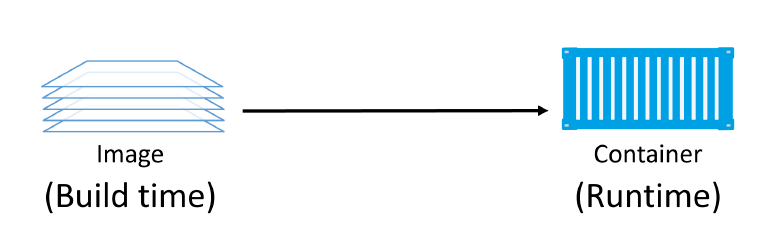
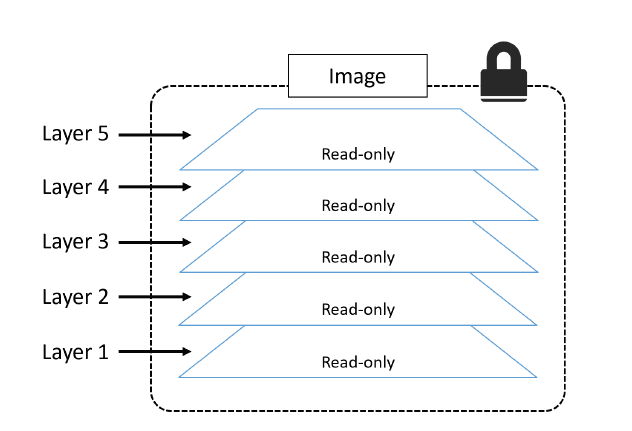
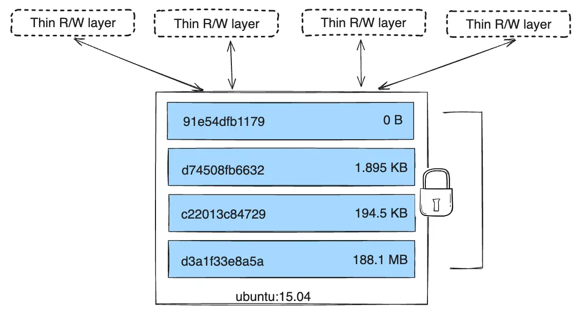
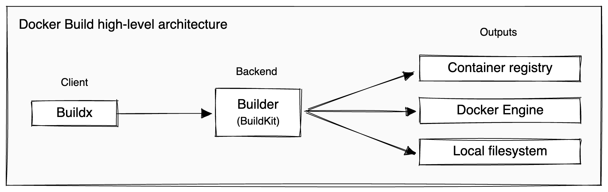
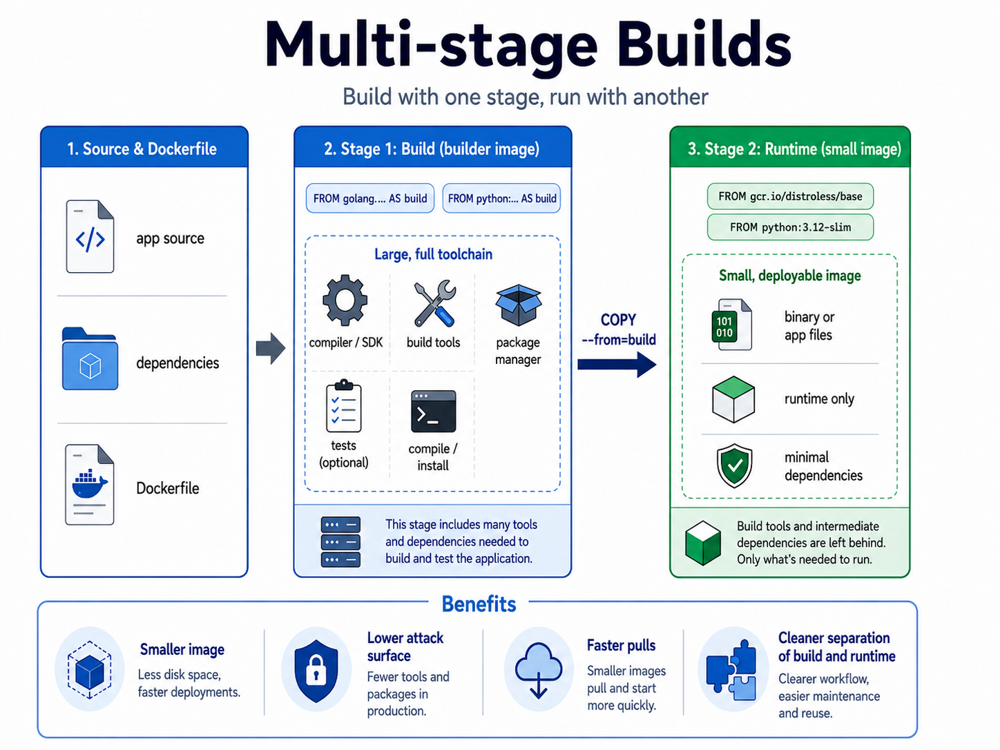

# The Image Problem: Risks and Vulnerabilities of Container Images

## What Is A Container Image?

A container image is **a self-contained unit of packaging that includes every component required for an application to run**. Think of it as a pre-configured environment that ensures consistency across different systems. The image encapsulates:
- **Application Code**: The binary or source files of your software.
- **Dependencies**: Libraries, runtimes (like Python or Node.js), and environment variables.
- **OS Constructs**: A "stripped-down" version of an operating system (usually just the filesystem and basic utilities). The image does not include a kernel, as containers share the host OS kernel.

| Feature | Image | Container |
| --- | --- | --- | 
| Status | A "stopped" or static template (Build-time). | A running instance of an image (Run-time). |
| Mutability | Immutable: Once built, it does not change. | Mutable: Has a writable layer for temporary data. |
| Analogy | Similar to a VM Template or a Class in OOP. | Similar to a running VM or an Object instance. |

> Just as a VM template is a "frozen" version of a virtual machine, a Docker image is the static blueprint for a container.



Source: Docker Deep Dive, Nigel Poulton

Images are constructed using a stacked layer system. Each instruction in a build file (like a Dockerfile) creates a new layer. These layers are read-only and stacked on top of each other to appear as a single unified object. This architecture allows for layer sharing, which saves disk space and speeds up downloads.

While Docker popularized the format, the industry now follows the **Open Container Initiative (OCI) standard**. This ensures portability across the ecosystem. You can build an image using Docker, but run it using Podman, containerd, or CRI-O without any modifications. If a tool is OCI-compliant, it will handle the image flawlessly.

## Why The Image Is The Problem

When a team says, “We run containers,” what they often mean in practice is: **We run whatever was baked into an image at build time.**

That image may contain:
- an outdated operating system snapshot
- vulnerable OS packages
- vulnerable language dependencies
- unnecessary shells, package managers, compilers, and debugging tools
- credentials or internal files accidentally copied from the build context
- a default runtime user of root
- broad metadata, labels, environment variables, and build history
- an old base image that has not been rebuilt since new CVEs were published
- no SBOM, no signature, no provenance, and no clear ownership

**If the image runs, that does not mean the image is fine.** Images have memory. Build steps, layers, metadata, copied files, and package manager artifacts can preserve information long after the final container appears to work correctly.

## OCI Container Standards

The [Open Container Initiative (OCI)](https://opencontainers.org/) is a lightweight, open governance structure (project), formed under the auspices of the Linux Foundation, for the express purpose of creating open industry standards around container formats and runtimes. The OCI was launched on June 22nd 2015 by Docker, CoreOS and other leaders in the container industry. The OCI currently contains three specifications: 
- the Runtime Specification (runtime-spec), 
- the Image Specification (image-spec) 
- the Distribution Specification (distribution-spec).

> The OCI Distribution Spec allows for arbitrary content, not just container images, to be stored in a registry. As a result, registries are being used to hold other types of container-adjacent artifacts, including Helm charts, Open Policy Agent policies, Software Bill of Materials and attestations.

### Docker image versus OCI image

In daily language, people often say “Docker image” when they mean any container image. Historically this made sense because Docker popularized the image workflow. In modern environments, the more precise term is OCI image.

A Docker-built image can be OCI-compatible, and OCI-compatible images can be used by many runtimes and tools, not just Docker. Kubernetes commonly runs images through container runtimes such as `containerd` or `CRI-O`. Tools such as Podman, Buildah, Skopeo, nerdctl, Trivy, Syft, Grype, Cosign, and registry scanners all operate in this ecosystem.

This distinction matters because the security target is not “Docker” as a brand. The security target is the artifact format and lifecycle: how the image is built, what it contains, how it is identified, where it is stored, how it is verified, and what the runtime does with it.

## Inspecting OCI Images

At its core, an OCI-compliant container image consists of two primary parts: **the root filesystem (rootfs)** and the **image configuration**.

1. **The Root Filesystem (Layers)**: When you instantiate a container, the image provides the root filesystem that the container sees.
      - **Layered Design**: The filesystem is composed of an ordered set of layers. The base layer is applied first, and subsequent layers are stacked on top to produce the final layout.
      - **Building Layers**: Commands in a Dockerfile like FROM, ADD, COPY, or RUN modify the contents of this filesystem by creating new layers.

2. **The Configuration Metadata**: The image also contains metadata that defines how the container should behave at runtime.
      - **Runtime Instructions**: Commands like USER, EXPOSE, ENV, or ENTRYPOINT do not change the files on disk; instead, they update the image's JSON configuration.
      - **Inspection**: You can view this metadata by running `docker inspect <image_name>`.
      - **Example**: If you define an environment variable using ENV in a Dockerfile, that variable is stored in the config and automatically injected into the container process when it starts.
      - In Docker, the config information can be overridden at runtime using command-line parameters.


The OCI manifest acts as the "map" for the image, linking the configuration object to the specific layers required for a particular architecture and OS.


| Component   | Description  | Security & Operational Impact   |
| ----------- | ----------- | --------- |
| Tag         | A human-friendly name such as `1.0`, `3.12-slim`, or `latest`       | Mutable. Tags can be overwritten, meaning `latest` today might not be the same as `latest` tomorrow.  |
| Digest      | A unique SHA256 hash of the content.   | Immutable. Provides a cryptographically secure way to ensure you are running the exact same code every time.  |
| Image index | A higher-level object that can point to platform-specific manifests | Enables multi-architecture support (e.g., the same tag working on both `linux/amd64` and `linux/arm64`).   |
| Manifest    | The JSON document linking the config and layers.  | Defines the integrity of the image by listing the hashes of all constituent parts.   |
| Config JSON | Metadata including Env vars, User, and Cmd.   | Least Privilege: Reveals if a container is set to run as root by default or if sensitive data is hardcoded in Env variables. |
| Layers      | Ordered filesystem changesets.   | Persistence: Sensitive files (like SSH keys) added in one layer and deleted in another still exist in the image history.   |

[Skopeo](https://github.com/containers/skopeo) is a versatile command-line utility designed to perform operations on container images and repositories without requiring a background daemon like Docker. Its primary advantage is the ability to inspect remote images directly on a registry, allowing you to view manifests and configurations without downloading the entire image to your local disk.

To install Skopeo, run:
```bash
# For Debian/Ubuntu
sudo apt-get -y update
sudo apt-get install -y skopeo
```

We can generate an OCI image from a Docker image and check the contents:
```bash
skopeo copy docker://python:3.14-slim-bookworm oci:python-oci:3.14-slim-bookworm

ls python-oci/
```

The `index.json` file contains the manifest for the image, including the unique digest
that identifies it:
```bash
cat python-oci/index.json
```   

Example output:
```json
{
   "schemaVersion":2,
   "manifests":[
      {
         "mediaType":"application/vnd.oci.image.manifest.v1+json",
         "digest":"sha256:c0bbb2bfea3d552260f0d071f4ef9358d25b50c37d7a91895710cde507de4ade", 
         "size":1751,
         "annotations":{
            "org.opencontainers.image.ref.name":"3.14-slim-bookworm"
         }
      }
   ]
}
```

This digest matches one of the blobs in the OCI-format image. The blobs can be checked by running:
```bash
ls python-oci/blobs/sha256/
```

While the OCI layout is perfect for storage and transport, low-level runtimes like runc cannot execute a container directly from these hashed blobs. Instead, the image must be "unpacked" into an **OCI Runtime Bundle**. 

To see this in action, we can use [umoci](https://github.com/opencontainers/umoci), a tool specifically designed to manipulate OCI images and transform them into bundles.

```bash
# Install umoci
sudo apt-get -y install umoci

# Unpack the image into a runtime bundle
umoci unpack --image python-oci:3.14-slim-bookworm python-bundle --rootless

# View the bundle structure
ls python-bundle

# Output:
# config.json  rootfs  sha256_c0bbb2bfea3d552260f0d071f4ef9358d25b50c37d7a91895710cde507de4ade.mtree  umoci.json
```

By exploring the rootfs directory, we see the actual Linux filesystem that the container will perceive as its own:
```bash
ls python-bundle/rootfs
```

The unpacking process transforms the abstract blobs into two concrete components that the runtime understands:
- **The `rootfs/` Directory**: This is the result of flattening all the filesystem Layers into a single directory. It contains the binaries, libraries, and distribution files (like Python and its dependencies) in their uncompressed state.
 - **The `config.json` File**: This is generated from the Configuration blob. It tells the runtime exactly how to start the process, including namespaces, resource limits, and environment variables.

The OCI layout uses **Content Addressable Storage**, meaning every file is named after its own SHA256 hash. This creates a secure "Chain of Trust":
- `index.json` points to the Manifest blob.
- The **Manifest blob** acts as a map, containing the hashes for the **Config blob** and each ordered Layer blob.
- The Container Runtime follows these hashes to verify and pull the correct files from the `/blobs/sha256/` directory to reconstruct the application.

> Because every component is referenced by its unique Digest, it is impossible to alter a single byte in a layer or config file without breaking the chain. If a blob is tampered with, the hash will no longer match the manifest, and the runtime will refuse to execute the container.

When you look at the extracts from the bundle, you are seeing the direct translation of image metadata into operating system instructions.
```bash
cat python-bundle/config.json
```

- **The Root Path**: This tells the runtime (like `runc`) where to find the unpacked filesystem. Once the container starts, the runtime will use the `pivot_root` or `chroot` system call to make this specific directory appear as the `/` (root) directory for the containerized process.
```json
"root": {
   "path": "rootfs"
}
```

- **Mounts**: Containers need access to certain kernel interfaces to function. The configuration explicitly defines where to mount pseudofilesystems like `/proc` (for process information) and `cgroups` (for resource management). This ensures the container can "see" its own limited view of the system hardware.
```json
"mounts": [
  {
    "destination": "/proc",
    "type": "proc",
    "source": "proc"
  },
  ...
```

- **Isolation via Namespaces**: This is where the magic of isolation happens. This section tells the kernel to wrap the process in specific namespaces. For example:
   - PID: The process will think it is PID 1.
   - Network: The process gets its own virtual network stack.
   - Mount: The process has its own private list of mount points.
```json
"namespaces": [
  { "type": "pid" },
  { "type": "network" },
  { "type": "ipc" },
  ...
]
```

> In Docker we can inspect the image configuration with `sudo docker pull python:3.14-slim-bookworm && sudo docker image inspect python:3.14-slim-bookworm`. 

## Image Layers

Layers are one of the most critical concepts in container architecture, particularly for optimization and security.

An image filesystem is built by stacking these layers on top of each other. Each layer represents a precise set of changes relative to its parent layer: files added, files modified, or files removed. The OCI configuration specification describes an image as an ordered collection of these filesystem changesets combined with execution parameters (like entrypoints, environment variables, and labels).

A simplified conceptual view of an image looks like this:

```
Layer 5: Set user and command  (Metadata only)
Layer 4: Install dependencies  (Filesystem changes)
Layer 3: Copy application      (Filesystem changes)
Layer 2: Install Python        (Filesystem changes)
Layer 1: Base OS files         (Base layer)
```



Source: Docker Deep Dive, Nigel Poulton

At runtime, the container runtime merges these separate layer archives into a single, unified filesystem view. To the application running inside the container, it feels like a standard, flat directory structure, even though it is backed by loosely-connected, read-only layers. Because layers are independent, **multiple images can and often do share the same base layers, leading to massive space efficiencies across your system**.

### Inspecting Image Layers

There are three primary ways to inspect the layers that make up an image:

1. **During an Image Pull**: When you download an image, you can watch the layers pull in real time. Each line ending in "Pull complete" is a distinct layer being downloaded and extracted.
   ```bash
   sudo docker image pull redis:latest
   ```

2. **Using `docker image inspect`**: This command provides low-level cryptographic details about the image, including the specific content hashes (DiffIDs) of the filesystem layers.
   ```bash
   sudo docker image inspect redis:latest
   ```

3. **Using `docker history`**: This command displays the build history of the image. Note that it is not a strict list of filesystem layers; some Dockerfile instructions (like `ENV`, `EXPOSE`, or `CMD`) only add configuration metadata and do not result in a physical layer.
   ```bash
   sudo docker image history redis:latest
   ```

### Images vs. Containers: The Writable Layer

The fundamental difference between a container and an image is a **single thin layer added to the very top of the stack: [the writable container layer](https://docs.docker.com/engine/storage/drivers/)**.


Source: https://docs.docker.com/storage/storagedriver/

While **all underlying image layers are strictly read-only**, the container layer enables all read/write operations for a active instance.
- **Short-lived Nature**: This writable layer lives on the Docker host's filesystem (typically under `/var/lib/docker/<storage-driver>/...`). It is tightly bound to the lifecycle of the container. If the container is deleted, its writable layer is permanently destroyed, while the underlying image remains completely unchanged.
- **Multi-Tenancy**: Because each container maintains its own separate writable layer, multiple running containers can simultaneously share access to the exact same underlying image while maintaining their own unique data states.



Source: https://docs.docker.com/storage/storagedriver/

If an application inside a container needs to modify an existing file that belongs to a read-only image layer, [Docker uses a **copy-on-write strategy**](https://docs.docker.com/engine/storage/drivers/#the-copy-on-write-cow-strategy):
1. The filesystem detects the write request on a lower layer file.
2. It instantly copies that file up into the container's thin writable layer.
3. The container modifies the copy in the writable layer, seamlessly hiding the original file beneath it.

This layer management is handled by [Linux storage drivers](https://docs.docker.com/engine/storage/drivers/select-storage-driver/) (such as `overlay2`, `fuse-overlayfs`, `btrfs`, or `zfs`). While storage drivers are highly space-efficient, copy-on-write operations **introduce performance overhead for write-intensive applications (like databases)**.

> Never use the container's writable layer for heavy I/O or persistent data. Always use Docker Volumes for write-intensive applications to bypass the storage driver and achieve native performance.

### Why "Deleted" Files Still Matter

A common security mistake occurs when developers treat a Dockerfile like a standard shell script. Consider this example:
```bash
mkdir image-layer-demo
cd image-layer-demo

# Create a fake .env file with a secret value
cat > .env <<'EOF'
DATABASE_PASSWORD=training-only-password
EOF

# Create an intentionally bad Dockerfile:
cat > Dockerfile <<'EOF'
FROM alpine:3.23
WORKDIR /app
COPY . .
RUN rm -f .env
CMD ["sh", "-c", "ls -la /app && sleep 3600"]
EOF

# Build the image
sudo docker build -t image-problem:layer-leak .

# Run the image and notice that .env is not visible:
sudo docker run --rm image-problem:layer-leak
```

It is a common misconception that `/app/.env` is safely erased because it does not appear in the final running container. It is not safe.

Because OCI layers are immutable changesets, a file removal does not delete the data from previous layers. Instead, the `rm` command creates a whiteout marker - an empty file with a `.wh.` prefix signifying that the path should be hidden from that point forward.

Now export the image and search the artifact:
```bash
sudo docker image save -o layer-leak.tar image-problem:layer-leak
mkdir extracted
sudo tar -xf layer-leak.tar -C extracted

# Create a directory to hold the actual recovered files
mkdir recovered_contents

# Find all compressed layer blobs and extract them into that directory
find extracted/blobs/sha256/ -type f -exec tar -xzf {} -C recovered_contents 2>/dev/null \;

# View your successfully stolen secret
cat recovered_contents/app/.env

# Confirm the file is still there even though it was "deleted" in the Dockerfile
ls -la recovered_contents/app/
# total 16
# drwxr-xr-x  2 administrator administrator 4096 May 15 09:35 .
# drwxrwxr-x 20 administrator administrator 4096 May 15 09:45 ..
# -rw-rw-r--  1 administrator administrator  100 May 15 09:35 Dockerfile
# -rw-rw-r--  1 administrator administrator   41 May 15 09:34 .env
# ----------  1 administrator administrator    0 Jan  1  1970 .wh..env
```

The sensitive file is hidden from the final merged filesystem view, but the raw bytes still exist entirely intact within the tarball of Layer 1. Anyone with access to the image archive, the container registry, or the CI/CD cache can easily extract the lower layer and recover the secret.
- "I deleted it later" is not a valid remediation for a leaked secret.
- If an image containing a secret was pushed to a registry, assume that secret has been compromised.
- Remediation: Rotate the secret immediately, use multi-stage builds to avoid copying secrets into intermediate layers, and rebuild your images from a clean state.

## Image naming and tagging

Image names look simple on the surface, but the way you reference them hides critical trust and security decisions. A fully qualified image reference follows this structure:
```
[registry]/[namespace]/[repository]:[tag]@[digest]
```

Examples:
- `nginx:1.27` (Implies Docker Hub registry and library namespace)
- `docker.io/library/nginx:1.27` (Explicit version of the same image)
- `registry.example.com/course/backend:1.0.0` (Private registry reference)
- `registry.example.com/course/backend@sha256` (Referenced strictly by digest)
- `registry.example.com/course/backend:1.0.0@sha256` (Referenced by both tag and digest)

The most critical distinction when managing container lifecycles is understanding that tags represent names, while digests represent identity.


| Feature   | Image Tag (:1.0.0)  | Image Digest (@sha256:...)   |
| ----------- | ----------- | --------- |
| **What it is** | A human-readable pointer or alias. | A unique, cryptographic SHA256 hash of the content. |
| **Mutability** | Mutable: Can be moved to point to a completely different image artifact. | Immutable: Uniquely ties to one specific layout of layers and config. It can never change. |
| **Analogy** | Like a Git branch name (e.g., main or dev) which moves as new commits are added. | Like a specific Git commit hash. It points to a precise moment in time. |

When you pull `backend:latest`, you are not identifying an exact artifact. You are pulling whatever image the registry currently maps to that tag. If someone pushes a new build to that tag five minutes later, the "latest" image changes.

When you **pull an image by its digest**, you guarantee that you are fetching the exact same bits every single time. Even if a developer overwrites a tag on the registry, the digest remains a permanent reference to that specific artifact.


Imagine you are running a production stack using a Docker Compose file distributed across three different backend servers:

```yaml
services:
  web:
    image: registry.example.com/course/backend:1.0.0
    ports:
      - "8080:8080"
```

If a developer accidentally overwrites the `1.0.0` tag in the registry with a buggy build, look at what happens over time:
   - Server A already has the old `1.0.0` cached locally and keeps running the stable code.
   - Server B crashes, restarts, pulls `1.0.0` fresh from the registry, and gets the buggy code.
   - Server C is a brand new server added to handle traffic logs, pulls `1.0.0`, and gets the buggy code.

Even though all three servers look identical in your Docker Compose file, they are now running completely different software configurations.

By **pinning your production environments to a digest, you eliminate tag drift**. If a tag changes on the registry, Docker will ignore the tag change and pull exactly what the cryptographic hash dictates. Also the risk for supply chain attacks is reduced, because if an attacker compromises the registry and pushes a malicious image to a commonly used tag, your production environment will not be affected if it is pinned to a digest.

```yaml
services:
  web:
    # Human-readable tag + strict digest validation
    image: registry.example.com/course/backend:1.0.0@sha256:45b23dee08af5e43...
    ports:
      - "8080:8080"
```

> When both a tag and a digest are provided, Docker prioritizes the digest for the pull operation.

### Practical Commands

1. **View the Immutable Repo Digest Locally**: After pulling a standard tagged image, you can find its cryptographic identity using docker image inspect:
   ```bash
   sudo docker pull alpine:3.23
   sudo docker image inspect alpine:3.23 --format '{{json .RepoDigests}}'
   ```

2. **Inspect Multi-Platform Image Indexes**: Many modern images contain sub-manifests for different architectures (like amd64 and arm64). You can inspect the root index digest using:
   ```bash
   sudo docker buildx imagetools inspect alpine:3.23
   ```

3. **Hardcoding Digests into Your Workflows**: To secure your builds, use digests right inside your Dockerfile:
   ```dockerfile
   FROM alpine:3.23@sha256:48d9183eb12a0535fbc24a101ee981f92e0df400810db69ef2dbf1e31d3f972b
   ```

Best practices for image referencing:
- **Local Development**: Version tags (like :3.12-slim) are perfectly acceptable for speed and convenience.
- **CI/CD Pipelines**: Use automated scripts to resolve your tags to their underlying SHA256 digests before shipping.
- **Production Environments**: Always deploy by digest. Never allow unpinned images or general environment tags like :latest in production environments, as they break your rollback capability and blindside container auditing.

## Container Builders

The build process is where an image transitions from a conceptual Dockerfile into a physical, runnable artifact. Historically, running `docker build` was a monolithic operation handled entirely by the Docker daemon. Today, modern container builds utilize a much more robust, efficient, and secure client-server architecture.

### Modern Architecture: Buildx and BuildKit

> As of Docker Engine 23.0 and Docker Desktop 4.19, Buildx is the default build client.

When you execute a standard build command: 
```bash
sudo docker build -t course/backend:1.0 .
```

You are doing much more than just reading a Dockerfile. You are interacting with a decoupled system consisting of [two primary components](https://docs.docker.com/build/concepts/overview/):
- **The Client (Buildx)**: Buildx is the user interface and CLI tool. It interprets your build options, gathers the necessary resources (build arguments, export options, context), and sends the build request.
- **The Server (BuildKit)**: [BuildKit](https://docs.docker.com/build/buildkit/) is the backend daemon process that actually resolves the instructions and executes the build steps. BuildKit offers more advanced capabilities, including a rootless mode, the ability to produce an image for multiple platforms, the ability to push the image to multiple registries, and more.



Unlike legacy builders that naively copied the entire local filesystem before starting a build, BuildKit only requests the specific resources it needs (local files, secrets, SSH sockets) from Buildx exactly when it needs them.

> `docker build` is [effectively a wrapper](https://docs.docker.com/build/builders/#difference-between-docker-build-and-docker-buildx-build) for `docker buildx build`. However, using `docker buildx build` allows you to explicitly manage and target custom or remote BuildKit backends instead of defaulting to the bundled Docker Engine builder. Check the builder status with `sudo docker buildx ls`.

The `docker build` and `docker buildx build` commands build Docker images from a **Dockerfile** and a **context**.

### Attacks on the Build Machine

The build machine should be treated as a critical security boundary. It is not only responsible for producing the final image, but it also executes the instructions from the Dockerfile during the build process. If an attacker can influence what gets built, or compromise the machine performing the build, the resulting image may become a delivery mechanism for malicious code.

There are two main risks:

- **Compromise of the build host**: A Dockerfile can execute arbitrary commands during build steps such as `RUN`. If the builder relies on a privileged Docker daemon, a successful attack may allow code running during the build to affect the host system or reach other internal services.
- **Compromise of the build output**: If an attacker can modify the Dockerfile, the build context, dependencies, or trigger unexpected builds, they may be able to insert a backdoor into the image that is later deployed to production.

Because build machines produce the software that eventually runs in production, they should be hardened with similar care as production systems themselves. Ideally, builds should run on separate infrastructure from production workloads. This limits the blast radius if a build process is compromised.

A stronger approach is to use **short-lived build environments**, where a fresh virtual machine or isolated builder is created for each build and destroyed afterwards. This makes it much harder for malicious files, credentials, or modified state to persist between builds.

To reduce risk:

- Prefer **rootless or unprivileged builders** where possible.
- Avoid running builds on machines with broad access to production networks or cloud services.
- Limit the credentials available during the build.
- Restrict direct user access to build machines.
- Use firewalls, VPC rules, and network policies to limit where build machines can connect.
- Remove unnecessary tools and services from build environments.

Even if the final container image is carefully secured, the build environment must not be ignored. A compromised build machine can silently produce compromised images.

### Alternative Builders and Non-Privileged Builds

To mitigate the security risks of privileged build environments, the industry has shifted toward non-privileged and rootless build architectures. For production and CI/CD environments, consider these alternatives:

| Alternative Builder | Description |
| ------------ | ----------- | 
| **Rootless Docker** | Runs the Docker daemon (`dockerd`) as a non-root user. This is generally available but requires manual opt-in. |
| **BuildKit Container Driver** | Allows running builds seamlessly within an isolated container, separating the build execution from the host operating system. |
| **Podman & Buildah** | Red Hat's daemonless alternatives. `buildah` is specifically engineered for building OCI images without requiring a background daemon or root privileges. |
| **Bazel & Nix** | Advanced build systems that focus on highly deterministic, reproducible builds, guaranteeing that the exact same source code will always produce the exact same cryptographic image hash. |
| **ko & jib** | Language-specific tools (`ko` for Go, `jib` for Java) that compile code and assemble container images directly, without needing Docker installed at all. |

> [Example](https://docs.gitlab.com/ci/docker/using_buildkit/#build-images-in-rootless-mode) from Gitlab on how to use BuildKit in a rootless mode.

Whether executed locally or automated in a pipeline, treating the build execution environment as a heavily scrutinized security boundary is just as important as securing the final container itself.

## Dockerfile: Build Instructions

Docker builds images by reading the instructions from a Dockerfile. A Dockerfile is a text file containing instructions for building your source code. The Dockerfile instruction syntax is defined by the specification reference in the [Dockerfile reference](https://docs.docker.com/reference/dockerfile/).

Dockerfiles are crucial inputs for image builds and can facilitate automated, multi-layer image builds based on your unique configurations. Dockerfiles can start simple and grow with your needs to support more complex scenarios.

The default filename to use for a Dockerfile is `Dockerfile`, without a file extension. Using the default name allows you to run the `docker build` command without having to specify additional command flags.

Some projects may need distinct Dockerfiles for specific purposes. A common convention is to name these `<something>.Dockerfile`. You can specify the Dockerfile filename using the `--file` flag for the docker `build command`.


Regardless of which tool you use, the vast majority of container image builds are
defined through a Dockerfile. The Dockerfile gives a series of instructions, each of
which results in either a filesystem layer or a change to the image configuration.

https://medium.com/microscaling-systems/spot-the-docker-difference-9f99adcc4aaf


## The Build Context: A Hidden Security Boundary

[The build context](https://docs.docker.com/build/concepts/context/) is the set of files that your build can access. The positional argument that you pass to the build command specifies the context that you want to use for the build.

Most teams diligently review their Dockerfiles. Far fewer teams review their build context. This is a critical security oversight. When you run `docker build .`, the `.` does not mean "only build the files explicitly mentioned in the Dockerfile." It dictates that the builder has access to a build context rooted at the current directory, including all subdirectories.

If you are not careful, highly sensitive files can be shipped to the builder or accidentally leaked into the image layers via blanket `COPY . .` commands. Dangerous context contents include:
- `.env` files with active credentials
- `.git/` directories containing full commit histories
- `id_rsa` or `*.pem` keys
- `npm` tokens or `pip.conf` files
- Test databases, debug logs, or customer samples


## Defending the Context with `.dockerignore`

You can use a `.dockerignore` file to exclude files or directories from the build context. This helps avoid sending unwanted files and directories to the builder, improving build speed, especially when using a remote builder.

When you run a build command, the build client looks for a file named `.dockerignore` in the root directory of the context. If this file exists, the files and directories that match patterns in the files are removed from the build context before it's sent to the builder.

Use a `.dockerignore` file aggressively to filter what the builder is allowed to see. While you can try to maintain a blacklist of specific sensitive files, an allow-list approach is far stricter and more secure:
```plaintext
# .dockerignore

# 1. Start by ignoring absolutely everything
**

# 2. Explicitly allow only what the build needs
!app.py
!requirements.txt
!Dockerfile
```

This pattern ensures that if a developer accidentally drops a new secret file into the directory, it will be automatically blocked from the build context by default.


## Multi-stage Builds

A [**multi-stage build** is a Dockerfile pattern](https://docs.docker.com/build/building/multi-stage/) that uses more than one `FROM` instruction. Each `FROM` starts a new build stage, and each stage can use a different base image. You can then selectively copy only the files you need from one stage into another using `COPY --from=...`.

This is useful because the tools needed to **build** an application are often not needed to **run** it. For example, a Go application needs the Go compiler to produce a binary, but the final runtime image does not need to contain the Go compiler, source code, package caches, or other build tools.

The general pattern looks like this:
```Dockerfile
FROM builder-image AS build
# install build tools
# copy source code
# compile or prepare the application

FROM runtime-image AS runtime
# copy only the final artifact from the build stage
COPY --from=build /path/to/artifact /path/to/artifact
```

The main benefit is that the final image contains only the runtime artifacts. This usually makes the image:
- smaller,
- faster to pull and distribute,
- easier to scan and reason about,
- less likely to contain unnecessary vulnerable packages,
- less useful to an attacker if the container is compromised.

Docker’s documentation describes this as a way to keep Dockerfiles readable while copying only selected artifacts into the final image and leaving behind everything else. The final image can contain just the built binary or prepared application files, without the build tools used to create them.

> Good read: [Using Multi-Stage Builds to Simplify And Standardize Build Processes](https://medium.com/capital-one-tech/multi-stage-builds-and-dockerfile-b5866d9e2f84)



### Example: Go Application

Go is a good example because it can produce a standalone binary. The first stage uses the Go toolchain to compile the program. The second stage starts from `scratch`, which is an empty image, and copies in only the compiled binary.

```Dockerfile
# syntax=docker/dockerfile:1

FROM golang:1.25 AS build
WORKDIR /src

COPY <<EOF ./main.go
package main

import "fmt"

func main() {
    fmt.Println("hello from a multi-stage Go image")
}
EOF

RUN CGO_ENABLED=0 go build -o /hello ./main.go

FROM scratch
COPY --from=build /hello /hello
CMD ["/hello"]
```

Copy the above Dockerfile into a directory and run the following commands from that directory to build and run the image:
- `sudo docker build -t course/hello-go:1.0 .`
- `sudo docker run --rm course/hello-go:1.0`

The final image does not contain the Go compiler, the source code, or the intermediate build files. It contains only the `/hello` binary.

### Example: Python Application

Python is different from Go because Python applications usually still need a Python runtime. However, multi-stage builds are still useful. The build stage can install or compile dependencies, while the runtime stage starts from a clean image and receives only the prepared environment and application files.

Assume the project contains these files (check the files at `./examples/01_multi_stage_python`):
```
.
├── app.py
├── requirements.txt
└── Dockerfile
```

Move to the directory and build the image:
- `cd examples/01_multi_stage_python`
- `sudo docker build -t course/hello-python:1.0 .`
- `sudo docker run --rm -p 8000:8000 course/hello-python:1.0`

In this Python example, the final image still contains Python, because Python is required at runtime. However, the dependency installation work is separated from the final application stage. For applications that require compilers or development headers to build Python packages, this prevents those build tools from being included in the runtime image.

### Multi-stage Builds and Security

Multi-stage builds are not a complete security solution, but they are an important hardening technique. The final image should contain only what the application needs to run. Build tools, compilers, package manager caches, source code, test data, and temporary files should normally remain in earlier stages.

A smaller final image reduces the attack surface and makes vulnerability scanning easier to interpret. However, the build stages still execute code during the build process, so the build machine and build context must still be treated as security-sensitive.

## Selecting Base Images

The base image is the foundation of the final image. If the base is stale, bloated, untrusted, unsupported, or malicious, everything built on top inherits that problem.

[Docker’s build best-practices documentation](https://docs.docker.com/build/building/best-practices/#choose-the-right-base-image) puts base image selection first: **choose an image from a trusted source and keep it small**. 
- **Docker Official Images** are a curated collection that have clear documentation, promote best practices, and are regularly updated. They provide a trusted starting point for many applications.
- **Verified Publisher images** are high-quality images published and maintained by the organizations partnering with Docker, with Docker verifying the authenticity of the content in their repositories.
- **Docker-Sponsored Open Source** images are published and maintained by open source projects sponsored by Docker through an open source program.

When building your own image from a Dockerfile, ensure you choose a minimal base image that matches your requirements. **A smaller base image not only offers portability and fast downloads, but also shrinks the size of your image and minimizes the number of vulnerabilities introduced through the dependencies.**

**Prefer:**
- official images from reputable maintainers
- verified publisher images
- internally curated base images
- hardened images maintained by your platform team
- approved private registries with access control
- images with documented update cadence and support lifecycle

**Avoid:**
- random public images from personal namespaces
- images with no Dockerfile or source repository
- abandoned images
- unsupported or end-of-life distributions
- images that require running as root without explanation
- images that install an SSH server for production use
- images with unclear licensing or provenance

A base image decision is not only a developer convenience decision. It is a supply-chain decision.

Smaller images are usually easier to secure because they have fewer packages, fewer libraries, fewer utilities, and fewer scanner findings. But minimal images have tradeoffs.

| Base Type               | Strength                                           | Tradeoff                                                         |
| ----------------------- | -------------------------------------------------- | ---------------------------------------------------------------- |
| Full distribution image | Familiar tools, easy debugging                     | Large attack surface, many packages                              |
| Slim image              | Smaller, still operationally familiar              | May still include shell and package manager                      |
| Alpine                  | Very small, common for simple workloads            | Uses musl libc, which can cause compatibility differences        |
| Distroless              | No package manager or shell, small runtime surface | Harder interactive debugging                                     |
| `scratch`               | Empty base, excellent for static binaries          | You must provide everything needed, such as CA certs if required |
| Hardened vendor image   | Curated, patched, often signed and documented      | Vendor lock-in, subscription, or operational constraints         |

**Use the smallest supported runtime image that your team can operate safely.**

**Base image checklist:**
- Who maintains it?
- How often is it rebuilt?
- What distribution and version is it based on?
- Is the distribution still supported?
- Is there a public Dockerfile or build recipe?
- Does it run as root by default?
- Does it include a shell, package manager, compiler, SSH server, or debugging tools?
- Is it signed?
- Does it publish SBOMs or provenance?
- Can we pin it by digest?
- Can our scanners correctly identify its packages?
- Do we have a plan for rebuilding when the base digest changes?

### Using Docker Hardened Images

[Docker Hardened Images (DHI)](https://docs.docker.com/dhi/) provide minimal, secure, and production-ready container images, Helm charts, and system packages maintained by Docker. Designed to reduce vulnerabilities and simplify compliance.

You can pull and run a DHI like any other Docker image. Note that Docker Hardened Images are designed to be minimal and secure, so they may not include all the tools or libraries you expect in a typical image.

> **[Considerations when adopting DHIs](https://docs.docker.com/dhi/how-to/use/#considerations-when-adopting-dhis)**: Docker Hardened Images are intentionally minimal to improve security. If you're updating existing Dockerfiles or frameworks to use DHIs, keep in mind that runtime images don't include shells or package managers, run as non-root users by default, and may have different configurations than images you're familiar with.

Copmare the DHI with a standard image:

```bash
# Create a free Docker Hub account and login in to pull the DHI
sudo docker login dhi.io

# Pull the DHI and a standard image for comparison
sudo docker pull dhi.io/python:3.13
sudo docker pull python:3.13

# Run the image to confirm everything works:
sudo docker run --rm dhi.io/python:3.13 python -c "print('Hello from DHI')"
sudo docker run --rm python:3.13 python -c "print('Hello from standard image')"

# Compare the images:
sudo docker image ls dhi.io/python:3.13
sudo docker image ls python:3.13

sudo docker history dhi.io/python:3.13
sudo docker history python:3.13
```

Let's explore the differences in the image with the [`dive`](https://github.com/wagoodman/dive) tool:

```bash
# Install dive
DIVE_VERSION=$(curl -sL "https://api.github.com/repos/wagoodman/dive/releases/latest" | grep '"tag_name":' | sed -E 's/.*"v([^"]+)".*/\1/')
curl -fOL "https://github.com/wagoodman/dive/releases/download/v${DIVE_VERSION}/dive_${DIVE_VERSION}_linux_amd64.deb"
sudo apt install ./dive_${DIVE_VERSION}_linux_amd64.deb

# Inspect the standard image visually
sudo dive python:3.13

# Inspect the DHI image visually
sudo dive dhi.io/python:3.13
```

### Using the `scratch` and the "distroless" base images

When packaging compiled binaries for production, minimizing the container's footprint is one of the most effective ways to optimize performance and harden security. Two primary strategies exist for creating these ultra-lean environments: building completely **[from scratch](https://docs.docker.com/build/building/base-images/#create-a-base-image)** or utilizing **[Google's "distroless"](https://github.com/GoogleContainerTools/distroless)** base images.

While both approaches eliminate standard operating system bloat, they serve slightly different needs in production workflows.


| Feature    | `FROM scratch`  | `FROM gcr.io/distroless/static-debian13`   |
| --------------- | --------- | ---------- |
| **Base Size** | 0 bytes  | ~2 MB to 3 MB   |
| **OS Packages**  | None   | None  |
| **System Libraries**  | None (Requires purely static binaries)   | Common minimal runtime dependencies (glibc, libssl)  |
| **SSL/TLS Certificates**  | No (Must be manually copied if needed) | Yes (Pre-installed and updated)    |
| **User Management** | No `/etc/passwd` (Runs as root by default)  | Includes a non-root user (`nobody:nogroup`, UID 65534) |
| **Primary Language**  | Go, Rust (Purely static compiled languages)    | C, C++, Rust, Go, or dynamic runtimes (Node/Python)       |


- **Dockerfile Example (`scratch`):** `scratch` is an explicitly empty starting point. It contains absolutely nothing - no shell, no libraries, no users, and no SSL certificates. If your application needs to make an HTTPS request, it will fail unless you manually bundle the root certificates. To use `scratch`, you must build your binary inside a build container using a multi-stage workflow, ensuring that your compiler outputs a completely self-contained, statically linked binary.

```bash
# Create a simple application file
cat > main.go <<'EOF'
package main

import "fmt"

func main() {
    fmt.Println("Hello from a completely empty container!")
}
EOF

# Create a Dockerfile that builds the binary and then packages it from scratch
cat > Dockerfile <<'EOF'
# Stage 1: The Build Environment
FROM golang:1.24-bookworm AS builder
WORKDIR /app
COPY main.go .
# Disable CGO to force a purely static binary
RUN CGO_ENABLED=0 GOOS=linux go build -o myapp main.go

# Stage 2: The Final Razor-Thin Image
FROM scratch
# Manually bring over SSL certs so our binary can make HTTPS calls
COPY --from=builder /etc/ssl/certs/ca-certificates.crt /etc/ssl/certs/
COPY --from=builder /app/myapp /myapp
ENTRYPOINT ["/myapp"]
EOF

# Build the image
sudo docker build -t myapp:scratch .

# Run the image
sudo docker run --rm myapp:scratch

# Check the image with dive
sudo dive myapp:scratch
```

- **Dockerfile Example (`distroless/static`)**: "Distroless" images, maintained by Google, restrict the runtime environment to only your application and its dependencies. They contain no package managers, shells, or standard terminal utilities. However, unlike `scratch`, they include critical system abstractions that production applications rely on, such as timezone data, SSL/TLS certificates, standard C libraries (`glibc`), and pre-configured non-root system users. Because the base image includes standard system prerequisites, your multi-stage setup becomes much cleaner and less prone to runtime crashes.

```bash
# Create a Dockerfile that builds the binary and then packages it with distroless
cat > Dockerfile.distroless <<'EOF'
# Stage 1: The Build Environment
FROM golang:1.24-bookworm AS builder
WORKDIR /app
COPY main.go .
RUN CGO_ENABLED=0 GOOS=linux go build -o myapp main.go

# Stage 2: The Production Image
# 'static' is the smallest distroless variant, designed for static binaries
FROM gcr.io/distroless/static-debian13:latest
COPY --from=builder /app/myapp /myapp
# Automatically switches to a secure, non-root user included in the base image
USER 65534:65534
ENTRYPOINT ["/myapp"]
EOF

# Build the image
sudo docker build -f Dockerfile.distroless -t myapp:distroless .

# Run the image
sudo docker run --rm myapp:distroless

# Check the image with dive
sudo dive myapp:distroless
```
If we inspect both resulting production images using tools like docker image ls or a low-level filesystem extraction, the differences become visually clear.
- The `scratch` image consists of a single layer containing just your binary file (and your manually copied certificates). It has no concept of file ownership outside of what you explicitly configure.
- The `distroless` image provides a small foundational layer that sets up standard Unix paths like `/etc`, `/var`, and `/tmp`, maps a default non-privileged user profile, and keeps system root certificates updated automatically through upstreams like Debian.

While FROM scratch offers the absolute theoretical minimum attack surface, **"distroless" is generally the superior choice for enterprise production binaries**:
1. **Security by Default (Non-Root Execution)**: Running a container as the root user is a critical vulnerability. In a scratch container, configuring a custom non-root user requires manually generating and copying `/etc/passwd` files into the image. Distroless images ship with a secure nobody user built-in, making risk mitigation as simple as adding `USER 65534:65534` to your Dockerfile.
2. **Maintenance and Compliance**: Production applications constantly interact with the outside world via TLS/SSL. If you choose scratch, you are responsible for manually updating root certificates every time an automated image build triggers. Distroless base images handle this up-stream; simply pulling the latest base patch automatically patches underlying certificate authorities and critical system libraries.
3. **Dynamic Linking Compatibility**: Many compiled binaries still rely on standard system bindings (like `glibc` for network lookups or cryptographic tasks). Compiling with `CGO_ENABLED=0` works perfectly for pure Go or Rust, but if your code pulls in a legacy C library, a scratch container will immediately crash with a misleading file not found error. Distroless provides specific variants (like `distroless/base`) that include `glibc`, giving you the safety of a shell-less image without sacrificing system library access.

> Use scratch only when you are deploying an entirely autonomous utility that requires no OS primitives, no network certificates, and no external library bindings. For everything else, default to distroless to ensure standard operational compliance, user isolation, and maintainability.

## Rebuild your images often

Docker's build cache drastically speeds up build times by reusing existing layers when an instruction hasn't changed. However, security teams must recognize that the cache can preserve stale, vulnerable assumptions.

Docker checks each Dockerfile instruction against cached layers based on the literal command string. For example, if you have `RUN apt-get -y update`, Docker matches the string text. The files residing on the remote package server are not examined to determine if the cache should be invalidated. Therefore, a successful rebuild does not guarantee that your OS packages were actually refreshed.

Practical guidance for cache security:
- Use `docker build --pull -t course/backend:1.0 .` in CI pipelines to force Docker to check the registry for newer versions of your base image.
- Use `docker build --no-cache -t course/backend:1.0 .` when patch freshness is absolutely critical.
- Use `docker builder prune` to periodically clear out stale local caches.

Implement scheduled CI rebuilds, rather than relying solely on application-code-triggered builds, to ensure upstream security patches are pulled in.

https://docs.docker.com/build/building/best-practices/#rebuild-your-images-often

<!-- ### 10. Rebuild Images Continuously

One of the most common image failures is simple neglect.

Teams often rebuild only when app code changes. That means:

- base image fixes are missed
- distro package fixes are missed
- scanner results become stale

Mature pattern:

- scheduled rebuilds even when app code is unchanged
- automatic pull requests or tickets when base image digests drift
- policy around maximum image age -->


## Using build variables
- https://docs.docker.com/build/building/variables/

> We will show how to use build secret variables in the Part 4 of the course.

## Building Multiplatform Images
- https://docs.docker.com/build/building/multi-platform/

Container images can be built to support multiple CPU architectures, including the
common options amd64 typically used for Intel-based chips, and arm64 for ARMbased
machines. A multiplatform image contains a manifest list that references
architecture-specific machines. You can use Docker to inspect a multiplatform image,
like this:

docker manifest inspect alpine

The manifest includes a digest identifying the image for each supported platform.
When pulling an image, the container runtime retrieves the image that matches the
platform it’s running on.
The contents of these per-platform images are independent of each other. If your
organization is running images on a mix of different platforms, you’ll need to make
sure that the images are scanned for vulnerabilities and insecure configurations for all
the different platforms, because there’s no guarantee that the content will be the same.
We’ll discuss image scanning in Chapter 8.
---

## General best practices for images

The instructions for building an image come from a Dockerfile. Each stage of the
build involves running one of these instructions, and if a bad actor is able to modify
the Dockerfile, it’s possible for them to take malicious actions, including:
• Adding malware or cryptomining software into the image
• Accessing build secrets
• Enumerating the network topology accessible from the build infrastructure
• Attacking the build host
90 | Chapter 7: Supply Chain Security
It may seem obvious, but the Dockerfile (like any source code) needs appropriate
access controls to protect against attackers adding malicious steps into the build.
The contents of the Dockerfile also have a huge bearing on the security of the image
that the build produces. Let’s turn to some practical steps you can take in the
Dockerfile to improve image security.

- **Decouple applications**: Each container should have only one concern. Decoupling applications into multiple containers makes it easier to scale horizontally and reuse containers.
- **Create ephemeral containers**: The image defined by your Dockerfile should generate containers that are as ephemeral as possible. Ephemeral means that the container can be stopped and destroyed, then rebuilt and replaced with an absolute minimum set up and configuration.
- **Don't install unnecessary packages**: Avoid installing extra or unnecessary packages just because they might be nice to have. For example, you don’t need to include a text editor in a database image. When you avoid installing extra or unnecessary packages, your images have reduced complexity, reduced dependencies, reduced file sizes, and reduced build times.
- **Sort multi-line arguments**: Whenever possible, sort multi-line arguments alphanumerically to make maintenance easier. This helps to avoid duplication of packages and make the list much easier to update. This also makes PRs a lot easier to read and review. Adding a space before a backslash (`\`) helps as well.
- **Leverage build cache**: When building an image, Docker steps through the instructions in your Dockerfile, executing each in the order specified. For each instruction, Docker checks whether it can reuse the instruction from the build cache. As soon as the cache is broken, Docker executes all the instructions that follow, even if they haven’t changed.
- **Pin base image versions**: To fully secure your supply chain integrity, you can pin the image version to a specific digest. By pinning your images to a digest, you're guaranteed to always use the same image version, even if a publisher replaces the tag with a new image.

Non-root USER
The USER instruction in a Dockerfile specifies that the default user identity for
running containers based on this image isn’t root. In Chapter 11 I’ll cover some
very good reasons why you should avoid running as root and should specify a
non-root user in all your Dockerfiles wherever possible.

RUN commands
Let’s be absolutely clear: a Dockerfile RUN command lets you run any arbitrary
command. If an attacker can compromise the Dockerfile with the default security
settings, that attacker can run any code of their choosing. If you have any reason
not to trust people who can run arbitrary container builds on your system, I can’t
think of a better way of saying this: you have given them privileges for remote
code execution. Make sure that privileges to edit Dockerfiles are limited to trusted
members of your team, and pay close attention to code reviewing these
changes. You might even want to institute a check or an audit log when any new
or modified RUN commands are introduced in your Dockerfiles.

Volume mounts
We often mount host directories into a container through volume mounts. As
you will see in Chapter 11, it’s important to check that Dockerfiles don’t mount
sensitive directories like /etc or /bin into a container.

Don’t include sensitive data in the Dockerfile
In Chapter 6, you saw some mechanisms for safely passing secrets during the
build process, and we’ll discuss sensitive data and secrets for runtime in more
detail in Chapter 14. Please understand that including credentials, passwords, or
other secret data in an image makes it easier for those secrets to be exposed.

Avoid setuid binaries
As discussed in Chapter 2, it’s a good idea to avoid including executable files with
the setuid bit, as these could potentially lead to privilege escalation.

Avoid unnecessary code
The smaller the amount of code in a container, the smaller the attack surface.
Avoid adding packages, libraries, and executables into an image unless they are
absolutely necessary. For the same reason, if you can base your image on the
scratch image or one of the distroless options, you’re likely to have dramatically
less code—and hence less vulnerable code—in your image.

Include everything that your container needs
If the previous point exhorted you to exclude superfluous code from a build, this
point is a corollary: do include everything that your application needs to operate.
If you allow for the possibility of a container installing additional packages at
runtime, how will you check that those packages are legitimate? It’s far better to
do all the installation and validation when the container image is built and create
an immutable image. See “Immutable Containers” on page 111 for more on why
this is a good idea.

Avoid dependency confusion
Here are some routes to consider for avoiding dependency confusion in your
Dockerfiles:
• As mentioned already, the base image is specified in the Dockerfile’s FROM
command. Identify the version you want to use, preferably by hash, but at
least by version tag rather than relying on latest. Specify the registry explicitly,
too, to make sure that the system doesn’t fall back to an unexpected
default location.
• Only use base images from sources that you trust. Many organizations insist
that they should be pulled from a private registry to ensure everyone is using
an approved version. The images might originate from a public registry and
are scanned and stored in the private registry if the organization’s security
team considers it safe to use. Another option is to build base images from
source.
• Make sure package managers are pulling from the correct registries—for
example, using --index-url on RUN pip install commands—or using
set @my-org:registry on RUN npm config.
• Consider pinning package dependency versions precisely, specifying versions
in commands like RUN apt-get install.
• Avoid letting the build automatically or implicitly upgrade dependencies. For
example, use --require-hashes on RUN pip install.
• Ideally, all the packages you need should be installed explicitly—for example,
using the --no-install-recommends flag on RUN apt-get install.

Specifying all dependency versions explicitly ensures you’re using a precisely defined
set of dependencies, avoiding dependency confusion, but there are some trade-offs.
Unless you keep the versions updated, you might be missing important security
updates that would be picked up automatically if you were to specify the versions
more loosely. On the other hand, if you specify versions too loosely, you could easily
find “breaking changes” in new versions of packages that are no longer compatible
with your code. Vulnerability scanning can be used to spot when your image needs an
important security update, and testing should spot when you encounter a breaking
Dockerfile Security | 93
change, but neither of these is 100% perfect. Finding the right balance between automatic
updates and explicitly defined dependencies is a careful balance

- write about the many supply chain attacks in may 2026 and how to set up pnpm, uv so it chack for dependencies older than X days for exmaple

- https://github.com/hadolint/hadolint
- https://www.checkov.io/7.Scan%20Examples/Dockerfile.html

## Generating SBOMs

Container images can contain lots of different software components:
• As you saw in Chapter 4, a container image includes a filesystem, often based on
a Linux distribution, containing all the files and directories included in that
distribution.
• Distributions typically support a package manager like apt or yum, and the container
image might have some of these packages installed into it—ideally (but not
necessarily) only the dependencies that are needed by the application.
• Depending on the language used, the application itself might be a compiled
binary, or it might be a series of interpreted scripts.
• There might well be some language-specific libraries needed—for example, Rust
crates, Ruby gems, or Node or Python packages.
• There might be other files—for example, for configuration or data—compiled
into the image.
Any of these software components might contain vulnerable code that an attacker can
exploit.
Distributions, packages, libraries, and application source code evolve over time.
Newer versions of any software might contain fixes for vulnerabilities; they could also
introduce new, unknown vulnerabilities.

These different components are, generally speaking, written by different developers
and are obtained from different sources. For example, the Linux distribution might
come from an organization like Alpine or a company like Red Hat. If you pull a base
image representing, say, a distribution of Red Hat Enterprise Linux, you want to be
sure that it really came from Red Hat and not from a malicious imposter. Similarly,
you want confidence that the packages and libraries included in an image come from
legitimate providers.
You also need appropriate access controls on your source code repositories to ensure
that unauthorized users can’t tamper with it or modify what gets built into container
images.
Your company or organization might run container images that it builds itself, perhaps
for your own business-specific applications. It probably also uses container
images built by a vendor or other third party, for common infrastructure components
or tools. You might be responsible for building container images that are distributed
and used by other organizations and want to give those consumers confidence that
your images are safe to use.

Knowing (or working out) what components are included, and what versions of each
component, is essential for flagging any known vulnerabilities in a container image.

An SBOM provides a machine-readable inventory of all these different components
that go into a container image, including information about the versions used. As
you’ll see in Chapter 8, the SBOM allows automating the process of identifying which
images need updating when a new vulnerability is discovered. The SBOM also holds

license information about the software components, which can be helpful to meet
compliance requirements.
The SBOM can play a critical role in combating vulnerabilities related to dependency
confusion and package hallucination.

Dependency Confusion
Dependency confusion can arise by using an unexpected version of a dependency,
because it wasn’t specified correctly, or by pulling it from the wrong location (the
wrong registry, package manager, or cache location). This can be avoided by explicitly
specifying the version and location of the dependency.
Package Hallucination
Dependency confusion has become a much bigger problem with the advent of AIgenerated
code. A 2025 study1 showed that code created by large language models
(LLMs) has a tendency to hallucinate the names of imported packages, often following
predictable naming patterns. It’s clearly a problem if generated code doesn’t work
because it tries to import a package that doesn’t exist. It’s arguably a bigger problem if
a malicious actor populates those missing packages that are commonly hallucinated
so that the generated code seems to be working but has incorporated exploit-ridden
dependencies.
In container builds, we have to cope with language-specific dependencies referred to
by source code that developers write, and container image dependencies specified in
Dockerfiles.

Language-Specific SBOMs
Source code is often quite nonspecific about the exact versions of dependencies that it
incorporates (for example, import antigravity in Python2 doesn’t mention a version
number). Approaches like lock files, Go’s go.sum files, and Python’s requirements.
txt are all language-specific approaches to using the right versions, but they are
optional. As you saw in Chapter 6, container image tags only very loosely indicate a
version. During the build process, all these loose specifications are resolved to some
specific versions that get used in the construction of the image.

The ideal SBOM records precisely what versions are resolved during the build process.
This can be done using reproducible build tools like Bazel or the OWASP
CycloneDX ecosystem, which has language-specific “plug-ins.” For example, in a Java
project build, you might run the following command during the build:
mvn org.cyclonedx:cyclonedx-maven-plugin:makeAggregateBom
Or in Go:
cyclonedx-gomod mod -licenses -json -output sbom.json
These generate SBOMs including all the resolved dependencies, based on the project’s
pom.xml file or go.mod file, respectively. CycloneDX plug-ins exist for many other
languages too.
If the SBOM isn’t generated at build time, it’s possible to generate one using tools that
inspect the image and reverse-engineer its contents, but this will likely be less complete
and accurate, particularly when it comes to language-specific packages. Creating
an SBOM is essentially the same problem that vulnerability scanners such as trivy
and syft tackle—in fact, both these scanning tools can generate SBOMs as well as
vulnerability reports. The best practice is to pair language-specific SBOMs with
container-level SBOMs for a complete picture. 

The OpenSSF has a Working Group on securing software repositories,
focusing on recommendations and best practices that can be
shared among different package manager communities, aiming to
better enable signing and provenance information for open source
software.

Generating an SBOM
As discussed previously, it’s good practice to create an SBOM to enumerate the contents
of an image. Ideally you’ll have a language-specific SBOM for your application
code, but you’ll also want to record information about the base image and installed
OS packages.
Ideally, the SBOM should be generated at build time, for example, with docker build
--sbom=true. You can also generate an SBOM for an existing image, and there are several
tools commonly used for this, including syft and trivy. SBOM information is often
generated in common formats SPDX or CycloneDX. To generate an SBOM in SPDX format
for the latest nginx image, I can run this command:
$ trivy image --format spdx-json nginx
The output contains information about the packages in the image, licensing information,
relationships between packages, and data about the tool that generated the
report. When I ran this tool, the output was more than 8,000 lines long, so I won’t
include it all here, but just to give you a flavor, here’s an extract (with some lines
removed or shortened for brevity) describing the bash package that Trivy identified
within the nginx container:

The SBOM can be used as input into a vulnerability scanner for cross-referencing
with known vulnerabilities (which we’ll come to in Chapter 8), and your SBOMs can
be indexed so that you can easily identify components affected by newly disclosed
vulnerabilities. SBOMs can also be used to check for license compliance. For example,
if you are building commercial, proprietary software, you may well be concerned
about including GPL licenses. Similarly, an organization can use the SBOM to
enforce policies about which components are permitted in their images.
You almost certainly want to store the SBOM along with the image that it refers to.
You can either upload it to the registry using OCI artifact support with a reference to
the image, or you can sign and attach it to the image. Let’s consider how you can sign
images and other artifacts.

### 6. Scan Early, Scan Late, And Re-Scan

A solid image security process scans:

- before build, to catch obvious context problems
- after build, to assess the actual image artifact
- in the registry, because vulnerabilities are discovered after images are pushed
- continuously, because yesterday's image may become today's incident

Good scanning workflow:

- developer scan for fast feedback
- CI scan for policy enforcement
- registry or platform scan for continuous re-evaluation

### 7. Generate SBOMs

An SBOM gives you a component inventory. That matters for:

- vulnerability triage
- incident response
- supplier communication
- proving what was shipped

With Docker Buildx:

```bash
docker buildx build --sbom -t registry.example.com/course/backend:1.0.0 --push .
```

Important nuance:

- SBOM and provenance attestations are most useful when pushed to a registry-backed workflow
- depending on the image store, local builds may not preserve attestations the way teams expect -->

An SBOM, or Software Bill of Materials, is an inventory of software components. For images, it helps answer:

What did we ship?
Which packages are inside?
Which versions are inside?
Which licenses are inside?
Which image is affected by this new CVE?
Which team owns this artifact?

Docker’s documentation describes SBOM attestations as a way to improve software supply-chain transparency by verifying the software artifacts an image contains and the artifacts used to create it. Docker notes that SBOM metadata can include artifact name, version, license, authors, and unique package identifier, and that build-time indexing can detect software used during the build that may not appear in the final image.

Generate an SBOM during build:

docker buildx build \
  --sbom=true \
  --provenance=true \
  -t registry.example.com/course/backend:1.0.0 \
  --push .

Docker BuildKit produces attestations in the in-toto format and attaches them to images as manifests in the image index. Docker also notes that attestations can be inspected from a registry without pulling the whole image.

Generate an SBOM from an existing image with Trivy:

trivy image \
  --format cyclonedx \
  --output backend.cdx.json \
  registry.example.com/course/backend:1.0.0

Scan an SBOM:

trivy sbom backend.cdx.json

Trivy supports SBOM scanning and can consume SBOM attestations; its documentation shows using Cosign to verify an SBOM attestation and then scanning the resulting SBOM file.

Generate an SBOM with Docker Scout:

docker scout sbom registry.example.com/course/backend:1.0.0

Generate an SBOM with Syft:

syft registry.example.com/course/backend:1.0.0 -o spdx-json=backend.spdx.json

Practical guidance:

Generate SBOMs for every production image.
Store SBOMs with the image, pipeline run, release record, or artifact repository.
Prefer standard formats such as SPDX or CycloneDX.
Treat SBOMs as evidence, not as a complete security guarantee.
Re-scan SBOMs and images when new vulnerability intelligence appears.
Use SBOMs during incident response to identify affected services quickly.

OWASP’s Software Component Verification Standard frames software supply-chain risk around identifying controls and best practices that reduce supply-chain risk; it specifically emphasizes supply-chain visibility and incremental adoption of controls


## Image Security Scanning


- Scan images before deployment.
- https://github.com/cr0hn/dockerscan

<!-- 
### 8. Generate Provenance

Provenance answers questions such as:

- what source produced this image
- which builder created it
- what parameters were used
- whether the artifact matches the claimed build process

Example:

```bash
docker buildx build --provenance -t registry.example.com/course/backend:1.0.0 --push .
```

Why it matters:

- provenance makes policy and trust decisions more defensible
- it helps distinguish "we built this" from "we found this in a registry"


 Container Image Scanning

Scanners are essential. They are not oracles.

Keep these rules in mind:

- CVE count is not exploitability
- severity may differ between vendor advisories and public databases
- third-party package sources can create false positives or false negatives
- "unfixed" does not mean "safe to ignore"; it means no vendor patch is available yet
- a secret scanner missing a value does not prove the artifact contains no sensitive data
- malware, logic bombs, or intentionally hostile code are not solved by CVE scanning alone

In other words:

- use scanners as evidence
- do not mistake scanner output for complete truth -->


Image scanning is necessary, but it is not magic.

A scanner may check for:

operating system package vulnerabilities
language package vulnerabilities
secrets
malware indicators
weak Dockerfile patterns
license risk
misconfigurations
end-of-life distributions
base image update recommendations

Example with Trivy:

trivy image --scanners vuln,secret,misconfig image-problem:layer-leak

Example with Docker Scout:

docker scout quickview image-problem:layer-leak
docker scout cves image-problem:layer-leak

Docker Scout image analysis extracts the SBOM and other image metadata, evaluates it against vulnerability data from security advisories, and can update image security status as new vulnerability data becomes available.

OWASP recommends integrating container scanning tools into CI/CD pipelines and notes that scanners can detect known vulnerabilities, secrets, and misconfigurations in container images. It lists examples including Clair, Grype, Trivy, Docker Scout, Anchore, Snyk, JFrog Xray, and Qualys.

Where to scan

Scan at several points:

Developer workstation
  -> fast feedback before commit

CI build
  -> enforce policy before push

Registry
  -> continuously re-evaluate stored images

Deployment admission
  -> prevent untrusted or policy-breaking images from running

Runtime inventory
  -> detect running vulnerable images after new CVEs appear

A mature image pipeline does not scan once and forget. Yesterday’s clean image may become today’s vulnerable image because new vulnerabilities are discovered after the image was built.

What not to assume from scanner output

Do not teach students that scanner output is the same as security truth.

Important limitations:

A low CVE count does not mean the image is safe.
A high CVE count does not mean all issues are exploitable.
“Unfixed” does not mean safe; it means no vendor fix is available yet.
Vulnerability severity may differ between distro advisories and public databases.
Static binaries and vendored dependencies can be hard to identify.
Language package detection depends on files and metadata present in the image.
Secret detection is heuristic and pattern-based.
Malware and intentional backdoors are not fully solved by CVE scanning.
Distroless images may reduce findings, but they can still contain vulnerable application code.
Scanners can miss custom-compiled libraries or unusual package layouts.


<!-- 


## Minimum 2026 CI/CD Gate For Images

For a professional baseline, a pipeline for containerized workloads should do at least this:

1. Build with a pinned base version and refresh base metadata with `--pull`.
2. Scan the built image for vulnerabilities, secrets, and misconfigurations.
3. Fail the pipeline on policy-breaking findings, such as critical issues with fixes available or forbidden image properties.
4. Generate SBOM and provenance attestations.
5. Push the image to a governed registry.
6. Sign the pushed digest.
7. Enforce verification and image policy at deployment time.

Typical deployment policy checks:

- signature valid
- approved registry only
- digest-based image reference only
- no `:latest`
- image not older than allowed threshold
- no critical vulnerabilities with fixes available
- required provenance present -->


- Rebuild images regularly.
- Review Dockerfiles and build pipelines.
- Avoid pulling random images directly into production.
- Monitor upstream security advisories.

| Risk | What It Looks Like | Why It Matters | Better Direction |
| --- | --- | --- | --- |
| Untrusted source | Pulling random public images | Malicious content, weak maintenance, hidden dependencies | Prefer curated sources, official images, verified publishers, or internal approved registries |
| Mutable tags | `FROM python:latest` | Builds are non-reproducible and can drift silently | Pin version, and for production pin digest |
| Bloated base images | Full distro plus shells, package managers, editors, tools | Larger attack surface and more CVEs | Use the smallest supported runtime image that still fits operations |
| Stale images | Old base image never rebuilt | Known fixes never reach production | Rebuild continuously, not only when app code changes |
| Hidden baggage in build context | `COPY . .` from a messy repo | Internal files, notes, caches, test data, and secrets may enter the image | Use `.dockerignore` and copy only what is needed |
| Secrets in layers | Copying `.env`, private keys, or tokens during build | Secrets may persist in image history and exported layers | Use BuildKit secrets and keep secrets out of the context |
| Build tools in runtime | Compiler, shell, package manager, git left in production image | Increases post-exploitation options and image size | Use multi-stage builds or dedicated runtime images |
| No provenance | No proof of what source or builder produced the image | Harder to trust, audit, or gate deployments | Generate provenance and attach it to pushed images |
| No SBOM | No inventory of packaged components | Harder to triage CVEs and respond to incidents | Generate and retain SBOMs per build |
| No signature verification | Anybody can push "something" to a registry path if governance is weak | Consumers cannot verify publisher integrity | Sign images and verify at deploy time |
| Scanner overconfidence | "Trivy says zero criticals, so we are safe" | Misses misconfigs, malicious code, exploitability context, and some package edge cases | Treat scanning as necessary but insufficient |


