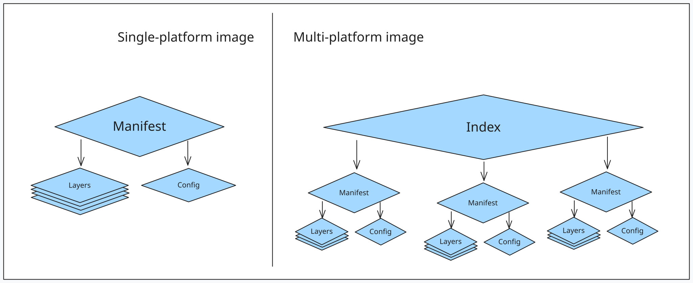

# The Image Problem: Risks and Vulnerabilities of Container Images

## What Is A Container Image?

A container image is **a self-contained unit of packaging that includes every component required for an application to run**. Think of it as a pre-configured environment that ensures consistency across different systems. The image encapsulates:
- **Application Code**: The binary or source files of your software.
- **Dependencies**: Libraries, runtimes (like Python or Node.js), and environment variables.
- **OS Constructs**: A "stripped-down" version of an operating system (usually just the filesystem and basic utilities). The image does not include a kernel, as containers share the host OS kernel.

| Feature | Image | Container |
| --- | --- | --- | 
| Status | A "stopped" or static template (Build-time). | A running instance of an image (Run-time). |
| Mutability | Immutable: Once built, it does not change. | Mutable: Has a writable layer for temporary data. |
| Analogy | Similar to a VM Template or a Class in OOP. | Similar to a running VM or an Object instance. |

> Just as a VM template is a "frozen" version of a virtual machine, a Docker image is the static blueprint for a container.


Source: Docker Deep Dive, Nigel Poulton

Images are constructed using a stacked layer system. Each instruction in a build file (like a Dockerfile) creates a new layer. These layers are read-only and stacked on top of each other to appear as a single unified object. This architecture allows for layer sharing, which saves disk space and speeds up downloads.

While Docker popularized the format, the industry now follows the **Open Container Initiative (OCI) standard**. This ensures portability across the ecosystem. You can build an image using Docker, but run it using Podman, containerd, or CRI-O without any modifications. If a tool is OCI-compliant, it will handle the image flawlessly.

## Why The Image Is The Problem

When a team says, “We run containers,” what they often mean in practice is: **We run whatever was baked into an image at build time.**

That image may contain:
- an outdated operating system snapshot
- vulnerable OS packages
- vulnerable language dependencies
- unnecessary shells, package managers, compilers, and debugging tools
- credentials or internal files accidentally copied from the build context
- a default runtime user of root
- broad metadata, labels, environment variables, and build history
- an old base image that has not been rebuilt since new CVEs were published
- no SBOM, no signature, no provenance, and no clear ownership

**If the image runs, that does not mean the image is fine.** Images have memory. Build steps, layers, metadata, copied files, and package manager artifacts can preserve information long after the final container appears to work correctly.

## OCI Container Standards

The [Open Container Initiative (OCI)](https://opencontainers.org/) is a lightweight, open governance structure (project), formed under the auspices of the Linux Foundation, for the express purpose of creating open industry standards around container formats and runtimes. The OCI was launched on June 22nd 2015 by Docker, CoreOS and other leaders in the container industry. The OCI currently contains three specifications: 
- the Runtime Specification (runtime-spec), 
- the Image Specification (image-spec) 
- the Distribution Specification (distribution-spec).

> The OCI Distribution Spec allows for arbitrary content, not just container images, to be stored in a registry. As a result, registries are being used to hold other types of container-adjacent artifacts, including Helm charts, Open Policy Agent policies, Software Bill of Materials and attestations.

### Docker image versus OCI image

In daily language, people often say “Docker image” when they mean any container image. Historically this made sense because Docker popularized the image workflow. In modern environments, the more precise term is OCI image.

A Docker-built image can be OCI-compatible, and OCI-compatible images can be used by many runtimes and tools, not just Docker. Kubernetes commonly runs images through container runtimes such as `containerd` or `CRI-O`. Tools such as Podman, Buildah, Skopeo, nerdctl, Trivy, Syft, Grype, Cosign, and registry scanners all operate in this ecosystem.

This distinction matters because the security target is not “Docker” as a brand. The security target is the artifact format and lifecycle: how the image is built, what it contains, how it is identified, where it is stored, how it is verified, and what the runtime does with it.

## Inspecting OCI Images

At its core, an OCI-compliant container image consists of two primary parts: **the root filesystem (rootfs)** and the **image configuration**.

1. **The Root Filesystem (Layers)**: When you instantiate a container, the image provides the root filesystem that the container sees.
      - **Layered Design**: The filesystem is composed of an ordered set of layers. The base layer is applied first, and subsequent layers are stacked on top to produce the final layout.
      - **Building Layers**: Commands in a Dockerfile like FROM, ADD, COPY, or RUN modify the contents of this filesystem by creating new layers.

2. **The Configuration Metadata**: The image also contains metadata that defines how the container should behave at runtime.
      - **Runtime Instructions**: Commands like USER, EXPOSE, ENV, or ENTRYPOINT do not change the files on disk; instead, they update the image's JSON configuration.
      - **Inspection**: You can view this metadata by running `docker inspect <image_name>`.
      - **Example**: If you define an environment variable using ENV in a Dockerfile, that variable is stored in the config and automatically injected into the container process when it starts.
      - In Docker, the config information can be overridden at runtime using command-line parameters.


The OCI manifest acts as the "map" for the image, linking the configuration object to the specific layers required for a particular architecture and OS.


| Component   | Description  | Security & Operational Impact   |
| ----------- | ----------- | --------- |
| Tag         | A human-friendly name such as `1.0`, `3.12-slim`, or `latest`       | Mutable. Tags can be overwritten, meaning `latest` today might not be the same as `latest` tomorrow.  |
| Digest      | A unique SHA256 hash of the content.   | Immutable. Provides a cryptographically secure way to ensure you are running the exact same code every time.  |
| Image index | A higher-level object that can point to platform-specific manifests | Enables multi-architecture support (e.g., the same tag working on both `linux/amd64` and `linux/arm64`).   |
| Manifest    | The JSON document linking the config and layers.  | Defines the integrity of the image by listing the hashes of all constituent parts.   |
| Config JSON | Metadata including Env vars, User, and Cmd.   | Least Privilege: Reveals if a container is set to run as root by default or if sensitive data is hardcoded in Env variables. |
| Layers      | Ordered filesystem changesets.   | Persistence: Sensitive files (like SSH keys) added in one layer and deleted in another still exist in the image history.   |

[Skopeo](https://github.com/containers/skopeo) is a versatile command-line utility designed to perform operations on container images and repositories without requiring a background daemon like Docker. Its primary advantage is the ability to inspect remote images directly on a registry, allowing you to view manifests and configurations without downloading the entire image to your local disk.

To install Skopeo, run:
```bash
# For Debian/Ubuntu
sudo apt-get -y update
sudo apt-get install -y skopeo
```

We can generate an OCI image from a Docker image and check the contents:
```bash
skopeo copy docker://python:3.14-slim-bookworm oci:python-oci:3.14-slim-bookworm

ls python-oci/
```

The `index.json` file contains the manifest for the image, including the unique digest
that identifies it:
```bash
cat python-oci/index.json
```   

Example output:
```json
{
   "schemaVersion":2,
   "manifests":[
      {
         "mediaType":"application/vnd.oci.image.manifest.v1+json",
         "digest":"sha256:c0bbb2bfea3d552260f0d071f4ef9358d25b50c37d7a91895710cde507de4ade", 
         "size":1751,
         "annotations":{
            "org.opencontainers.image.ref.name":"3.14-slim-bookworm"
         }
      }
   ]
}
```

This digest matches one of the blobs in the OCI-format image. The blobs can be checked by running:
```bash
ls python-oci/blobs/sha256/
```

While the OCI layout is perfect for storage and transport, low-level runtimes like runc cannot execute a container directly from these hashed blobs. Instead, the image must be "unpacked" into an **OCI Runtime Bundle**. 

To see this in action, we can use [umoci](https://github.com/opencontainers/umoci), a tool specifically designed to manipulate OCI images and transform them into bundles.

```bash
# Install umoci
sudo apt-get -y install umoci

# Unpack the image into a runtime bundle
umoci unpack --image python-oci:3.14-slim-bookworm python-bundle --rootless

# View the bundle structure
ls python-bundle

# Output:
# config.json  rootfs  sha256_c0bbb2bfea3d552260f0d071f4ef9358d25b50c37d7a91895710cde507de4ade.mtree  umoci.json
```

By exploring the rootfs directory, we see the actual Linux filesystem that the container will perceive as its own:
```bash
ls python-bundle/rootfs
```

The unpacking process transforms the abstract blobs into two concrete components that the runtime understands:
- **The `rootfs/` Directory**: This is the result of flattening all the filesystem Layers into a single directory. It contains the binaries, libraries, and distribution files (like Python and its dependencies) in their uncompressed state.
 - **The `config.json` File**: This is generated from the Configuration blob. It tells the runtime exactly how to start the process, including namespaces, resource limits, and environment variables.

The OCI layout uses **Content Addressable Storage**, meaning every file is named after its own SHA256 hash. This creates a secure "Chain of Trust":
- `index.json` points to the Manifest blob.
- The **Manifest blob** acts as a map, containing the hashes for the **Config blob** and each ordered Layer blob.
- The Container Runtime follows these hashes to verify and pull the correct files from the `/blobs/sha256/` directory to reconstruct the application.

> Because every component is referenced by its unique Digest, it is impossible to alter a single byte in a layer or config file without breaking the chain. If a blob is tampered with, the hash will no longer match the manifest, and the runtime will refuse to execute the container.

When you look at the extracts from the bundle, you are seeing the direct translation of image metadata into operating system instructions.
```bash
cat python-bundle/config.json
```

- **The Root Path**: This tells the runtime (like `runc`) where to find the unpacked filesystem. Once the container starts, the runtime will use the `pivot_root` or `chroot` system call to make this specific directory appear as the `/` (root) directory for the containerized process.
```json
"root": {
   "path": "rootfs"
}
```

- **Mounts**: Containers need access to certain kernel interfaces to function. The configuration explicitly defines where to mount pseudofilesystems like `/proc` (for process information) and `cgroups` (for resource management). This ensures the container can "see" its own limited view of the system hardware.
```json
"mounts": [
  {
    "destination": "/proc",
    "type": "proc",
    "source": "proc"
  },
  ...
```

- **Isolation via Namespaces**: This is where the magic of isolation happens. This section tells the kernel to wrap the process in specific namespaces. For example:
   - PID: The process will think it is PID 1.
   - Network: The process gets its own virtual network stack.
   - Mount: The process has its own private list of mount points.
```json
"namespaces": [
  { "type": "pid" },
  { "type": "network" },
  { "type": "ipc" },
  ...
]
```

> In Docker we can inspect the image configuration with `sudo docker pull python:3.14-slim-bookworm && sudo docker image inspect python:3.14-slim-bookworm`. 

## Image Layers

Layers are one of the most critical concepts in container architecture, particularly for optimization and security.

An image filesystem is built by stacking these layers on top of each other. Each layer represents a precise set of changes relative to its parent layer: files added, files modified, or files removed. The OCI configuration specification describes an image as an ordered collection of these filesystem changesets combined with execution parameters (like entrypoints, environment variables, and labels).

A simplified conceptual view of an image looks like this:

```
Layer 5: Set user and command  (Metadata only)
Layer 4: Install dependencies  (Filesystem changes)
Layer 3: Copy application      (Filesystem changes)
Layer 2: Install Python        (Filesystem changes)
Layer 1: Base OS files         (Base layer)
```


Source: Docker Deep Dive, Nigel Poulton

At runtime, the container runtime merges these separate layer archives into a single, unified filesystem view. To the application running inside the container, it feels like a standard, flat directory structure, even though it is backed by loosely-connected, read-only layers. Because layers are independent, **multiple images can and often do share the same base layers, leading to massive space efficiencies across your system**.

### Inspecting Image Layers

There are three primary ways to inspect the layers that make up an image:

1. **During an Image Pull**: When you download an image, you can watch the layers pull in real time. Each line ending in "Pull complete" is a distinct layer being downloaded and extracted.
   ```bash
   sudo docker image pull redis:latest
   ```

2. **Using `docker image inspect`**: This command provides low-level cryptographic details about the image, including the specific content hashes (DiffIDs) of the filesystem layers.
   ```bash
   sudo docker image inspect redis:latest
   ```

3. **Using `docker history`**: This command displays the build history of the image. Note that it is not a strict list of filesystem layers; some Dockerfile instructions (like `ENV`, `EXPOSE`, or `CMD`) only add configuration metadata and do not result in a physical layer.
   ```bash
   sudo docker image history redis:latest
   ```

### Images vs. Containers: The Writable Layer

The fundamental difference between a container and an image is a **single thin layer added to the very top of the stack: [the writable container layer](https://docs.docker.com/engine/storage/drivers/)**.


Source: https://docs.docker.com/storage/storagedriver/

While **all underlying image layers are strictly read-only**, the container layer enables all read/write operations for a active instance.
- **Short-lived Nature**: This writable layer lives on the Docker host's filesystem (typically under `/var/lib/docker/<storage-driver>/...`). It is tightly bound to the lifecycle of the container. If the container is deleted, its writable layer is permanently destroyed, while the underlying image remains completely unchanged.
- **Multi-Tenancy**: Because each container maintains its own separate writable layer, multiple running containers can simultaneously share access to the exact same underlying image while maintaining their own unique data states.


Source: https://docs.docker.com/storage/storagedriver/

If an application inside a container needs to modify an existing file that belongs to a read-only image layer, [Docker uses a **copy-on-write strategy**](https://docs.docker.com/engine/storage/drivers/#the-copy-on-write-cow-strategy):
1. The filesystem detects the write request on a lower layer file.
2. It instantly copies that file up into the container's thin writable layer.
3. The container modifies the copy in the writable layer, seamlessly hiding the original file beneath it.

This layer management is handled by [Linux storage drivers](https://docs.docker.com/engine/storage/drivers/select-storage-driver/) (such as `overlay2`, `fuse-overlayfs`, `btrfs`, or `zfs`). While storage drivers are highly space-efficient, copy-on-write operations **introduce performance overhead for write-intensive applications (like databases)**.

> Never use the container's writable layer for heavy I/O or persistent data. Always use Docker Volumes for write-intensive applications to bypass the storage driver and achieve native performance.

### Why "Deleted" Files Still Matter

A common security mistake occurs when developers treat a Dockerfile like a standard shell script. Consider this example:
```bash
mkdir image-layer-demo
cd image-layer-demo

# Create a fake .env file with a secret value
cat > .env <<'EOF'
DATABASE_PASSWORD=training-only-password
EOF

# Create an intentionally bad Dockerfile:
cat > Dockerfile <<'EOF'
FROM alpine:3.23
WORKDIR /app
COPY . .
RUN rm -f .env
CMD ["sh", "-c", "ls -la /app && sleep 3600"]
EOF

# Build the image
sudo docker build -t image-problem:layer-leak .

# Run the image and notice that .env is not visible:
sudo docker run --rm image-problem:layer-leak
```

It is a common misconception that `/app/.env` is safely erased because it does not appear in the final running container. It is not safe.

Because OCI layers are immutable changesets, a file removal does not delete the data from previous layers. Instead, the `rm` command creates a whiteout marker - an empty file with a `.wh.` prefix signifying that the path should be hidden from that point forward.

Now export the image and search the artifact:
```bash
sudo docker image save -o layer-leak.tar image-problem:layer-leak
mkdir extracted
sudo tar -xf layer-leak.tar -C extracted

# Create a directory to hold the actual recovered files
mkdir recovered_contents

# Find all compressed layer blobs and extract them into that directory
find extracted/blobs/sha256/ -type f -exec tar -xzf {} -C recovered_contents 2>/dev/null \;

# View your successfully stolen secret
cat recovered_contents/app/.env

# Confirm the file is still there even though it was "deleted" in the Dockerfile
ls -la recovered_contents/app/
# total 16
# drwxr-xr-x  2 administrator administrator 4096 May 15 09:35 .
# drwxrwxr-x 20 administrator administrator 4096 May 15 09:45 ..
# -rw-rw-r--  1 administrator administrator  100 May 15 09:35 Dockerfile
# -rw-rw-r--  1 administrator administrator   41 May 15 09:34 .env
# ----------  1 administrator administrator    0 Jan  1  1970 .wh..env
```

The sensitive file is hidden from the final merged filesystem view, but the raw bytes still exist entirely intact within the tarball of Layer 1. Anyone with access to the image archive, the container registry, or the CI/CD cache can easily extract the lower layer and recover the secret.
- "I deleted it later" is not a valid remediation for a leaked secret.
- If an image containing a secret was pushed to a registry, assume that secret has been compromised.
- Remediation: Rotate the secret immediately, use multi-stage builds to avoid copying secrets into intermediate layers, and rebuild your images from a clean state.

## Image naming and tagging

Image names look simple on the surface, but the way you reference them hides critical trust and security decisions. A fully qualified image reference follows this structure:
```
[registry]/[namespace]/[repository]:[tag]@[digest]
```

Examples:
- `nginx:1.27` (Implies Docker Hub registry and library namespace)
- `docker.io/library/nginx:1.27` (Explicit version of the same image)
- `registry.example.com/course/backend:1.0.0` (Private registry reference)
- `registry.example.com/course/backend@sha256` (Referenced strictly by digest)
- `registry.example.com/course/backend:1.0.0@sha256` (Referenced by both tag and digest)

The most critical distinction when managing container lifecycles is understanding that tags represent names, while digests represent identity.


| Feature   | Image Tag (:1.0.0)  | Image Digest (@sha256:...)   |
| ----------- | ----------- | --------- |
| **What it is** | A human-readable pointer or alias. | A unique, cryptographic SHA256 hash of the content. |
| **Mutability** | Mutable: Can be moved to point to a completely different image artifact. | Immutable: Uniquely ties to one specific layout of layers and config. It can never change. |
| **Analogy** | Like a Git branch name (e.g., main or dev) which moves as new commits are added. | Like a specific Git commit hash. It points to a precise moment in time. |

When you pull `backend:latest`, you are not identifying an exact artifact. You are pulling whatever image the registry currently maps to that tag. If someone pushes a new build to that tag five minutes later, the "latest" image changes.

When you **pull an image by its digest**, you guarantee that you are fetching the exact same bits every single time. Even if a developer overwrites a tag on the registry, the digest remains a permanent reference to that specific artifact.


Imagine you are running a production stack using a Docker Compose file distributed across three different backend servers:

```yaml
services:
  web:
    image: registry.example.com/course/backend:1.0.0
    ports:
      - "8080:8080"
```

If a developer accidentally overwrites the `1.0.0` tag in the registry with a buggy build, look at what happens over time:
   - Server A already has the old `1.0.0` cached locally and keeps running the stable code.
   - Server B crashes, restarts, pulls `1.0.0` fresh from the registry, and gets the buggy code.
   - Server C is a brand new server added to handle traffic logs, pulls `1.0.0`, and gets the buggy code.

Even though all three servers look identical in your Docker Compose file, they are now running completely different software configurations.

By **pinning your production environments to a digest, you eliminate tag drift**. If a tag changes on the registry, Docker will ignore the tag change and pull exactly what the cryptographic hash dictates. Also the risk for supply chain attacks is reduced, because if an attacker compromises the registry and pushes a malicious image to a commonly used tag, your production environment will not be affected if it is pinned to a digest.

```yaml
services:
  web:
    # Human-readable tag + strict digest validation
    image: registry.example.com/course/backend:1.0.0@sha256:45b23dee08af5e43...
    ports:
      - "8080:8080"
```

> When both a tag and a digest are provided, Docker prioritizes the digest for the pull operation.

### Practical Commands

1. **View the Immutable Repo Digest Locally**: After pulling a standard tagged image, you can find its cryptographic identity using docker image inspect:
   ```bash
   sudo docker pull alpine:3.23
   sudo docker image inspect alpine:3.23 --format '{{json .RepoDigests}}'
   ```

2. **Inspect Multi-Platform Image Indexes**: Many modern images contain sub-manifests for different architectures (like amd64 and arm64). You can inspect the root index digest using:
   ```bash
   sudo docker buildx imagetools inspect alpine:3.23
   ```

3. **Hardcoding Digests into Your Workflows**: To secure your builds, use digests right inside your Dockerfile:
   ```dockerfile
   FROM alpine:3.23@sha256:48d9183eb12a0535fbc24a101ee981f92e0df400810db69ef2dbf1e31d3f972b
   ```

Best practices for image referencing:
- **Local Development**: Version tags (like :3.12-slim) are perfectly acceptable for speed and convenience.
- **CI/CD Pipelines**: Use automated scripts to resolve your tags to their underlying SHA256 digests before shipping.
- **Production Environments**: Always deploy by digest. Never allow unpinned images or general environment tags like :latest in production environments, as they break your rollback capability and blindside container auditing.

## Container Builders

The build process is where an image transitions from a conceptual Dockerfile into a physical, runnable artifact. Historically, running `docker build` was a monolithic operation handled entirely by the Docker daemon. Today, modern container builds utilize a much more robust, efficient, and secure client-server architecture.

### Modern Architecture: Buildx and BuildKit

> As of Docker Engine 23.0 and Docker Desktop 4.19, Buildx is the default build client.

When you execute a standard build command: 
```bash
sudo docker build -t course/backend:1.0 .
```

You are doing much more than just reading a Dockerfile. You are interacting with a decoupled system consisting of [two primary components](https://docs.docker.com/build/concepts/overview/):
- **The Client (Buildx)**: Buildx is the user interface and CLI tool. It interprets your build options, gathers the necessary resources (build arguments, export options, context), and sends the build request.
- **The Server (BuildKit)**: [BuildKit](https://docs.docker.com/build/buildkit/) is the backend daemon process that actually resolves the instructions and executes the build steps. BuildKit offers more advanced capabilities, including a rootless mode, the ability to produce an image for multiple platforms, the ability to push the image to multiple registries, and more.


Unlike legacy builders that naively copied the entire local filesystem before starting a build, BuildKit only requests the specific resources it needs (local files, secrets, SSH sockets) from Buildx exactly when it needs them.

> `docker build` is [effectively a wrapper](https://docs.docker.com/build/builders/#difference-between-docker-build-and-docker-buildx-build) for `docker buildx build`. However, using `docker buildx build` allows you to explicitly manage and target custom or remote BuildKit backends instead of defaulting to the bundled Docker Engine builder. Check the builder status with `sudo docker buildx ls`.

The `docker build` and `docker buildx build` commands build Docker images from a **Dockerfile** and a **context**.

### Attacks on the Build Machine

The build machine should be treated as a critical security boundary. It is not only responsible for producing the final image, but it also executes the instructions from the Dockerfile during the build process. If an attacker can influence what gets built, or compromise the machine performing the build, the resulting image may become a delivery mechanism for malicious code.

There are two main risks:

- **Compromise of the build host**: A Dockerfile can execute arbitrary commands during build steps such as `RUN`. If the builder relies on a privileged Docker daemon, a successful attack may allow code running during the build to affect the host system or reach other internal services.
- **Compromise of the build output**: If an attacker can modify the Dockerfile, the build context, dependencies, or trigger unexpected builds, they may be able to insert a backdoor into the image that is later deployed to production.

Because build machines produce the software that eventually runs in production, they should be hardened with similar care as production systems themselves. Ideally, builds should run on separate infrastructure from production workloads. This limits the blast radius if a build process is compromised.

A stronger approach is to use **short-lived build environments**, where a fresh virtual machine or isolated builder is created for each build and destroyed afterwards. This makes it much harder for malicious files, credentials, or modified state to persist between builds.

To reduce risk:

- Prefer **rootless or unprivileged builders** where possible.
- Avoid running builds on machines with broad access to production networks or cloud services.
- Limit the credentials available during the build.
- Restrict direct user access to build machines.
- Use firewalls, VPC rules, and network policies to limit where build machines can connect.
- Remove unnecessary tools and services from build environments.

Even if the final container image is carefully secured, the build environment must not be ignored. A compromised build machine can silently produce compromised images.

### Alternative Builders and Non-Privileged Builds

To mitigate the security risks of privileged build environments, the industry has shifted toward non-privileged and rootless build architectures. For production and CI/CD environments, consider these alternatives:

| Alternative Builder | Description |
| ------------ | ----------- | 
| **Rootless Docker** | Runs the Docker daemon (`dockerd`) as a non-root user. This is generally available but requires manual opt-in. |
| **BuildKit rootless mode** | Allows the [BuildKit daemon](https://github.com/moby/buildkit) (`buildkitd`) to [run as a non-root user](https://crazymax.dev/buildkit/user-guides/rootless-mode/). This reduces the risk of giving the build process broad host privileges while still keeping the advanced BuildKit features such as efficient caching, concurrent build execution, and flexible outputs.
| **BuildKit Container Driver** | Allows running builds seamlessly within an isolated container, separating the build execution from the host operating system. |
| **Podman & Buildah** | Red Hat's daemonless alternatives. `buildah` is specifically engineered for building OCI images without requiring a background daemon or root privileges. |
| **Bazel & Nix** | Advanced build systems that focus on highly deterministic, reproducible builds, guaranteeing that the exact same source code will always produce the exact same cryptographic image hash. |
| **ko & jib** | Language-specific tools (`ko` for Go, `jib` for Java) that compile code and assemble container images directly, without needing Docker installed at all. |

> [Example](https://docs.gitlab.com/ci/docker/using_buildkit/#build-images-in-rootless-mode) from GitLab on how to use BuildKit in rootless mode. [Another example shows](https://candrews.integralblue.com/2025/03/building-docker-images-without-root-or-privilege-escalation/) how building Docker images becomes difficult when both root access and privilege escalation are disallowed.

Whether executed locally or automated in a pipeline, treating the build execution environment as a heavily scrutinized security boundary is just as important as securing the final container itself.

## Dockerfile: Build Instructions

Docker builds images by reading instructions from a Dockerfile. The Dockerfile is a text file that describes how to assemble an image, and [Docker’s own reference](https://docs.docker.com/reference/dockerfile/) defines the supported instructions such as `FROM`, `RUN`, `COPY`, `ADD`, `ENV`, `ARG`, `USER`, `ENTRYPOINT`, `CMD`, `WORKDIR`, `EXPOSE`, `LABEL`, `HEALTHCHECK`, and others. Docker executes Dockerfile instructions in order, and the Dockerfile must begin with a FROM instruction, except for parser directives, comments, or globally scoped ARG instructions that may appear before it.

The default filename is Dockerfile, without a file extension. Using the default name allows the common build form:
```bash
sudo docker build -t course/backend:1.0 .
```

Some projects use multiple Dockerfiles for different purposes:
```bash
Dockerfile
build.Dockerfile
test.Dockerfile
lint.Dockerfile
runtime.Dockerfile
```

In that case, specify the file explicitly:
```bash
sudo docker build -f build.Dockerfile -t course/backend:build .
sudo docker build --file runtime.Dockerfile -t course/backend:runtime .
```

### Instructions That Create Filesystem Layers

Some **Dockerfile instructions modify the image filesystem and therefore create new filesystem content in the image**. The most important are:
| Instruction | What It Does                                                                                           | Security Meaning                                                                                      |
| ----------- | ------------------------------------------------------------------------------------------------------ | ----------------------------------------------------------------------------------------------------- |
| `FROM`      | Starts a new build stage from a base image                                                             | Inherits all packages, files, users, labels, and defaults from the base image                         |
| `RUN`       | Executes commands during the build                                                                     | Creates a new layer; can install packages, download files, compile code, or accidentally leak secrets |
| `COPY`      | Copies files from the build context, another stage, named context, or image                            | Can accidentally copy `.env`, keys, source history, test data, or internal files                      |
| `ADD`       | Copies files like `COPY`, but also supports extra behavior such as remote sources and archive handling | More implicit behavior; use carefully and prefer `COPY` unless you need `ADD` features                |

The `RUN` instruction executes commands and creates a new layer on top of the current image. That layer is then used by the next Dockerfile step. Docker also documents that COPY copies files or directories from the build context, build stage, named context, or image into the filesystem of the image.

A simple example:
```Dockerfile
FROM alpine:3.23

RUN apk add --no-cache curl
COPY app.sh /usr/local/bin/app.sh
RUN chmod +x /usr/local/bin/app.sh
```

This creates filesystem changes:
```
Base layer: Alpine filesystem
Layer 2: curl and its dependencies installed
Layer 3: app.sh copied into /usr/local/bin
Layer 4: executable bit changed on app.sh
```

### Instructions That Change Image Configuration

Other instructions do not necessarily add files. Instead, they update the image configuration metadata.

| Instruction   | What It Changes                                          | Security Meaning                                                              |
| ------------- | -------------------------------------------------------- | ----------------------------------------------------------------------------- |
| `USER`        | Default user and group for later build steps and runtime | Reveals whether the container runs as root or non-root                        |
| `ENV`         | Environment variables stored in the image config         | Values persist into the final image and can be inspected                      |
| `ARG`         | Build-time variable                                      | Useful for build options, unsafe for secrets                                  |
| `ENTRYPOINT`  | Default executable                                       | Defines what process starts as PID 1                                          |
| `CMD`         | Default arguments or command                             | Can be overridden at runtime                                                  |
| `WORKDIR`     | Working directory for later instructions                 | Prevents accidental operations in unexpected directories                      |
| `EXPOSE`      | Documents intended listening ports                       | Does not publish the port by itself                                           |
| `LABEL`       | Adds metadata                                            | Useful for ownership, source, version, and audit information                  |
| `HEALTHCHECK` | Defines how to test container health                     | Can improve operations, but must not leak credentials or hit unsafe endpoints |

The `USER` instruction sets the user name or UID, and optionally the group, used for the rest of the current build stage and at runtime for `ENTRYPOINT` and `CMD`. Docker also recommends setting `WORKDIR` explicitly to avoid unintended operations in unknown directories inherited from the base image.

`ENV` deserves special attention. Environment variables set with `ENV` persist when a container is run from the resulting image, and Docker notes that they can be viewed with `docker inspect` and changed at runtime with `docker run --env`. Docker’s build checks explicitly warn that potentially sensitive data should not be used in `ARG` or `ENV`, because values set this way can persist in the final image. Docker recommends BuildKit secret mounts instead.

Better pattern:
```Dockerfile
 # syntax=docker/dockerfile:1.8

FROM alpine:3.23

RUN --mount=type=secret,id=api_token \
    TOKEN="$(cat /run/secrets/api_token)" && \
    echo "Using token temporarily during build"
```

Build:
```bash
printf "training-only-token\n" > api-token.txt

sudo docker build \
  --secret id=api_token,src=api-token.txt \
  -t secret-mount-demo .
```

> `ARG` is for build options. `ENV` is for non-sensitive runtime defaults. Neither is for secrets.

`CMD` and `ENTRYPOINT` Dockerfile instructions support two forms:
```Dockerfile
CMD echo hello # Shell form

CMD ["echo", "hello"] # Exec form (preferred)
```

The first is the shell form. It runs through a shell such as `/bin/sh -c`. The second is the exec form. It executes the binary directly. This distinction matters because the process launched by the container usually becomes PID 1 inside the container. Signal handling, argument parsing, environment expansion, and process termination behavior can differ depending on whether a shell is involved.

Prefer exec form for production entrypoints:
```Dockerfile
ENTRYPOINT ["python", "app.py"]
```

The shell form is convenient, but it introduces an extra shell process. That may affect signal forwarding and graceful shutdown. A common pattern is:
```Dockerfile
ENTRYPOINT ["python", "app.py"]
CMD ["--port", "8080"]
```

This makes the executable stable while allowing default arguments to be overridden at runtime.

### Parser Directives

A Dockerfile can start with parser directives. These are special comments that affect how the Dockerfile is interpreted. Docker documents supported parser directives such as `syntax`, `escape`, and `check`, and notes that parser directives must appear at the top of the Dockerfile before normal comments, empty lines, or instructions.

Example:
```Dockerfile
# syntax=docker/dockerfile:1

FROM alpine:3.23
RUN echo "hello"
```

The most common directive is syntax, which selects the Dockerfile frontend version. This is important when using modern BuildKit features such as:
```Dockerfile
RUN --mount=type=cache,target=/root/.cache/pip ...
RUN --mount=type=secret,id=npmrc,target=/root/.npmrc ...
RUN --mount=type=ssh ...
```

Without the correct syntax version, newer Dockerfile features may not work consistently across build environments.

Dockerfile Instruction Security Table:
| Instruction  | Common Mistake                                       | Security Impact                                | Better Direction                                     |
| ------------ | ---------------------------------------------------- | ---------------------------------------------- | ---------------------------------------------------- |
| `FROM`       | `FROM latest`                                        | Non-reproducible builds and tag drift          | Use version tags; pin digests for production         |
| `RUN`        | `curl https://example/install.sh \| sh`              | Executes unverified remote code                | Use trusted package repos, checksums, or signatures  |
| `RUN`        | Installing compilers and leaving them in final image | Increases attack surface                       | Use multi-stage builds                               |
| `COPY`       | `COPY . .`                                           | Copies secrets, `.git`, caches, and test data  | Copy only required files                             |
| `ADD`        | Using remote URLs without verification               | Pulls external content into the build          | Prefer `COPY`; use `ADD --checksum` when appropriate |
| `ENV`        | Storing tokens or passwords                          | Values persist in final image metadata         | Use runtime secret injection or BuildKit secrets     |
| `ARG`        | Passing credentials with `--build-arg`               | May appear in metadata, logs, or provenance    | Use `RUN --mount=type=secret`                        |
| `USER`       | Missing user directive                               | Container runs as root by default              | Create and use a non-root user                       |
| `WORKDIR`    | Relying on inherited working directory               | Unexpected file placement or command execution | Set it explicitly                                    |
| `ENTRYPOINT` | Shell form for long-running processes                | Poor signal handling and shutdown behavior     | Prefer exec form                                     |
| `CMD`        | Multiple `CMD` instructions                          | Only the last one takes effect                 | Use one clear default                                |
| `EXPOSE`     | Assuming it publishes the port                       | False sense of exposure control                | Use runtime `-p` or Compose/Kubernetes config        |
| `LABEL`      | No ownership metadata                                | Harder incident response and audit             | Add source, owner, version, revision, license        |

## The Build Context: A Hidden Security Boundary

[The build context](https://docs.docker.com/build/concepts/context/) is the set of files that the build can access. Docker’s build documentation states that the positional argument passed to docker build specifies the build context, and build instructions such as `COPY` and `ADD` can reference files and directories inside that context. Filesystem contexts are processed recursively, meaning that local directories include subdirectories.

Most teams diligently review their Dockerfiles. Far fewer teams review their build context. This is a critical security oversight. When you run `docker build .`, the `.` does not mean "only build the files explicitly mentioned in the Dockerfile." It dictates that the builder has access to a build context rooted at the current directory, including all subdirectories.

If you are not careful, highly sensitive files can be shipped to the builder or accidentally leaked into the image layers via blanket `COPY . .` commands. Dangerous context contents include:
- `.env` files with active credentials
- `.git/` directories containing full commit histories
- `id_rsa` or `*.pem` keys
- `npm` tokens or `pip.conf` files
- Test databases, debug logs, or customer samples

During builds, Docker often displays a line like this:
```
=> [internal] load build context
=> => transferring context: 138.4MB
```

A large context is not automatically insecure, but it is a signal worth investigating. For a tiny Python service, a 300 MB context probably means the build is sending unnecessary files to the builder.

Before approving a Dockerfile or build pipeline, check:

| Question     | Why It Matters          |
| --------------- | ------------- |
| What directory is passed as the build context?          | Determines what the builder can access                   |
| Is the context root too broad?                          | Building from repository root may expose unrelated files |
| Is `.dockerignore` present?                             | Without it, everything under the context can be sent     |
| Is `.dockerignore` deny-list or allow-list based?       | Allow-list is safer for sensitive services               |
| Is `COPY . .` used?                                     | Broad copy is the most common leakage pattern            |
| Are secrets excluded?                                   | `.env`, keys, credentials, package tokens                |
| Is `.git/` excluded?                                    | Source history may contain deleted secrets               |
| Are tests and local data excluded from runtime builds?  | Reduces image size and accidental data exposure          |
| Are Dockerfile-specific ignore files used where needed? | Different builds often need different file sets          |
| Is the context size reasonable?                         | Large context often indicates hidden baggage             |
| Is a remote context pinned or trusted?                  | Remote build inputs are supply-chain inputs              |


## Defending the Context with `.dockerignore`

You can use a `.dockerignore` file to exclude files or directories from the build context. This helps avoid sending unwanted files and directories to the builder, improving build speed, especially when using a remote builder.

When you run a build command, the build client looks for a file named `.dockerignore` in the root directory of the context. If this file exists, the files and directories that match patterns in the files are removed from the build context before it's sent to the builder.

Use a `.dockerignore` file aggressively to filter what the builder is allowed to see. While you can try to maintain a blacklist of specific sensitive files, an **allow-list approach is far stricter and more secure**:
```plaintext
# .dockerignore

# 1. Start by ignoring absolutely everything
**

# 2. Explicitly allow only what the build needs
!app.py
!requirements.txt
!Dockerfile
```

This pattern ensures that if a developer accidentally drops a new secret file into the directory, it will be automatically blocked from the build context by default.


## Multi-stage Builds

A [**multi-stage build** is a Dockerfile pattern](https://docs.docker.com/build/building/multi-stage/) that uses more than one `FROM` instruction. Each `FROM` starts a new build stage, and each stage can use a different base image. You can then selectively copy only the files you need from one stage into another using `COPY --from=...`.

This is useful because the tools needed to **build** an application are often not needed to **run** it. For example, a Go application needs the Go compiler to produce a binary, but the final runtime image does not need to contain the Go compiler, source code, package caches, or other build tools.

The general pattern looks like this:
```Dockerfile
FROM builder-image AS build
# install build tools
# copy source code
# compile or prepare the application

FROM runtime-image AS runtime
# copy only the final artifact from the build stage
COPY --from=build /path/to/artifact /path/to/artifact
```

The main benefit is that the final image contains only the runtime artifacts. This usually makes the image:
- smaller,
- faster to pull and distribute,
- easier to scan and reason about,
- less likely to contain unnecessary vulnerable packages,
- less useful to an attacker if the container is compromised.

Docker’s documentation describes this as a way to keep Dockerfiles readable while copying only selected artifacts into the final image and leaving behind everything else. The final image can contain just the built binary or prepared application files, without the build tools used to create them.

> Good read: [Using Multi-Stage Builds to Simplify And Standardize Build Processes](https://medium.com/capital-one-tech/multi-stage-builds-and-dockerfile-b5866d9e2f84)


### Example: Go Application

Go is a good example because it can produce a standalone binary. The first stage uses the Go toolchain to compile the program. The second stage starts from `scratch`, which is an empty image, and copies in only the compiled binary.

```Dockerfile
# syntax=docker/dockerfile:1

FROM golang:1.25 AS build
WORKDIR /src

COPY <<EOF ./main.go
package main

import "fmt"

func main() {
    fmt.Println("hello from a multi-stage Go image")
}
EOF

RUN CGO_ENABLED=0 go build -o /hello ./main.go

FROM scratch
COPY --from=build /hello /hello
CMD ["/hello"]
```

Copy the above Dockerfile into a directory and run the following commands from that directory to build and run the image:
- `sudo docker build -t course/hello-go:1.0 .`
- `sudo docker run --rm course/hello-go:1.0`

The final image does not contain the Go compiler, the source code, or the intermediate build files. It contains only the `/hello` binary.

### Example: Python Application

Python is different from Go because Python applications usually still need a Python runtime. However, multi-stage builds are still useful. The build stage can install or compile dependencies, while the runtime stage starts from a clean image and receives only the prepared environment and application files.

Assume the project contains these files (check the files at `./examples/01_multi_stage_python`):
```
.
├── app.py
├── requirements.txt
└── Dockerfile
```

Move to the directory and build the image:
- `cd examples/01_multi_stage_python`
- `sudo docker build -t course/hello-python:1.0 .`
- `sudo docker run --rm -p 8000:8000 course/hello-python:1.0`

In this Python example, the final image still contains Python, because Python is required at runtime. However, the dependency installation work is separated from the final application stage. For applications that require compilers or development headers to build Python packages, this prevents those build tools from being included in the runtime image.

### Multi-stage Builds and Security

Multi-stage builds are not a complete security solution, but they are an important hardening technique. The final image should contain only what the application needs to run. Build tools, compilers, package manager caches, source code, test data, and temporary files should normally remain in earlier stages.

A smaller final image reduces the attack surface and makes vulnerability scanning easier to interpret. However, the build stages still execute code during the build process, so the build machine and build context must still be treated as security-sensitive.

## Selecting Base Images

The base image is the foundation of the final image. If the base is stale, bloated, untrusted, unsupported, or malicious, everything built on top inherits that problem.

[Docker’s build best-practices documentation](https://docs.docker.com/build/building/best-practices/#choose-the-right-base-image) puts base image selection first: **choose an image from a trusted source and keep it small**. 
- **Docker Official Images** are a curated collection that have clear documentation, promote best practices, and are regularly updated. They provide a trusted starting point for many applications.
- **Verified Publisher images** are high-quality images published and maintained by the organizations partnering with Docker, with Docker verifying the authenticity of the content in their repositories.
- **Docker-Sponsored Open Source** images are published and maintained by open source projects sponsored by Docker through an open source program.

When building your own image from a Dockerfile, ensure you choose a minimal base image that matches your requirements. **A smaller base image not only offers portability and fast downloads, but also shrinks the size of your image and minimizes the number of vulnerabilities introduced through the dependencies.**

**Prefer:**
- official images from reputable maintainers
- verified publisher images
- internally curated base images
- hardened images maintained by your platform team
- approved private registries with access control
- images with documented update cadence and support lifecycle

**Avoid:**
- random public images from personal namespaces
- images with no Dockerfile or source repository
- abandoned images
- unsupported or end-of-life distributions
- images that require running as root without explanation
- images that install an SSH server for production use
- images with unclear licensing or provenance

A base image decision is not only a developer convenience decision. It is a supply-chain decision.

Smaller images are usually easier to secure because they have fewer packages, fewer libraries, fewer utilities, and fewer scanner findings. But minimal images have tradeoffs.

| Base Type               | Strength                                           | Tradeoff                                                         |
| ----------------------- | -------------------------------------------------- | ---------------------------------------------------------------- |
| Full distribution image | Familiar tools, easy debugging                     | Large attack surface, many packages                              |
| Slim image              | Smaller, still operationally familiar              | May still include shell and package manager                      |
| Alpine                  | Very small, common for simple workloads            | Uses musl libc, which can cause compatibility differences        |
| Distroless              | No package manager or shell, small runtime surface | Harder interactive debugging                                     |
| `scratch`               | Empty base, excellent for static binaries          | You must provide everything needed, such as CA certs if required |
| Hardened vendor image   | Curated, patched, often signed and documented      | Vendor lock-in, subscription, or operational constraints         |

**Use the smallest supported runtime image that your team can operate safely.**

**Base image checklist:**
- Who maintains it?
- How often is it rebuilt?
- What distribution and version is it based on?
- Is the distribution still supported?
- Is there a public Dockerfile or build recipe?
- Does it run as root by default?
- Does it include a shell, package manager, compiler, SSH server, or debugging tools?
- Is it signed?
- Does it publish SBOMs or provenance?
- Can we pin it by digest?
- Can our scanners correctly identify its packages?
- Do we have a plan for rebuilding when the base digest changes?

**[SlimToolkit](https://github.com/slimtoolkit/slim)** is another useful tool to know about when optimizing container images. Instead of changing your Dockerfile or replacing your normal build workflow, Slim can analyze an existing image, observe what the application actually uses at runtime, and generate a smaller optimized image that contains only the necessary files and dependencies. It also provides commands such as `xray` for inspecting image contents, `lint` for checking Dockerfiles, and `debug` for troubleshooting minimized containers. This can significantly reduce image size and attack surface, but the optimized image should always be tested carefully, because dynamic analysis may miss files or code paths that are only used in less common runtime scenarios.

### Using Docker Hardened Images

[Docker Hardened Images (DHI)](https://docs.docker.com/dhi/) provide minimal, secure, and production-ready container images, Helm charts, and system packages maintained by Docker. Designed to reduce vulnerabilities and simplify compliance.

You can pull and run a DHI like any other Docker image. Note that Docker Hardened Images are designed to be minimal and secure, so they may not include all the tools or libraries you expect in a typical image.

> **[Considerations when adopting DHIs](https://docs.docker.com/dhi/how-to/use/#considerations-when-adopting-dhis)**: Docker Hardened Images are intentionally minimal to improve security. If you're updating existing Dockerfiles or frameworks to use DHIs, keep in mind that runtime images don't include shells or package managers, run as non-root users by default, and may have different configurations than images you're familiar with.

Copmare the DHI with a standard image:

```bash
# Create a free Docker Hub account and login in to pull the DHI
sudo docker login dhi.io

# Pull the DHI and a standard image for comparison
sudo docker pull dhi.io/python:3.13
sudo docker pull python:3.13

# Run the image to confirm everything works:
sudo docker run --rm dhi.io/python:3.13 python -c "print('Hello from DHI')"
sudo docker run --rm python:3.13 python -c "print('Hello from standard image')"

# Compare the images:
sudo docker image ls dhi.io/python:3.13
sudo docker image ls python:3.13

sudo docker history dhi.io/python:3.13
sudo docker history python:3.13
```

Let's explore the differences in the image with the [`dive`](https://github.com/wagoodman/dive) tool:

```bash
# Install dive
DIVE_VERSION=$(curl -sL "https://api.github.com/repos/wagoodman/dive/releases/latest" | grep '"tag_name":' | sed -E 's/.*"v([^"]+)".*/\1/')
curl -fOL "https://github.com/wagoodman/dive/releases/download/v${DIVE_VERSION}/dive_${DIVE_VERSION}_linux_amd64.deb"
sudo apt install ./dive_${DIVE_VERSION}_linux_amd64.deb

# Inspect the standard image visually
sudo dive python:3.13

# Inspect the DHI image visually
sudo dive dhi.io/python:3.13
```

### Using the `scratch` and the "distroless" base images

When packaging compiled binaries for production, minimizing the container's footprint is one of the most effective ways to optimize performance and harden security. Two primary strategies exist for creating these ultra-lean environments: building completely **[from scratch](https://docs.docker.com/build/building/base-images/#create-a-base-image)** or utilizing **[Google's "distroless"](https://github.com/GoogleContainerTools/distroless)** base images.

While both approaches eliminate standard operating system bloat, they serve slightly different needs in production workflows.


| Feature    | `FROM scratch`  | `FROM gcr.io/distroless/static-debian13`   |
| --------------- | --------- | ---------- |
| **Base Size** | 0 bytes  | ~2 MB to 3 MB   |
| **OS Packages**  | None   | None  |
| **System Libraries**  | None (Requires purely static binaries)   | Common minimal runtime dependencies (glibc, libssl)  |
| **SSL/TLS Certificates**  | No (Must be manually copied if needed) | Yes (Pre-installed and updated)    |
| **User Management** | No `/etc/passwd` (Runs as root by default)  | Includes a non-root user (`nobody:nogroup`, UID 65534) |
| **Primary Language**  | Go, Rust (Purely static compiled languages)    | C, C++, Rust, Go, or dynamic runtimes (Node/Python)       |


- **Dockerfile Example (`scratch`):** `scratch` is an explicitly empty starting point. It contains absolutely nothing - no shell, no libraries, no users, and no SSL certificates. If your application needs to make an HTTPS request, it will fail unless you manually bundle the root certificates. To use `scratch`, you must build your binary inside a build container using a multi-stage workflow, ensuring that your compiler outputs a completely self-contained, statically linked binary.

```bash
# Create a simple application file
cat > main.go <<'EOF'
package main

import "fmt"

func main() {
    fmt.Println("Hello from a completely empty container!")
}
EOF

# Create a Dockerfile that builds the binary and then packages it from scratch
cat > Dockerfile <<'EOF'
# Stage 1: The Build Environment
FROM golang:1.24-bookworm AS builder
WORKDIR /app
COPY main.go .
# Disable CGO to force a purely static binary
RUN CGO_ENABLED=0 GOOS=linux go build -o myapp main.go

# Stage 2: The Final Razor-Thin Image
FROM scratch
# Manually bring over SSL certs so our binary can make HTTPS calls
COPY --from=builder /etc/ssl/certs/ca-certificates.crt /etc/ssl/certs/
COPY --from=builder /app/myapp /myapp
ENTRYPOINT ["/myapp"]
EOF

# Build the image
sudo docker build -t myapp:scratch .

# Run the image
sudo docker run --rm myapp:scratch

# Check the image with dive
sudo dive myapp:scratch
```

- **Dockerfile Example (`distroless/static`)**: "Distroless" images, maintained by Google, restrict the runtime environment to only your application and its dependencies. They contain no package managers, shells, or standard terminal utilities. However, unlike `scratch`, they include critical system abstractions that production applications rely on, such as timezone data, SSL/TLS certificates, standard C libraries (`glibc`), and pre-configured non-root system users. Because the base image includes standard system prerequisites, your multi-stage setup becomes much cleaner and less prone to runtime crashes.

```bash
# Create a Dockerfile that builds the binary and then packages it with distroless
cat > Dockerfile.distroless <<'EOF'
# Stage 1: The Build Environment
FROM golang:1.24-bookworm AS builder
WORKDIR /app
COPY main.go .
RUN CGO_ENABLED=0 GOOS=linux go build -o myapp main.go

# Stage 2: The Production Image
# 'static' is the smallest distroless variant, designed for static binaries
FROM gcr.io/distroless/static-debian13:latest
COPY --from=builder /app/myapp /myapp
# Automatically switches to a secure, non-root user included in the base image
USER 65534:65534
ENTRYPOINT ["/myapp"]
EOF

# Build the image
sudo docker build -f Dockerfile.distroless -t myapp:distroless .

# Run the image
sudo docker run --rm myapp:distroless

# Check the image with dive
sudo dive myapp:distroless
```
If we inspect both resulting production images using tools like docker image ls or a low-level filesystem extraction, the differences become visually clear.
- The `scratch` image consists of a single layer containing just your binary file (and your manually copied certificates). It has no concept of file ownership outside of what you explicitly configure.
- The `distroless` image provides a small foundational layer that sets up standard Unix paths like `/etc`, `/var`, and `/tmp`, maps a default non-privileged user profile, and keeps system root certificates updated automatically through upstreams like Debian.

While FROM scratch offers the absolute theoretical minimum attack surface, **"distroless" is generally the superior choice for enterprise production binaries**:
1. **Security by Default (Non-Root Execution)**: Running a container as the root user is a critical vulnerability. In a scratch container, configuring a custom non-root user requires manually generating and copying `/etc/passwd` files into the image. Distroless images ship with a secure nobody user built-in, making risk mitigation as simple as adding `USER 65534:65534` to your Dockerfile.
2. **Maintenance and Compliance**: Production applications constantly interact with the outside world via TLS/SSL. If you choose scratch, you are responsible for manually updating root certificates every time an automated image build triggers. Distroless base images handle this up-stream; simply pulling the latest base patch automatically patches underlying certificate authorities and critical system libraries.
3. **Dynamic Linking Compatibility**: Many compiled binaries still rely on standard system bindings (like `glibc` for network lookups or cryptographic tasks). Compiling with `CGO_ENABLED=0` works perfectly for pure Go or Rust, but if your code pulls in a legacy C library, a scratch container will immediately crash with a misleading file not found error. Distroless provides specific variants (like `distroless/base`) that include `glibc`, giving you the safety of a shell-less image without sacrificing system library access.

> Use scratch only when you are deploying an entirely autonomous utility that requires no OS primitives, no network certificates, and no external library bindings. For everything else, default to distroless to ensure standard operational compliance, user isolation, and maintainability.

## Rebuild your images often

One of the most common image security failures is simple neglect. Because container images are immutable, building an image captures a frozen snapshot of dependencies, base images, and system libraries at that exact moment in time.

Many teams only trigger a container build when their application code changes. This is a dangerous mistake that leads to "stale" security postures. If an application's code doesn't change for six months, the running container will completely miss six months of critical OS security updates and patch releases, leaving it highly vulnerable to exploits.

Docker’s build cache is incredibly useful for speeding up development, but security teams must understand its limitations. Docker checks each **Dockerfile instruction against cached layers by looking at the literal command string**.

Consider this standard instruction:
```Dockerfile
# syntax=docker/dockerfile:1
FROM ubuntu:24.04
RUN apt-get -y update && apt-get install -y --no-install-recommends python3
```

When rebuilding this image, Docker evaluates the string `RUN apt-get -y update...`. If that text matches a previously cached layer, Docker reuses the existing layer. **The builder does not query the remote package repository to see if new security patches are available**. A successful rebuild using the cache does not mean your software packages were actually upgraded.

To break past cached assumptions and guarantee patch freshness, you must explicitly instruct the builder how to handle upstream dependencies:
- **Force Fresh Base Images (`--pull`)**: Upstream publishers constantly update tags (like `ubuntu:24.04` or `node:22-slim`) with security fixes. By default, if Docker finds the tag locally, it won't check the registry. Using the `--pull` flag forces Docker to check for and download the newest digest of the base image:
  ```bash
  sudo docker build --pull -t course/backend:1.0 .
  ```
- **Invalidate Layer Cache (`--no-cache`)**: To force package managers (like `apt`, `npm`, or `pip`) to bypass cached layers and fetch the absolute latest dependencies from remote servers, use the `--no-cache` flag:
  ```bash
  sudo docker build --no-cache -t course/backend:1.0 .
  ```
- **The Ultimate Fresh Build**: Note that `--no-cache` does not fetch a fresh base image, and `--pull` does not invalidate downstream package manager layers. For a completely secure, fully refreshed production build, combine both flags:
  ```bash
  sudo docker build --pull --no-cache -t course/backend:1.0 .
  ```

Relying on developers to remember these flags is not a viable security strategy. Instead, **production environments should enforce the following operational guardrails**:
- **Scheduled Rebuilds**: Implement automated, time-triggered CI/CD pipelines (e.g., nightly or weekly) to rebuild and redeploy images, even if no application code has changed. This ensures underlying OS vulnerabilities are patched continuously.
- **Monitor Base Image Digest Drift**: Set up automated scanning tools or alerts to detect when an upstream base image layer changes, triggering automatic pull requests to rebuild downstream applications.
- **Establish a Maximum Image Age Policy**: Enforce an organizational policy where running containers exceeding a specific age threshold (e.g., 30 days) are flagged for mandatory rebuilding and cycling, keeping your runtime environment resilient against newly discovered zero-day vulnerabilities.
- **Cache Sanitation**: Use `sudo docker builder prune` periodically within your build infrastructure to wipe out stale local build caches and reclaim disk space.


## Building Multiplatform Images

Docker famously solves the "it works on my machine" dilemma by packaging applications alongside their entire dependency tree. However, containerization alone only solves part of the environmental friction. Because containers share the host operating system's kernel, the binary code executed inside a container must be inherently compatible with the host’s underlying CPU architecture.

A binary compiled for an Intel or AMD x86-64 processor (`linux/amd64`) cannot run natively on an ARM-based processor (`linux/arm64`), such as an Apple Silicon Mac or an AWS Graviton EC2 instance, without relying on slow, resource-heavy CPU emulation.

To bypass this hardware barrier, modern workflows utilize [multiplatform builds](https://docs.docker.com/build/building/multi-platform/). This technique allows a single build invocation to target multiple operating systems or CPU architectures simultaneously, wrapping them into a single, unified image tag.

Multiplatform images have a completely different architectural structure than traditional single-platform images:
- **Single-Platform Image**: Contains a single image manifest pointing directly to a specific configuration file and a specific set of layer tarballs.
- **Multiplatform Image**: Utilizes a parent wrapper called a manifest list (or an OCI Image Index). This manifest list does not contain any application layers itself; instead, it acts as a directory or a routing table pointing to separate, architecture-specific manifests.



Source: https://docs.docker.com/build/building/multi-platform/

When you push a multiplatform image to a registry, the registry stores the master manifest list along with all individual architecture variants. When a client runs docker pull or docker run, the container runtime fetches the master manifest list, detects the host machine's native architecture, and automatically downloads only the matching variant.

You can inspect the multiplatform layout of any public image using the docker manifest command:
```bash
sudo docker manifest inspect nginx:latest
```

The output will expose a JSON array of manifests, each displaying its target platform (e.g., `architecture: amd64` vs `architecture: arm64`) alongside its distinct cryptographic digest.

### The Security Blind Spot in Multi-Platform Container Images

From a security perspective, it is risky to assume that every architecture-specific image behind a multi-platform tag contains the same software. A multi-platform image tag usually points to a manifest list or image index. That index references separate images for each target platform, such as `linux/amd64`, `linux/arm64`, or `linux/arm/v7`. Each platform variant has its own image manifest, layers, filesystem contents, packages, binaries, and digest.

Although these variants may be built from the same Dockerfile, they are not guaranteed to be identical. Base image maintainers may use different package versions, source libraries, compiler options, or patches depending on the target architecture. Build pipelines may also include platform-specific logic or rely on different package repositories.

As a result, a vulnerability may exist in one architecture variant but not another. For example, the `linux/amd64` version of an image could contain a vulnerable library, while the `linux/arm64` version remains unaffected - or the reverse.

**If your organization uses containers across multiple hardware architectures, your vulnerability scanning must cover every platform you actually deploy.**

### Hands-On Example: Multi-Architecture Build for a Go Application

To execute a multiplatform build, you must use BuildKit. While the standard Docker daemon can only load a single architecture into its legacy local image store at a time, BuildKit bypasses this by building the variants concurrently and exporting them directly to a remote registry or an OCI artifact bundle.

Go is an excellent language for multi-architecture demonstrations because the Go compiler natively supports cross-compilation out of the box using environment variables (`GOOS` and `GOARCH`).

We will use BuildKit's automatic platform arguments (`BUILDPLATFORM`, `TARGETOS`, and `TARGETARCH`). These variables are automatically populated by the builder based on the platforms requested in the build command.

1. Move to the `examples/02_multi_arch_build` directory and check the `main.go` and `Dockerfile` files.
2. To build for multiple platforms at once, pass a comma-separated list to the `--platform` flag.
```bash
sudo docker buildx build --platform linux/amd64,linux/arm64 -t go-app:1.0 .
```
3. Check the resulting image with `sudo docker image ls go-app:1.0`. 


## General best practices for images

At this point, we have already seen that a container image is not just “the application packaged in Docker.” It is a layered supply-chain artifact created from a Dockerfile, a build context, a base image, package repositories, build infrastructure, and registry behavior.

That means image security is not one control. It is a set of habits that reduce the chance of shipping vulnerable, unnecessary, malicious, or untrusted content into the environments where containers will eventually run.

The instructions for building an image come from a Dockerfile. Each stage of the build involves running one of these instructions, and if an attacker can modify the Dockerfile, they can potentially:
- add malware or cryptomining software into the image,
- access build-time secrets,
- enumerate the internal network reachable from the build infrastructure,
- attack the build host,
- modify the final application artifact,
- weaken runtime defaults such as `USER`, `ENTRYPOINT`, or exposed ports.

It may sound obvious, but the Dockerfile needs the same level of review and access control as application source code. In many organizations, it deserves even more attention, because the Dockerfile decides what software is installed, what commands execute during build, what user the container runs as, and what files become part of the final image.

Docker’s own best-practice guidance emphasizes reducing image size, rebuilding regularly, excluding unnecessary files, creating ephemeral containers, avoiding unnecessary packages, decoupling applications, sorting multi-line arguments, leveraging the build cache, pinning base image versions, and building/testing images in CI. These are not only optimization practices. They are security practices too.

### Treat Dockerfile changes as security-sensitive changes

A small Dockerfile change can have large impact. Consider this pull request:
```Dockerfile
RUN curl -fsSL https://example.com/install.sh | sh
```

This one line can:
- download remote code,
- execute it during the build,
- access network resources from the builder,
- read files available in the build environment,
- write files into the image,
- influence every deployment that later uses the image.

A secure review process should treat Dockerfile changes as sensitive, especially changes involving:
- new or modified RUN instructions,
- new base images,
- new package repositories,
- new package managers,
- new `curl`, `wget`, `git clone`, or remote downloads,
- new `ARG` or `ENV` values,
- new `COPY . .` patterns,
- new `USER root` or removed `USER` instructions,
- new `VOLUME`, `EXPOSE`, or `HEALTHCHECK` directives,
- dependency lockfile changes.

### Decouple applications

Each container should have one primary concern. Docker’s best-practice documentation describes this as decoupling applications so that each container is easier to scale horizontally and reuse. It also notes that “one process per container” is a useful rule of thumb, but not an absolute rule, because some legitimate applications spawn worker processes internally.

### Create short-lived, ephemeral containers

The image defined by your Dockerfile should create containers that can be stopped, destroyed, rebuilt, and replaced with minimal manual setup. Docker describes this as making containers as ephemeral as possible. A container should not rely on:
- manual package installation after startup,
- SSH access for configuration,
- files written into the container filesystem as the only copy of important state,
- runtime mutation of application code,
- one-off administrator fixes inside a running container.

### Do not install unnecessary packages

Avoid installing extra or unnecessary packages just because they might be nice to have. For example, you don’t need to include a text editor in a database image. When you avoid installing extra or unnecessary packages, your images have reduced complexity, reduced dependencies, reduced file sizes, and reduced build times. Common unnecessary runtime tools include: `vim`, `nano`, `curl`, `wget`, `git`, `gcc`. These tools are helpful during development, but dangerous in production images because they increase the post-exploitation toolbox. If an attacker compromises the application, every extra utility becomes something they can use.

A better pattern is to separate images by purpose:
| Image Type    | Contains                                           | Used For                            |
| ------------- | -------------------------------------------------- | ----------------------------------- |
| Builder image | compilers, package managers, headers, source code  | building artifacts                  |
| Runtime image | only application and runtime dependencies          | production deployment               |
| Debug image   | shell, diagnostic tools, troubleshooting utilities | controlled incident/debug workflows |

### Use a non-root `USER`

If the service can run without root privileges, configure the image to run as a non-root user. Docker’s best-practice documentation recommends using `USER` when a service can run without privileges and shows creating a dedicated user and group in the Dockerfile.

Exmaple:
```Dockerfile
FROM debian:13-slim

RUN groupadd --system app \
    && useradd --system --gid app --home-dir /app --no-create-home app

WORKDIR /app
COPY app /app/app

RUN chown -R app:app /app

USER app
ENTRYPOINT ["/app/app"]
```

> We will cover more about the risks of running as root in Part 4.

### Be suspicious of `RUN`

A `RUN` instruction can execute arbitrary commands during build. It can install packages, download code, query internal services, print secrets to logs, or modify the final image.

Bad patterns:
```Dockerfile
RUN curl -fsSL https://example.com/install.sh | sh
RUN wget https://example.com/tool && chmod +x tool && ./tool
RUN git clone https://github.com/random-user/random-project
RUN echo "$TOKEN" > /root/.npmrc
RUN apt-get update && apt-get install -y lots of packages we might need someday
```

Better patterns:
```Dockerfile
RUN apt-get update \
    && apt-get install -y --no-install-recommends ca-certificates curl \
    && rm -rf /var/lib/apt/lists/*

ARG TOOL_VERSION=1.2.3
ARG TOOL_SHA256=<expected-sha256>

RUN curl -fsSLo /tmp/tool.tar.gz "https://example.com/tool-${TOOL_VERSION}.tar.gz" \
    && echo "${TOOL_SHA256}  /tmp/tool.tar.gz" | sha256sum -c - \
    && tar -xzf /tmp/tool.tar.gz -C /usr/local/bin \
    && rm /tmp/tool.tar.gz
```

Review questions for every `RUN` instruction:
| Question                                                 | Why It Matters                                    |
| -------------------------------------------------------- | ------------------------------------------------- |
| Does this command download remote code?                  | Remote code becomes part of the image             |
| Is the download pinned by version and hash?              | Prevents silent upstream changes                  |
| Does this command access internal systems?               | Builder network access may leak topology          |
| Does this command use secrets?                           | Secrets may appear in layers, logs, or provenance |
| Does this command install unnecessary tools?             | Increases attack surface                          |
| Can this be moved to a builder stage?                    | Keeps runtime image smaller                       |
| Can this be replaced with a verified package repository? | Reduces untrusted install paths                   |


### Avoid setuid binaries

Setuid binaries can allow a process to run with the privileges of the file owner, often root. In a container image, setuid files increase the risk of privilege escalation if an attacker gains code execution inside the container.

Check an image filesystem for setuid and setgid files:
```bash
sudo docker run --rm -it image-name sh -c 'find / -perm /6000 -type f -exec ls -l {} \; 2>/dev/null'
```

### Avoid dependency confusion

Dependency confusion happens when a package manager resolves a dependency from an unintended source, such as a public registry instead of an internal registry. In container builds, this risk is amplified because package installation often happens automatically inside RUN instructions.

Common risk patterns:
```Dockerfile
RUN pip install internal-package
RUN npm install @my-org/private-package
RUN apt-get install internal-tool
```

If registry configuration is not explicit, the build may resolve from an unexpected location.

| Ecosystem      | Safer Direction                                                               |
| -------------- | ----------------------------------------------------------------------------- |
| Base images    | Specify the registry explicitly and prefer private mirrors for approved bases |
| Python         | Use `--index-url`, constraints, hashes, and internal package indexes          |
| Node.js        | Use scoped registries and lockfiles                                           |
| OS packages    | Use approved distro repositories or internal mirrors                          |
| All ecosystems | Pin versions and review lockfile changes                                      |

Example: explicit Python index:

```Dockerfile
RUN pip install \
    --index-url https://pypi.company.example/simple \
    --require-hashes \
    -r requirements.txt
```

> **Package Hallucination**: Dependency confusion becomes more concerning when AI-generated code enters the workflow. Code-generating models may invent plausible package names that do not exist. If attackers notice that a model repeatedly suggests the same nonexistent package name, they can publish a malicious package under that name and wait for developers or CI systems to install it. [A research paper on package hallucinations](https://arxiv.org/pdf/2406.10279) generated 576,000 code samples across Python and JavaScript and found many hallucinated package names, including large numbers of unique nonexistent package names. The authors describe this as a software supply-chain risk because attackers can publish malicious packages under hallucinated names.

### Add dependency cooldowns for package freshness risk

In 2026, package ecosystems saw a sharp increase in supply-chain attacks that targeted developer and CI/CD environments. The Axios incident showed a malicious npm dependency delivering platform-specific RAT payloads during installation, and Microsoft specifically noted that normal application behavior might remain unchanged while malicious activity happens during npm install or update.

The May 2026 Mini Shai-Hulud wave was even more direct for build pipelines: Snyk reported that 84 malicious TanStack npm artifacts were published across 42 packages in a six-minute window, using TanStack’s legitimate release pipeline and trusted OIDC identity after the runner was hijacked. The campaign then spread to Mistral AI, UiPath, and other maintainers, and Snyk highlighted that this was a case where malicious packages could carry valid provenance because the legitimate build pipeline itself had been abused.

> A package can be new, signed, published by a legitimate pipeline, and still be malicious.

One defensive pattern is a **dependency cooldown: do not install packages that were published too recently**. Many malicious package versions are detected and removed within hours or days. Delaying adoption of brand-new releases can prevent your builds from becoming part of the first wave of compromise.

Examples:
- `pnpm` supports `minimumReleaseAge`, which defines the minimum number of minutes that must pass after a package version is published before pnpm will install it.
- For Python projects using `uv`, the equivalent control is `exclude-newer`

This policy is useful when the build resolves dependencies from public package indexes. It is especially useful in CI, where a fresh build might otherwise pick up a malicious package shortly after publication.

### Scan Dockerfiles before building

Image scanning happens after an image exists. Dockerfile scanning happens before the image is built. You want both.
Two useful tools for Dockerfile review are [**Hadolint**](https://github.com/hadolint/hadolint) and [**Checkov**](https://www.checkov.io/1.Welcome/Quick%20Start.html).

## Generating SBOMs

A container image can contain many different software components, and those components often come from many different places. A simple-looking application image may include:
- a Linux distribution filesystem from the base image,
- OS packages installed with `apt`, `apk`, `dnf`, `yum`, or another package manager,
- a language runtime such as Python, Node.js, Java, Go, Ruby, or Rust,
- application source code or compiled binaries,
- language-specific dependencies such as npm packages, Python wheels, Ruby gems, Rust crates, Maven artifacts, or Go modules,
- configuration files, static assets, certificates, or data files,
- metadata inherited from the base image or produced during the build.

Any one of these components might contain vulnerable code. Newer versions may fix known vulnerabilities, but they may also introduce new vulnerabilities or malicious behavior. This is the central problem SBOMs try to make manageable: before you can decide whether an image is affected by a vulnerability, you need to know what is inside it.

An **SBOM, or Software Bill of Materials, is a machine-readable inventory of software components**. For container images, an SBOM helps answer:
- What did we ship?
- Which packages are inside?
- Which versions are inside?
- Which licenses are inside?
- Which image is affected by this new CVE?
- Which team owns this artifact?
- Which base image did we inherit from?
- Which package manager ecosystems are represented?

NIST describes an SBOM as a formal record containing details and supply-chain relationships of components used in building software, similar to an ingredient list. NIST also notes that SBOMs improve transparency and help vulnerabilities be identified and remediated faster.

> An image without an SBOM is not automatically unsafe, but it is much harder to reason about during vulnerability management, incident response, and compliance review.

Container images are especially good candidates for SBOM generation because they bundle many layers of software together. A single production image can combine:
- Debian packages
- Python packages
- npm packages
- Go modules
- custom application binaries
- CA certificates
- shell utilities
- package manager metadata

Without an SBOM, security teams often have to reverse-engineer this information later by scanning the image. That works, but it is not ideal. The best time to record what went into an image is when the image is built, because that is when the build system knows the source inputs, dependency lockfiles, resolved package versions, base image, build environment, and final artifact.

[Docker’s SBOM attestation documentation](https://docs.docker.com/build/metadata/attestations/sbom/) describes SBOM attestations as a way to improve supply-chain transparency by describing the software artifacts an image contains, as well as artifacts used to create it. It also notes that SBOM metadata can include artifact name, version, license, author, and unique package identifiers.

When a new vulnerability is disclosed, the first question is usually: **Where are we using the affected component?**

An SBOM helps answer this quickly. If a new OpenSSL, glibc, zlib, lodash, requests, Spring, or Go module vulnerability appears, a well-indexed SBOM database can help identify which images contain the affected component and which running services need attention. If an image contains a vulnerable component, **fixing the issue normally means rebuilding and redeploying the image, not patching a running container manually**.

SPDX is an open standard from the Linux Foundation that can represent systems with software components as SBOMs and is also an ISO standard. SPDX is commonly used for license and supply-chain metadata. CycloneDX is an OWASP full-stack Bill of Materials standard that supports SBOMs and other BOM types, including SaaSBOM, HBOM, ML-BOM, CBOM, OBOM, Vulnerability Disclosure Reports, VEX, and attestations. In practical container workflows, the two most common SBOM formats you will see are:

| Format    | Common Use                                                                        |
| --------- | --------------------------------------------------------------------------------- |
| SPDX      | License compliance, supply-chain metadata, component inventory                    |
| CycloneDX | Security-focused BOMs, dependency relationships, vulnerability and risk workflows |

### Generating An SBOM During Docker Build

The preferred approach is to generate SBOM data during the image build and attach it to the image artifact. Example:
```bash
# Move to examples/03_sbom_generation
cd examples/03_sbom_generation

export IMAGE="<REGISTRY>/<USER>/backend:1.0.0"

# Build the image with SBOM and provenance metadata, and push to the registry
sudo docker buildx build \
  --sbom=true \
  --provenance=true \
  -t "$IMAGE" \
  --push .

# Check the generated SBOM attestation
sudo docker buildx imagetools inspect "$IMAGE" --format "{{ json .SBOM.SPDX }}" | jq . > sbom.json
# Open the file sbom.json to see the SPDX SBOM data, including all the components and their versions that went into the image.
rm sbom.json
```

This does two things:
- `--sbom=true` generates an SBOM attestation.
- `--provenance=true` generates provenance information about how the image was built.

Docker BuildKit produces attestations in the in-toto format and attaches them to images as manifests in the image index.

### Generating An SBOM With Trivy

[**Trivy**](https://trivy.dev/docs/latest/guide/supply-chain/sbom/) can generate SBOMs from images and output them in SPDX or CycloneDX formats. [Follow the documentation to install](https://trivy.dev/docs/latest/getting-started/installation/#debianubuntu-official) Trivy.

- Generate an SPDX JSON SBOM:
  ```bash
  trivy image --format spdx-json  --output nginx.spdx.json nginx:latest
  ```
- Generate a CycloneDX SBOM:
  ```bash
  trivy image --format cyclonedx --output nginx.cdx.json nginx:latest
  ```
- Scan an SBOM later:
  ```
  trivy sbom nginx.cdx.json
  ```

That matters because vulnerabilities are discovered after images are built. A clean scan today does not mean the image will still be clean next month.

### Generating An SBOM With Syft

[Syft](https://oss.anchore.com/docs/projects/) is another common SBOM generation tool. It can inspect container images, filesystems, archives, and directories and produce SBOMs in formats such as SPDX and CycloneDX.

Install Syft by following the [official documentation](https://oss.anchore.com/docs/installation/syft/):
```bash
curl -sSfL https://get.anchore.io/syft | sudo sh -s -- -b /usr/local/bin
```
- Generate SPDX JSON:
  ```bash
  syft nginx:latest -o spdx-json=nginx.spdx.json
  ```
- Generate CycloneDX JSON:
  ```bash
  syft nginx:latest -o cyclonedx-json=nginx.cdx.json
  ```
- Generate a table view for quick inspection:
  ```bash
  syft nginx:latest -o table
  ```

### SBOMs And VEX

An SBOM says what is inside the image. It does not necessarily say whether a vulnerability is exploitable in your specific application. That is where VEX, or Vulnerability Exploitability eXchange, can help. CycloneDX supports VEX as part of its broader BOM ecosystem. This distinction matters because container images often include packages that exist on disk but are not reachable by the running application. However, be careful: “not exploitable” claims need evidence. VEX should not become a way to dismiss findings casually.

[OWASP Dependency-Track](https://dependencytrack.org/) is an example of a continuous SBOM analysis platform that helps organizations identify and reduce software supply-chain risk using SBOMs.

A good pattern:
- Build image
- Generate SBOM
- Attach SBOM to image digest
- Push image and SBOM to registry
- Index SBOM in vulnerability management platform
- Re-scan SBOM when new vulnerability data appears

## Image Security Scanning

After generating an SBOM, the next practical question is: does this image contain known risks?

Image security scanning is the process of analyzing a container image for known vulnerabilities, exposed secrets, weak configuration, risky metadata, license concerns, and sometimes malware indicators. A scanner does not “make the image secure,” but it gives the team evidence about what is inside the artifact before it is pushed, deployed, or allowed to run.

At minimum, image scanning should answer:
- Which vulnerable packages are present?
- Which vulnerabilities have fixes available?
- Are there secrets inside the image?
- Does the image run as root?
- Is the base image stale?
- Are there risky Dockerfile or image configuration patterns?
- Are there license or policy violations?

Modern scanners usually inspect both the image filesystem and image metadata. Trivy, for example, scans container image files for vulnerabilities, misconfigurations, secrets, and licenses, with vulnerability and secret scanning enabled by default for container image targets. It can detect OS package vulnerabilities, language-specific package vulnerabilities, non-packaged software, and Kubernetes components.

A typical image scanner checks several layers of risk:
| Scan Area             | What It Detects                    | Example                                |
| --------------------- | ---------------------------------- | -------------------------------------- |
| OS packages           | Vulnerable distribution packages   | `openssl`, `glibc`, `curl`, `bash`     |
| Language dependencies | Vulnerable application libraries   | npm, pip, Maven, RubyGems, Go modules  |
| Secrets               | Accidentally embedded credentials  | `.env`, private keys, API tokens       |
| Misconfiguration      | Risky image or Dockerfile defaults | running as root, missing health checks |
| Licenses              | License compliance concerns        | GPL in proprietary runtime image       |
| SBOM data             | Component inventory                | SPDX or CycloneDX package lists        |

The important point is that vulnerabilities are discovered after images are built. An image that had no critical findings yesterday may become vulnerable tomorrow because a new CVE is published. Docker Scout’s image analysis model is a good example of this idea: it extracts SBOM and image metadata, evaluates it against vulnerability advisories, and can update security status later when new vulnerability data becomes available.

Common Tools:
| Tool               | Main Use                                                                               |
| ------------------ | -------------------------------------------------------------------------------------- |
| Trivy              | Broad image, filesystem, SBOM, secret, misconfiguration, IaC, and Kubernetes scanning  |
| Grype              | Vulnerability scanning for images, filesystems, and SBOMs                              |
| Docker Scout       | Docker-native SBOM, vulnerability, and base image recommendation workflow              |
| Snyk Container     | Commercial image and dependency scanning with developer workflow integration           |
| Clair              | Registry-oriented vulnerability scanning, often seen in enterprise registry ecosystems |
| Anchore Enterprise | Enterprise policy, SBOM, and vulnerability management around images                    |
| Dockerscan         | Docker image/container security analysis and lab-friendly inspection                   |

Practical Best Practices:
| Practice                             | Why It Matters                                                 |
| ------------------------------------ | -------------------------------------------------------------- |
| Scan every production image          | Prevents obvious vulnerable artifacts from reaching deployment |
| Scan for vulnerabilities and secrets | CVEs are not the only image risk                               |
| Generate machine-readable output     | CI/CD systems need structured results                          |
| Fail on clear policy violations      | Scanning without enforcement becomes advisory only             |
| Re-scan after release                | New CVEs appear after images are built                         |
| Scan SBOMs as well as images         | Enables fast re-evaluation without always pulling images       |
| Compare multiple tools periodically  | Helps reveal scanner blind spots                               |
| Keep scanner databases updated       | Old vulnerability databases create false confidence            |
| Track exceptions                     | Risk acceptance should be explicit and time-bound              |
| Prioritize by runtime context        | Not all findings carry the same operational risk               |

### Dockerscan example

[Dockerscan](https://github.com/cr0hn/dockerscan) is a Docker security analysis tool by Daniel García, also known as cr0hn. The current DockerScan v2.0 project describes itself as a Go-based security scanner for Docker containers and images, combining multiple scanning techniques based on research, CIS Benchmark, NIST SP 800-190, and real-world attack patterns.

Dockerscan is useful to mention in training because it focuses not only on package CVEs but also on broader Docker security analysis. The project page describes capabilities such as scanning Docker images for vulnerabilities, analyzing container configuration, detecting hardcoded secrets, and identifying security issues in real time.

Typical usage will depend on the version installed, but conceptually:
```bash
# Linux installation example - https://github.com/cr0hn/dockerscan?utm_source=chatgpt.com#-installation
curl -L https://github.com/cr0hn/dockerscan/releases/latest/download/dockerscan-linux-amd64 -o dockerscan
chmod +x dockerscan
sudo mv dockerscan /usr/local/bin/

sudo dockerscan update-db

sudo dockerscan nginx:latest
```

Do not build a production gate around only one tool. Different scanners use different databases, package detection logic, severity models, and output formats.
