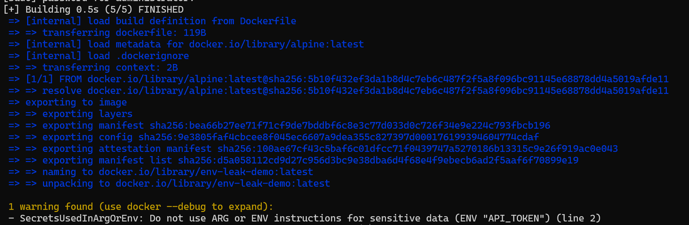

# Managing Secrets In Containerized Environments

In a compromised application, the first question an attacker asks is "What credentials can I steal from here?" This reality elevates secrets management from an administrative afterthought to a fundamental pillar of container security. While web exploitation serves as the entry point and system hardening restricts an attacker's movement, secrets management ultimately dictates the level of authority accessible once a perimeter is breached. By centralizing and securing sensitive data, you ensure that even if an attacker lands within your environment, the secrets remain out of reach.

## Secrets fundamentals and threat model

### What is a secret?

A secret is any value that grants access, proves identity, decrypts data, signs data, or allows one system to impersonate another. In Docker security, the most important teaching point is that secrets are not only “passwords.” A secret can be a tiny string copied into a `.env` file, a private key baked into an image layer, a CI token printed in build logs, or a certificate mounted into a container. Docker’s own documentation treats API tokens, passwords, and SSH keys as examples of sensitive values that should not be passed using Dockerfile `ARG` or `ENV`, because those mechanisms can persist in images or metadata. Some common types of secrets include:
- **API keys**: API keys are one of the easiest secrets to underestimate because they often look like harmless application configuration. In practice, an API key is usually a bearer credential: whoever has it can call the service as your application, often without proving anything else. In a Docker project, API keys commonly leak through .env files, docker-compose.yml, Docker build arguments, container logs, or example configuration copied into Git. A practical exploit is simple: an attacker finds a leaked payment, AI, email, SMS, or cloud API key in a public repository or image layer and starts making requests that generate cost, steal data, or damage reputation.
- **Database passwords**: A database password is dangerous because it often protects the most valuable part of the system: user data, business data, audit logs, sessions, and sometimes password hashes. In Dockerized applications, the classic mistake is placing POSTGRES_PASSWORD=supersecret directly in `docker-compose.yml` or an environment file that gets committed. A practical exploit does not require “hacking Docker”; the attacker simply obtains the Compose file, CI logs, backup archive, or image configuration, then connects to the database if it is reachable. Even if the database is not exposed to the internet, the password can still be useful after a second step, such as getting shell access to one container on the same Docker network. This is why database credentials should be scoped, rotated, and ideally injected at runtime.
- **OAuth client secrets**: OAuth client secrets are often misunderstood because people confuse them with OAuth client IDs. The client ID usually identifies the application and is often public; the client secret authenticates the application and must be protected. If an OAuth client secret leaks from a container image or repository, an attacker may be able to impersonate the application in token exchange flows, depending on the OAuth grant type and provider configuration. A practical example is a backend service that stores `OAUTH_CLIENT_SECRET` in a Dockerfile `ENV`. Anyone with access to the image can inspect image metadata and recover it.
- **TLS private keys**: TLS private keys are secrets because they prove the identity of a service and can sometimes decrypt captured traffic, depending on protocol versions and key exchange settings. In Docker environments, private keys often appear in bind-mounted certificate directories, reverse proxy containers, backup archives, or copied into images for convenience. A practical exploit is not always “decrypt all traffic”; often the bigger risk is impersonation. If an attacker steals the private key for `api.example.com`, they may be able to stand up a convincing fake service, intercept internal clients that trust the certificate, or abuse mutual TLS trust relationships.
- **SSH keys**: SSH keys are secrets because they often grant interactive or automated access to servers, Git repositories, deployment targets, and CI/CD systems. In Docker projects, SSH keys leak when developers copy them into images to clone private repositories during build, mount their entire `~/.ssh` directory into a container, or pass keys through build arguments. The practical exploit is straightforward: recover the private key from the image or container filesystem, then attempt access to Git, servers, or deployment infrastructure.
- **Cloud provider credentials**: Cloud credentials are especially dangerous because they often provide broad access: object storage, databases, container registries, queues, secrets managers, compute resources, and logs. In Docker, cloud credentials leak through local development mounts like `~/.aws`, CI variables, image layers, and debug logs. A practical exploit is a leaked AWS, Azure, or Google Cloud credential that lets an attacker list storage buckets, pull private container images, create compute resources for cryptomining, or read production secrets from a cloud secret manager.
- **Signing keys**: Signing keys are secrets used to prove that an artifact, token, package, image, release, or message came from a trusted source. They are high-impact because compromise can turn trust itself into an attack vector. In containerized environments, signing keys might be used for JWT signing, package signing, image signing, update signing, or webhook verification. A practical exploit is severe: if a JWT signing key leaks, an attacker may forge authentication tokens; if a release signing key leaks, an attacker may distribute malicious artifacts that appear legitimate.
- **Webhook tokens**: Webhook tokens are secrets that verify that an incoming request really came from a trusted system such as GitHub, Stripe, Slack, GitLab, or a CI/CD platform. In Docker apps, they often appear as `WEBHOOK_SECRET` in environment variables or Compose files. A practical exploit is request forgery: if the attacker knows the webhook token, they can send fake deployment events, fake payment events, fake user lifecycle events, or fake CI notifications.
- **Internal service credentials**: Internal service credentials are usernames, passwords, shared tokens, mTLS keys, or API keys used between services. Teams often treat them as lower-risk because they are “internal only,” but Docker networks make lateral movement practical. If an attacker compromises one low-privilege container and discovers internal credentials, they may authenticate to a database, cache, message queue, admin API, or another service on the same Docker network.

Not every configuration value is a secret. This distinction matters because if teams classify everything as secret, developers stop taking the label seriously. What is not usually a secret?
- Hostnames
- Port numbers
- Feature flags
- Public client IDs
- Non-sensitive environment names

### Secret lifecycle

Secrets management is not only about where a value is stored. It is a lifecycle problem: a secret is created, distributed, used, stored, rotated, revoked, expired, and eventually destroyed. [OWASP’s Secrets Management Cheat Sheet](https://cheatsheetseries.owasp.org/cheatsheets/Secrets_Management_Cheat_Sheet.html) emphasizes lifecycle concerns such as access control, rotation, expiration, auditing, and management across systems.
- **Creation**: Secret creation is the moment where quality and ownership are established. A weak database password, overprivileged cloud key, or long-lived token starts the lifecycle already unsafe.
- **Distribution**: Distribution is how the secret gets from storage to the place where it is needed. This is where many Docker failures happen. Developers send secrets in chat, paste them into `.env` files, attach them to tickets, copy them into Compose files, or print them in CI logs.
- **Use**: Secret use is the moment the application actually reads the value. The safest pattern is usually: read the secret from a file or secret manager, use it only where needed, do not print it, do not expose it in error messages, and avoid passing it through command-line arguments.
- **Storage**: Storage is where the secret rests when it is not actively being used. Bad storage includes Git history, Docker image layers, old `.tar` exports, CI artifacts, shell history, unencrypted backups, and copied .env files on laptops.
- **Rotation**: Rotation means replacing an existing secret with a new one. Rotation matters because you rarely know exactly when a secret was copied, logged, cached, or leaked.
- **Revocation**: Revocation is different from rotation. Rotation replaces; revocation invalidates. If a secret is suspected to be leaked, the safest assumption is that someone else may already have it. A practical incident workflow is: revoke the token, identify where it was used, rotate related credentials, review logs, and remove the leak from active locations.
- **Expiration**: Expiration limits how long a secret can be useful. Short-lived credentials reduce blast radius because a stolen value becomes worthless sooner.
- **Destruction**: Destruction means removing a secret from all places it should no longer exist. This is harder than it sounds. A secret may remain in Git history, Docker image layers, build cache, registry storage, backups, logs, crash dumps, and developer laptops.

### Threat model for containerized apps

A container threat model asks: who can get access to the secret, from where, and what can they do next? [NIST SP 800-190](https://nvlpubs.nist.gov/nistpubs/SpecialPublications/NIST.SP.800-190.pdf) frames containers as portable and automatable application packages, but also warns that containerized environments introduce security concerns across images, registries, orchestrators, hosts, and runtime configuration.

- **Malicious dependency**: A malicious dependency is dangerous because it runs inside your build or application with whatever access you gave the process. If your Docker build installs packages while a secret is available, a malicious install script may read that secret and exfiltrate it. If your application loads a compromised runtime dependency, it may read environment variables, mounted secret files, config directories, or cloud credentials.
- **Compromised developer machine**: A compromised developer machine is one of the most realistic secret-theft scenarios. Developers often have source code, `.env` files, SSH keys, cloud CLI sessions, package registry tokens, browser sessions, and Docker credentials on the same laptop.
- **Leaked image**: A leaked image can be as dangerous as a leaked repository, sometimes more dangerous. Images may contain compiled code, configuration, package manager caches, private dependency URLs, build metadata, and accidentally copied secrets.
- **Exposed Docker socket**: The Docker socket is one of the most important Docker security lessons. Mounting `/var/run/docker.sock` into a container often gives that container control over the Docker daemon. OWASP states that giving access to the Docker socket is equivalent to giving unrestricted root access to the host.
- **CI/CD compromise**: CI/CD systems are high-value targets because they often hold deployment credentials, registry tokens, package publishing keys, cloud credentials, signing keys, and environment secrets. A compromised pipeline can steal secrets even if the application code is clean.
- **Logs and observability leaks**: Logs are a common secret graveyard. Applications log full URLs with credentials, database connection strings, authorization headers, webhook payloads, stack traces, environment dumps, and debug configuration.
- **Runtime shell access**: Runtime shell access means an attacker, operator, or overly curious user can execute commands inside a running container. Once inside, they may inspect environment variables, mounted secret files, application configuration, process arguments, writable volumes, logs, and network access.
- **Backups and volume leakage**: Backups and volumes are often forgotten in secret threat models. Docker volumes may contain database files, uploaded files, TLS material, application config, cached tokens, or generated credentials. Backups may preserve old secrets long after rotation.

## How secrets leak in Docker projects

### Secrets in source code
Secrets in source code are the classic leak, but the Docker-specific angle is that source code often becomes part of the build context. If a developer writes an API key directly into app.py, settings.js, or config.go, that value may be copied into the image, stored in Git history, cached by CI, indexed by code search, and eventually distributed through a container registry. The exploit path is practical: an attacker does not need shell access to production; they only need access to the repository, a leaked image, or old build artifacts. Even after removing the secret from the current file, it may still exist in Git history and old images.

Example:
```bash
cd ./examples/01_secrets_in_source_code

# Initialize a new Git repository and make a commit with a secret in the source code
git init
git add app.py
git config --global user.email "you@example.com"
git config --global user.name "Your Name"
git commit -m "Add app with config"

grep -R "sk_live" .
git log -p -- app.py

# Then “fix” the file:
cat > app.py <<'PY'
import os
PAYMENT_API_KEY = os.environ.get("PAYMENT_API_KEY")
print("App started")
PY

cat app.py

# App file looks good, but the secret is still in Git history:
git add app.py
git commit -m "Move key to env"
git log -p -- app.py

# remove the git history to fully remove the secret from the repository
rm -rf .git
```

The current file is clean, but the previous commit still contains the fake key. This shows why remediation usually means rotate or revoke the secret, not just delete it from code.

### Secrets in `.env` files committed to Git

`.env` files are dangerous because they feel informal. Developers use them for local convenience, but Docker Compose automatically integrates heavily with environment-based configuration, so `.env` often becomes the place where real credentials accumulate. [Docker’s Compose documentation](https://docs.docker.com/compose/how-tos/environment-variables/best-practices/) explicitly recommends being careful with sensitive data in environment variables and considering Docker secrets for sensitive values.

Example:
```bash
cd ./examples/02_secrets_in_env_files

cat .env

cat > .gitignore <<'EOF'
.env
*.secret
secrets/
EOF

cat > .env.example <<'EOF'
POSTGRES_PASSWORD=
STRIPE_SECRET_KEY=
JWT_SIGNING_KEY=
EOF
```
A `.env.example` tells developers what variables exist without encouraging them to share real values. In many teams, `.env.example` becomes part of onboarding and CI validation.

### Secrets in `docker-compose.yml`

Putting secrets directly into `docker-compose.yml` is worse than putting them in a local `.env` file because Compose files are almost always committed, reviewed, copied, reused, and shared. A password in Compose also becomes part of the deployment definition, which means it may be visible to anyone who can read infrastructure configuration. [Docker Compose supports](https://docs.docker.com/compose/how-tos/use-secrets/) secrets and mounts them into containers as files, typically under `/run/secrets/<secret_name>`, only for services that explicitly request them.

Example:
```bash
cd ./examples/03_secrets_in_compose

cat docker-compose.yml
grep -n "PASSWORD" docker-compose.yml

# Create a secrets directory
mkdir -p secrets
printf "FAKE_compose_password_123\n" > secrets/postgres_password.txt

cat > docker-compose.yml <<'YAML'
services:
  db:
    image: postgres:16
    environment:
      POSTGRES_PASSWORD_FILE: /run/secrets/postgres_password
    secrets:
      - postgres_password

secrets:
  postgres_password:
    file: ./secrets/postgres_password.txt
YAML

cat docker-compose.yml
```

The secret file still exists on the host. The host, developer machine, backup system, and filesystem permissions still matter.

### Secrets in Dockerfile `ENV`

Dockerfile `ENV` is a common beginner mistake because it “works.” The container starts, the application sees the variable, and everything looks fine. The problem is that `ENV` becomes part of the image metadata and is inherited by containers created from the image. [Docker’s build check documentation](https://docs.docker.com/reference/build-checks/secrets-used-in-arg-or-env/) says sensitive data should not be used in `ENV` because it persists in the final image.



Example:
```bash
cd ./examples/04_secrets_in_dockerfile_env

cat Dockerfile

sudo docker build -t env-leak-demo .
sudo docker inspect env-leak-demo | grep -A3 API_TOKEN

# You can also start a container and inspect the environment:
sudo docker run --name env-leak-container -d env-leak-demo
sudo docker inspect env-leak-container | grep -A3 API_TOKEN
sudo docker rm -f env-leak-container
```

Even if the application never prints the token, Docker metadata may still reveal it. This is why “we do not log the secret” is not enough if the Dockerfile itself stores the secret.

### Secrets in Dockerfile `ARG`

`ARG` feels safer than `ENV` because it is “only build-time,” but it can still leak through image history, build metadata, and build cache behavior. Docker’s documentation warns that build arguments are inappropriate for build secrets because they can persist in the final image.

Example:
```bash
cd ./examples/05_secrets_in_dockerfile_arg

cat Dockerfile

sudo docker build --build-arg NPM_TOKEN=FAKE_arg_token_123 -t arg-leak-demo .
sudo docker run --rm arg-leak-demo
sudo docker history --no-trunc arg-leak-demo
```

### Secrets in image layers

If you copy a secret into an image and delete it later, the final filesystem may look clean, but an earlier layer can still contain the file. Deleting a file in a later layer does not necessarily erase it from earlier layers. The fix is not “copy then delete.” The fix is “never copy the secret into the image layer in the first place.”

### Secrets in `docker history`

`docker history` can reveal build commands, build arguments, and mistakes that happened during image creation. Docker provides docker history, and Docker’s own build checks warn against secrets in ARG and ENV because they persist in the final image. An attacker who can pull the image from a registry may not need source code or CI logs. They can inspect the image locally and search history, labels, environment variables, and layers. The practical lesson: treat container registries as sensitive systems, especially when images were built before your team had good secret hygiene.

### Secrets in build cache

Build cache is subtle because it is created for performance, not security. If a build step uses a secret in a way that affects files, layers, or command metadata, the cache can preserve traces of that secret. This can happen locally on developer machines, on shared CI runners, or in remote build cache systems. Docker’s BuildKit secret mounts are designed to reduce this risk by allowing secrets to be mounted temporarily during build steps.

### Secrets in logs

Logs are one of the most realistic leak paths. Docker captures container output from stdout and stderr, and `docker logs` retrieves that output. Docker’s logging documentation states that, by default, `docker logs` shows the command’s stdout and stderr. Once a secret is logged, it may leave the Docker host. It can be forwarded to log drivers, SIEM platforms, APM tools, support bundles, alerting systems, and long-term archives. The attacker does not need container access if they have access to logs. Do not log full connection strings, authorization headers, JWTs, session cookies, or webhook payloads.

Crash dumps are dangerous because they capture application state at the worst possible time: during an exception, panic, fatal error, or debug failure. They may contain environment variables, request headers, stack frames, local variables, connection strings, tokens, and memory fragments. In Docker, crash output often goes directly to stdout/stderr, which then becomes Docker logs. That connects crash leakage directly to the logging pipeline. Docker’s logs collect stdout and stderr by default, so a verbose crash can become a persistent secret leak.

## Build-time secrets with Docker BuildKit

[Build-time secrets](https://docs.docker.com/build/building/secrets/) solve a narrow but important problem: the image build needs a credential, but the final image must not contain it. A common example is an `npm`, `pip`, Maven, Git, cloud storage, or package registry token that is needed only while downloading private dependencies. Docker BuildKit supports this through build secrets: the secret is passed to `docker build` with `--secret`, and the Dockerfile consumes it only inside a specific `RUN` instruction with `RUN --mount=type=secret`. By default, BuildKit mounts the secret as a temporary file under `/run/secrets/<id>`, and Docker also supports file-backed secrets, environment-backed secrets, custom target paths, and secret values mounted as environment variables for the build step.

The distinction between build-time and runtime secrets is important. A build-time secret is needed to create the image, but the application should not need it after the image is built. A runtime secret is needed when the container is running, such as a database password, OAuth client secret, or API token used by the application. BuildKit secrets are not a replacement for runtime secret management. They only protect secrets during image construction.

This is different from Dockerfile `ARG` and `ENV`. Docker warns that sensitive values should not be placed in `ARG` or `ENV`, because they can persist in the final image or its metadata. Docker’s build checks recommend secret mounts instead of `ARG` or `ENV` for build secrets.

Using BuildKit secrets without baking them into the image:
```bash
cd ./examples/06_buildkit_secrets

mkdir -p secrets
printf "FAKE_npm_token_123\n" > secrets/npm_token.txt

# Explore the Dockerfile that uses BuildKit secrets
cat Dockerfile

sudo LICENSE_KEY="FAKE_license_key_456" docker build \
  --secret id=npm_token,src=./secrets/npm_token.txt \
  --secret id=license_key,env=LICENSE_KEY \
  -t buildkit-secret-demo .

sudo docker run --rm buildkit-secret-demo
```

In this example, the token from `secrets/npm_token.txt` is available only as `/tmp/npm_token` during that one `RUN` instruction. The `LICENSE_KEY` variable is also available only during that one build step. The final image receives only `/app/status.txt`.

Multi-stage builds help create a clean boundary, but they do not automatically make a build safe. If a build step writes the secret into `/out`, a log file, a package manager config file, or a compiled artifact, `COPY --from=build` can still carry the leak into the final image. BuildKit prevents the secret mount itself from becoming an image layer; **it cannot prevent careless commands from copying the secret somewhere else**.

Verify the final image:
```bash
sudo docker history --no-trunc buildkit-secret-demo | grep -E "FAKE_npm_token|FAKE_license_key" || echo "No fake secret found in docker history"

sudo docker save buildkit-secret-demo -o buildkit-secret-demo.tar

sudo grep -aE "FAKE_npm_token|FAKE_license_key" buildkit-secret-demo.tar || echo "No fake secret found in saved image tar"

sudo rm buildkit-secret-demo.tar
sudo rm -rf secrets
```

This is a useful sanity check when you know the exact test value, but it is not enough for real pipelines. Add secret scanning before and after the image is built.

For source code and Git history, a pre-commit hook catches many leaks before they enter the repository. [Gitleaks](https://github.com/gitleaks/gitleaks) supports pre-commit hooks and can scan repositories, directories, and standard input for secrets.

```bash
cat > .pre-commit-config.yaml <<'YAML'
repos:
  - repo: https://github.com/gitleaks/gitleaks
    rev: v8.24.2
    hooks:
      - id: gitleaks
YAML

pre-commit install
pre-commit run --all-files
```

For container images, scan the image itself. [Trivy scans files](https://trivy.dev/docs/latest/guide/scanner/secret/) inside container images for vulnerabilities, misconfigurations, secrets, and licenses, and secret scanning is enabled by default for image files. Trivy can also scan image configuration for secrets when enabled with `--image-config-scanners`.

```bash
# Looks clean
sudo trivy image --scanners secret buildkit-secret-demo
sudo trivy image --image-config-scanners secret buildkit-secret-demo

# Try again with a known secret to see it detected:
sudo docker build -t trivy-positive-demo -f Dockerfile.with_secrets .
sudo trivy image --scanners secret trivy-positive-demo
```

Secret scanning should not be treated as proof that no secret exists. It is a safety net. The primary control is still design: do not put secrets in source code, Dockerfiles, image layers, build logs, package manager config, or CI output.

## Docker Compose secrets

[Docker Compose secrets](https://docs.docker.com/compose/how-tos/use-secrets/) are a practical way to inject sensitive values into containers without putting the values directly in `docker-compose.yml` or environment variables. Compose uses a two-step model: define the secret under the top-level secrets element, then grant access to specific services with the service-level secrets attribute. A secret defined at the top level is not automatically available to every service. It must be explicitly attached to each service that needs it. Compose mounts secrets as files inside the container, normally under `/run/secrets/<secret_name>`.

Compose supports both file-backed and environment-backed secrets. A file-backed secret gets its value from a file on the host. An environment-backed secret gets its value from a host environment variable. The Compose specification describes these as file and environment sources, and Docker’s Compose reference notes that environment-backed secrets are supported by Docker Compose but not by `docker stack deploy`.

Demo: per-service secret access in Compose:
```bash
cd ./examples/07_compose_secrets

mkdir -p secrets
printf "FAKE_db_password_456\n" > secrets/db_password.txt
chmod 600 secrets/db_password.txt

sudo API_TOKEN="FAKE_compose_env_token_789" docker compose run --rm app
sudo API_TOKEN="FAKE_compose_env_token_789" docker compose run --rm worker

sudo docker compose down -v
```

The app service can read both db_password and api_token. The worker service cannot read either because it was not granted access. This is the practical value of Compose secrets: access can be scoped per service.

The db service demonstrates the `_FILE` convention. Many official images support variables such as `POSTGRES_PASSWORD_FILE`, `MYSQL_PASSWORD_FILE`, or similar names. Instead of placing the password directly in an environment variable, the variable points to a file containing the password. Docker’s Compose documentation shows this convention with official images such as MySQL and Postgres.

Secret naming also matters. Use names that describe purpose and scope, such as `db_password`, `stripe_api_key`, or `app_jwt_signing_key`. Avoid names like secret, password, or token1, because they become unclear as the Compose file grows.

File permissions still matter. The host file in the example is restricted with chmod 600, because a file-backed Compose secret starts as a real file on the host. Docker Compose also supports long syntax for service secrets, including target, uid, gid, and mode, but Docker’s reference notes an important limitation: uid, gid, and mode are implemented only for environment-backed secrets in Docker Compose; for file-backed secrets, Compose uses a bind mount and those attributes are ignored.

## Runtime retrieval from external secret stores

Another option is to avoid injecting the actual application secret at container start and let the application retrieve it from a secret store at runtime. In this pattern, the container image contains application code, not the secret. When the application starts, it authenticates to a secret management service such as **AWS Secrets Manager, HashiCorp Vault, Azure Key Vault, or Google Secret Manager**, then requests only the secrets it is allowed to read.

AWS Secrets Manager is designed to manage, retrieve, and rotate database credentials, application credentials, OAuth tokens, API keys, and other secrets. AWS describes the preferred pattern as replacing hard-coded credentials with runtime calls to Secrets Manager when the application needs them. [HashiCorp Vault](https://github.com/hashicorp/vault) can also issue dynamic secrets: credentials generated on demand, unique to each client, and short-lived. This reduces the value of a stolen secret because it expires quickly and can be traced to a specific requester.

This pattern improves lifecycle control, but it introduces a bootstrapping question: how does the container authenticate to the secret store in the first place? The answer should not be “put a master token in the image.” In production, use workload identity, cloud IAM roles, short-lived tokens, mTLS, Vault AppRole, or another platform identity mechanism. The application’s identity should be allowed to read only the specific secret paths it needs.

Runtime retrieval is strongest when combined with short-lived credentials, narrow access policies, encrypted transport, and careful application behavior. Read the secret only when needed, keep it in memory, avoid logging it, handle rotation, and design for secret-store outages. A secret manager reduces secret sprawl, but it does not remove the need for least privilege.
